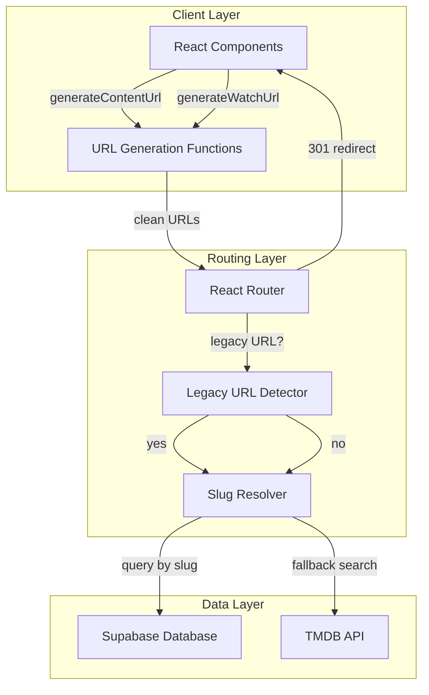

# مستند التصميم - روابط المحتوى بالـ Slugs فقط

## Overview

هذا التصميم يهدف إلى تحويل نظام الروابط في الموقع من استخدام IDs كـ fallback إلى استخدام slugs نظيفة فقط. حالياً، عندما لا يكون هناك slug للمحتوى، يتم إضافة الـ ID في نهاية الرابط (مثل `/watch/movie/spider-man-12345`)، مما يجعل الروابط غير نظيفة وغير صديقة لمحركات البحث.

الحل المقترح يتضمن ثلاثة مكونات رئيسية:

1. **Slug Generation System**: نظام لتوليد slugs فريدة لجميع المحتوى الموجود في قاعدة البيانات
2. **URL Generation Refactoring**: تحديث دوال توليد الروابط لاستخدام slugs فقط ورفض المحتوى بدون slugs
3. **Legacy URL Support**: نظام لدعم الروابط القديمة وإعادة توجيهها إلى الروابط الجديدة

هذا التصميم يضمن:
- جميع الروابط نظيفة وصديقة لمحركات البحث
- الروابط القديمة تعمل وتُعاد توجيهها بشكل دائم (301 redirect)
- جميع المحتوى في قاعدة البيانات يحتوي على slugs صالحة
- تجربة مستخدم سلسة بدون روابط منكسرة

## Architecture

### High-Level Architecture



### Component Interaction Flow

**URL Generation Flow:**
```
Component → generateContentUrl/generateWatchUrl → Validate slug exists → Generate clean URL
                                                  ↓ (no slug)
                                                  Throw Error
```

**Legacy URL Handling Flow:**
```
User Request → Router → Legacy URL Detector → Extract ID → Query Database → 301 Redirect to Clean URL
```

**Slug Resolution Flow:**
```
Watch Page → Extract slug from URL → Query Database by slug → Found? → Load content
                                                             ↓ (not found)
                                                             Search TMDB → Found? → Load content
                                                                         ↓ (not found)
                                                                         404 Page
```

### Key Design Decisions

1. **Strict Slug Requirement**: دوال توليد الروابط ترفض المحتوى بدون slugs بدلاً من استخدام fallback. هذا يضمن اكتشاف المشاكل مبكراً.

2. **Permanent Redirects (301)**: الروابط القديمة تُعاد توجيهها بشكل دائم، مما يساعد محركات البحث على تحديث فهرسها.

3. **Year-Based Uniqueness**: عند وجود slugs مكررة، نضيف السنة أولاً قبل استخدام أرقام تسلسلية، مما يجعل الروابط أكثر وضوحاً.

4. **TMDB Fallback**: في صفحة المشاهدة، إذا لم يُعثر على المحتوى في قاعدة البيانات، نبحث في TMDB كـ fallback.

## Components and Interfaces

### 1. Slug Generator

**Purpose**: توليد slugs فريدة لجميع المحتوى في قاعدة البيانات.

**Interface**:
```typescript
interface SlugGeneratorOptions {
  title: string
  existingSlugs: Set<string>
  year?: number | null
  contentType: 'movie' | 'tv' | 'game' | 'software' | 'actor'
}

interface SlugGenerationResult {
  slug: string
  wasModified: boolean
  modificationReason?: 'duplicate' | 'invalid-chars' | 'empty'
}

function generateUniqueSlug(options: SlugGeneratorOptions): SlugGenerationResult
```

**Implementation Details**:
- يستخدم الدالة الموجودة `slugify()` من `src/lib/utils.ts`
- يتحقق من التفرد عن طريق مقارنة مع `existingSlugs`
- عند وجود تكرار، يضيف السنة أولاً: `spider-man-2024`
- إذا لم تكن السنة متوفرة أو ما زال هناك تكرار، يضيف رقم تسلسلي: `spider-man-2`, `spider-man-3`
- يدعم الأحرف العربية والصينية واليابانية والكورية

**Validation Rules**:
- Slug يجب أن يتطابق مع النمط: `^[a-z0-9\u0621-\u064A\u0660-\u0669\u3000-\u303f\u3040-\u309f\u30a0-\u30ff\uff00-\uff9f\u4e00-\u9faf\u3400-\u4dbf-]+$`
- Slug لا يمكن أن يكون فارغاً
- Slug لا يمكن أن يكون "content" فقط

### 2. URL Generation Functions

**Purpose**: توليد روابط نظيفة تحتوي على slugs فقط.

**Updated Interface**:
```typescript
interface ContentItem {
  id: number | string
  slug: string  // Required, not optional anymore
  media_type?: string
  type?: string
  title?: string | null
  name?: string | null
  release_date?: string | null
  first_air_date?: string | null
}

function generateContentUrl(item: ContentItem): string
function generateWatchUrl(item: ContentItem, season?: number, episode?: number): string
```

**Changes from Current Implementation**:
- `slug` الآن مطلوب (required) وليس اختياري
- إزالة منطق الـ fallback الذي يضيف ID
- رمي خطأ واضح عندما يكون `slug` مفقوداً أو غير صالح
- الحفاظ على دعم جميع أنواع المحتوى: movie, tv, series, anime, actor, person, game, software

**Error Handling**:
```typescript
class MissingSlugError extends Error {
  constructor(contentId: number | string, contentType: string) {
    super(`Content ${contentType}:${contentId} is missing a valid slug`)
    this.name = 'MissingSlugError'
  }
}
```

### 3. Legacy URL Detector

**Purpose**: اكتشاف الروابط القديمة التي تحتوي على IDs وإعادة توجيهها.

**Interface**:
```typescript
interface LegacyUrlDetectionResult {
  isLegacy: boolean
  extractedId?: number
  slugPart?: string
  contentType?: string
}

function detectLegacyUrl(pathname: string): LegacyUrlDetectionResult
```

**Detection Logic**:
- يتحقق من النمط: `/watch/{type}/{slug-with-id}` أو `/{type}/{slug-with-id}`
- يستخرج ID من نهاية الـ slug: `spider-man-12345` → `12345`
- يتحقق أن الجزء الأخير بعد آخر `-` هو رقم
- يدعم الأنماط: `/watch/movie/slug-123`, `/watch/tv/slug-456/s1/ep1`, `/movie/slug-789`

**Example**:
```typescript
detectLegacyUrl('/watch/movie/spider-man-12345')
// Returns: { isLegacy: true, extractedId: 12345, slugPart: 'spider-man', contentType: 'movie' }

detectLegacyUrl('/watch/movie/spider-man')
// Returns: { isLegacy: false }
```

### 4. Slug Resolver

**Purpose**: تحليل slugs من الروابط وإيجاد المحتوى المقابل.

**Interface**:
```typescript
interface SlugResolutionOptions {
  slug: string
  contentType: 'movie' | 'tv' | 'game' | 'software' | 'actor'
  searchTmdb?: boolean
}

interface SlugResolutionResult {
  contentId: number | null
  source: 'database' | 'tmdb' | 'not-found'
  metadata?: {
    title?: string
    year?: number
    correctSlug?: string
  }
}

async function resolveSlug(options: SlugResolutionOptions): Promise<SlugResolutionResult>
```

**Resolution Strategy**:
1. **Database Query**: البحث في قاعدة البيانات أولاً باستخدام الـ slug
2. **TMDB Search** (optional): إذا لم يُعثر على المحتوى، البحث في TMDB
3. **Year Extraction**: استخراج السنة من الـ slug إذا كانت موجودة (مثل `spider-man-2024`)
4. **Year Prioritization**: عند البحث في TMDB، إعطاء الأولوية للنتائج التي تطابق السنة

**TMDB Search Logic**:
```typescript
// Extract year from slug
const yearMatch = slug.match(/-(\d{4})$/)
const year = yearMatch ? parseInt(yearMatch[1]) : null
const searchQuery = slug.replace(/-(\d{4})$/, '').replace(/-/g, ' ')

// Search TMDB
const results = await tmdb.search(searchQuery, { year })

// Prioritize results matching the year
if (year) {
  results.sort((a, b) => {
    const aYear = new Date(a.release_date || a.first_air_date).getFullYear()
    const bYear = new Date(b.release_date || b.first_air_date).getFullYear()
    if (aYear === year) return -1
    if (bYear === year) return 1
    return 0
  })
}
```

### 5. Redirect Handler

**Purpose**: إعادة توجيه الروابط القديمة إلى الروابط الجديدة.

**Interface**:
```typescript
interface RedirectOptions {
  legacyUrl: string
  contentId: number
  contentType: string
  season?: number
  episode?: number
}

function generateRedirectUrl(options: RedirectOptions): string
```

**Implementation**:
- يستعلم عن المحتوى من قاعدة البيانات باستخدام ID
- يستخدم `generateWatchUrl` أو `generateContentUrl` لتوليد الرابط الجديد
- يُرجع رابط نظيف يحتوي على slug فقط
- يحافظ على معلومات الموسم والحلقة للمسلسلات

## Data Models

### Content Table Schema

```sql
-- Existing table structure (assumed)
CREATE TABLE content (
  id SERIAL PRIMARY KEY,
  title TEXT NOT NULL,
  slug TEXT,  -- Will be made NOT NULL after migration
  media_type TEXT NOT NULL,
  release_date DATE,
  first_air_date DATE,
  -- ... other fields
  CONSTRAINT unique_slug UNIQUE (slug)
);

-- Index for fast slug lookups
CREATE INDEX idx_content_slug ON content(slug) WHERE slug IS NOT NULL;
```

### Migration Strategy

**Phase 1: Generate Slugs**
```sql
-- Script to generate slugs for all content without slugs
UPDATE content
SET slug = generate_unique_slug(title, release_date, id)
WHERE slug IS NULL OR slug = '';
```

**Phase 2: Validate Slugs**
```sql
-- Check for missing slugs
SELECT id, title, media_type
FROM content
WHERE slug IS NULL OR slug = '';

-- Check for duplicate slugs
SELECT slug, COUNT(*)
FROM content
GROUP BY slug
HAVING COUNT(*) > 1;

-- Check for invalid slug patterns
SELECT id, title, slug
FROM content
WHERE slug !~ '^[a-z0-9\u0621-\u064A\u0660-\u0669\u3000-\u303f\u3040-\u309f\u30a0-\u30ff\uff00-\uff9f\u4e00-\u9faf\u3400-\u4dbf-]+$';
```

**Phase 3: Make Slug Required**
```sql
-- Add NOT NULL constraint after all slugs are generated
ALTER TABLE content
ALTER COLUMN slug SET NOT NULL;
```

### Slug Generation Algorithm

```typescript
interface ContentRecord {
  id: number
  title: string
  release_date?: string | null
  first_air_date?: string | null
  media_type: string
}

function generateSlugForContent(content: ContentRecord, existingSlugs: Set<string>): string {
  // Step 1: Generate base slug from title
  let slug = slugify(content.title)
  
  // Step 2: Check if slug is unique
  if (!existingSlugs.has(slug)) {
    return slug
  }
  
  // Step 3: Try adding year
  const date = content.release_date || content.first_air_date
  if (date) {
    const year = new Date(date).getFullYear()
    const slugWithYear = `${slug}-${year}`
    if (!existingSlugs.has(slugWithYear)) {
      return slugWithYear
    }
  }
  
  // Step 4: Add sequential number
  let counter = 2
  while (existingSlugs.has(`${slug}-${counter}`)) {
    counter++
  }
  
  return `${slug}-${counter}`
}
```

### URL Patterns

**Clean URLs (New)**:
```
/movie/{slug}                    # Movie details
/series/{slug}                   # Series details
/watch/movie/{slug}              # Watch movie
/watch/tv/{slug}/s{n}/ep{m}      # Watch series episode
/actor/{slug}                    # Actor profile
/game/{slug}                     # Game details
/software/{slug}                 # Software details
```

**Legacy URLs (Supported with 301 redirect)**:
```
/movie/{slug-id}                 # Redirects to /movie/{slug}
/watch/movie/{slug-id}           # Redirects to /watch/movie/{slug}
/watch/tv/{slug-id}/s{n}/ep{m}   # Redirects to /watch/tv/{slug}/s{n}/ep{m}
```

### Slug Cache

للأداء الأفضل، نستخدم cache للـ slug resolution:

```typescript
interface SlugCacheEntry {
  contentId: number
  slug: string
  contentType: string
  timestamp: number
}

class SlugCache {
  private cache: Map<string, SlugCacheEntry>
  private ttl: number = 3600000 // 1 hour
  
  get(slug: string, contentType: string): number | null
  set(slug: string, contentType: string, contentId: number): void
  clear(contentType?: string): void
  isExpired(entry: SlugCacheEntry): boolean
}
```


## Correctness Properties

*A property is a characteristic or behavior that should hold true across all valid executions of a system—essentially, a formal statement about what the system should do. Properties serve as the bridge between human-readable specifications and machine-verifiable correctness guarantees.*

### Property 1: Slug Generation Creates Unique Slugs

*For any* set of content items without slugs, after running the slug generator, all items should have unique, non-empty slugs.

**Validates: Requirements 1.1**

### Property 2: Slug Derivation from Title

*For any* content item with a title, the generated slug should match the output of the slugify function applied to that title (when no conflicts exist).

**Validates: Requirements 1.2**

### Property 3: Slug Uniqueness Strategy

*For any* set of content items with duplicate base slugs, the generator should ensure uniqueness by first appending the year (if available), then appending sequential numbers if needed, such that all final slugs are unique.

**Validates: Requirements 1.3, 1.4**

### Property 4: Slug Generation Idempotence

*For any* content item with a valid existing slug, running the slug generator should preserve that slug without modification.

**Validates: Requirements 1.5**

### Property 5: Multi-Language Slug Support

*For any* title containing Arabic, English, or CJK characters, the generated slug should be valid and contain only lowercase letters, numbers, hyphens, and the appropriate Unicode ranges for those character sets.

**Validates: Requirements 1.6**

### Property 6: Slug Pattern Validation

*For any* generated slug, it should match the pattern `^[a-z0-9\u0621-\u064A\u0660-\u0669\u3000-\u303f\u3040-\u309f\u30a0-\u30ff\uff00-\uff9f\u4e00-\u9faf\u3400-\u4dbf-]+$` and should not be empty or equal to "content".

**Validates: Requirements 1.7**

### Property 7: URL Generation Excludes IDs

*For any* content item with a valid slug, the generated URL (both content and watch URLs) should not contain the content ID as a substring.

**Validates: Requirements 2.1, 2.3**

### Property 8: Missing Slug Error

*For any* content item without a slug, attempting to generate a URL should throw a MissingSlugError with the content ID and type.

**Validates: Requirements 2.2**

### Property 9: URL Format Correctness

*For any* content item with a valid slug, the generated URL should match the expected format for its media type: `/watch/movie/{slug}` for movies, `/watch/tv/{slug}/s{season}/ep{episode}` for series, `/{type}/{slug}` for other types.

**Validates: Requirements 2.4, 2.5, 2.6**

### Property 10: Legacy URL Detection

*For any* URL string, the legacy URL detector should correctly identify whether it contains a numeric ID at the end (after the last hyphen) and extract that ID if present.

**Validates: Requirements 3.1, 3.4**

### Property 11: Year Extraction from Slugs

*For any* slug containing a 4-digit year at the end (e.g., "spider-man-2024"), the year extraction function should correctly identify and extract that year.

**Validates: Requirements 4.4**

### Property 12: Round-Trip URL Conversion

*For any* valid content object with a slug (across all media types: movie, tv, game, software, actor), generating a URL and then parsing it should return the same content ID and metadata (including season and episode numbers for series).

**Validates: Requirements 7.1, 7.2, 7.3, 7.4**

### Property 13: Component URL Generation Completeness

*For any* content object passed to a component for link generation, the object should include a non-empty slug field.

**Validates: Requirements 5.4**

### Property 14: Error Message Privacy

*For any* user-facing error message, it should not contain internal database IDs, table names, or SQL query fragments.

**Validates: Requirements 8.6**

## Error Handling

### Error Types

**1. MissingSlugError**
- **When**: Content item lacks a valid slug during URL generation
- **Response**: Throw error with content ID and type
- **Logging**: Log error with full content details for debugging
- **User Impact**: Should not reach users (caught during development/validation)

**2. ContentNotFoundError**
- **When**: Slug or ID cannot be resolved to content
- **Response**: Return 404 status
- **Logging**: Log slug/ID and search attempts
- **User Impact**: Display user-friendly 404 page with suggestions

**3. InvalidSlugFormatError**
- **When**: Slug doesn't match required pattern
- **Response**: Reject during validation
- **Logging**: Log content ID, title, and invalid slug
- **User Impact**: Should not reach users (caught during validation)

**4. DatabaseError**
- **When**: Database query fails
- **Response**: Return 500 status
- **Logging**: Log full error details and query context
- **User Impact**: Display generic error message without exposing internals

### Error Handling Strategy

```typescript
// URL Generation Error Handling
try {
  const url = generateContentUrl(content)
} catch (error) {
  if (error instanceof MissingSlugError) {
    logger.error('Missing slug during URL generation', {
      contentId: content.id,
      contentType: content.type,
      title: content.title
    })
    // In development: throw error
    // In production: fallback to error page
  }
}

// Slug Resolution Error Handling
try {
  const result = await resolveSlug({ slug, contentType })
  if (result.source === 'not-found') {
    // Display 404 with suggestions
    const suggestions = await getSimilarContent(slug)
    return render404Page({ slug, suggestions })
  }
} catch (error) {
  logger.error('Slug resolution failed', { slug, contentType, error })
  return render500Page()
}

// Legacy URL Redirect Error Handling
try {
  const detection = detectLegacyUrl(pathname)
  if (detection.isLegacy) {
    const content = await getContentById(detection.extractedId)
    if (!content) {
      return render404Page({ message: 'Content not found' })
    }
    const cleanUrl = generateWatchUrl(content)
    return redirect(cleanUrl, 301)
  }
} catch (error) {
  logger.error('Legacy URL handling failed', { pathname, error })
  return render404Page()
}
```

### User-Facing Error Messages

**404 - Content Not Found**:
```
عذراً، لم نتمكن من العثور على هذا المحتوى.

قد يكون الرابط قديماً أو تم حذف المحتوى.

محتوى مشابه قد يعجبك:
- [Suggestion 1]
- [Suggestion 2]
- [Suggestion 3]
```

**500 - Server Error**:
```
عذراً، حدث خطأ غير متوقع.

نحن نعمل على حل المشكلة. يرجى المحاولة مرة أخرى لاحقاً.
```

### Logging Strategy

**Development Environment**:
- Log all errors with full stack traces
- Log all slug generation attempts
- Log all URL generation calls
- Log all database queries

**Production Environment**:
- Log errors with sanitized details (no sensitive data)
- Log failed slug resolutions for monitoring
- Log legacy URL redirects for analytics
- Aggregate error metrics for alerting

## Testing Strategy

### Dual Testing Approach

This feature requires both unit tests and property-based tests to ensure comprehensive coverage:

**Unit Tests**: Focus on specific examples, edge cases, and integration points
**Property Tests**: Verify universal properties across all inputs through randomization

### Property-Based Testing

**Library**: We will use `fast-check` for TypeScript property-based testing.

**Configuration**:
- Minimum 100 iterations per property test
- Each test tagged with: `Feature: content-url-slugs-only, Property {number}: {property_text}`

**Property Test Examples**:

```typescript
import fc from 'fast-check'

// Property 1: Slug Generation Creates Unique Slugs
// Feature: content-url-slugs-only, Property 1: Slug Generation Creates Unique Slugs
test('all generated slugs are unique', () => {
  fc.assert(
    fc.property(
      fc.array(fc.record({
        id: fc.integer(),
        title: fc.string({ minLength: 1 }),
        media_type: fc.constantFrom('movie', 'tv', 'game', 'software')
      })),
      (contentItems) => {
        const slugs = contentItems.map(item => generateUniqueSlug({
          title: item.title,
          existingSlugs: new Set(),
          contentType: item.media_type
        }))
        const uniqueSlugs = new Set(slugs)
        return slugs.length === uniqueSlugs.size
      }
    ),
    { numRuns: 100 }
  )
})

// Property 7: URL Generation Excludes IDs
// Feature: content-url-slugs-only, Property 7: URL Generation Excludes IDs
test('generated URLs do not contain content IDs', () => {
  fc.assert(
    fc.property(
      fc.record({
        id: fc.integer({ min: 1, max: 999999 }),
        slug: fc.string({ minLength: 3 }).map(s => slugify(s)),
        media_type: fc.constantFrom('movie', 'tv', 'game', 'software'),
        title: fc.string()
      }),
      (content) => {
        const url = generateContentUrl(content)
        return !url.includes(String(content.id))
      }
    ),
    { numRuns: 100 }
  )
})

// Property 12: Round-Trip URL Conversion
// Feature: content-url-slugs-only, Property 12: Round-Trip URL Conversion
test('URL generation and parsing round-trip correctly', () => {
  fc.assert(
    fc.property(
      fc.record({
        id: fc.integer({ min: 1 }),
        slug: fc.string({ minLength: 3 }).map(s => slugify(s)),
        media_type: fc.constantFrom('movie', 'tv'),
        title: fc.string()
      }),
      fc.option(fc.integer({ min: 1, max: 10 })),
      fc.option(fc.integer({ min: 1, max: 20 })),
      (content, season, episode) => {
        const url = generateWatchUrl(content, season, episode)
        const parsed = parseWatchUrl(url)
        
        return parsed.slug === content.slug &&
               parsed.type === content.media_type &&
               (season ? parsed.season === season : true) &&
               (episode ? parsed.episode === episode : true)
      }
    ),
    { numRuns: 100 }
  )
})
```

### Unit Testing

**Focus Areas**:
1. Specific edge cases (empty strings, special characters)
2. Error handling (missing slugs, invalid formats)
3. Integration with database and TMDB
4. Component rendering with correct URLs
5. Legacy URL redirect behavior

**Example Unit Tests**:

```typescript
describe('Slug Generator', () => {
  test('handles empty title gracefully', () => {
    expect(() => generateUniqueSlug({
      title: '',
      existingSlugs: new Set(),
      contentType: 'movie'
    })).toThrow(InvalidSlugFormatError)
  })
  
  test('preserves existing valid slug', () => {
    const existingSlug = 'spider-man'
    const result = generateUniqueSlug({
      title: 'Spider-Man',
      existingSlugs: new Set([existingSlug]),
      contentType: 'movie',
      existingSlug
    })
    expect(result.slug).toBe(existingSlug)
    expect(result.wasModified).toBe(false)
  })
  
  test('appends year for duplicate slugs', () => {
    const result = generateUniqueSlug({
      title: 'Spider-Man',
      existingSlugs: new Set(['spider-man']),
      year: 2024,
      contentType: 'movie'
    })
    expect(result.slug).toBe('spider-man-2024')
  })
})

describe('URL Generation', () => {
  test('throws error for missing slug', () => {
    expect(() => generateContentUrl({
      id: 123,
      slug: null,
      media_type: 'movie'
    })).toThrow(MissingSlugError)
  })
  
  test('generates correct movie URL', () => {
    const url = generateContentUrl({
      id: 123,
      slug: 'spider-man',
      media_type: 'movie'
    })
    expect(url).toBe('/movie/spider-man')
  })
  
  test('generates correct series watch URL', () => {
    const url = generateWatchUrl({
      id: 456,
      slug: 'breaking-bad',
      media_type: 'tv'
    }, 2, 5)
    expect(url).toBe('/watch/tv/breaking-bad/s2/ep5')
  })
})

describe('Legacy URL Detection', () => {
  test('detects legacy URL with ID', () => {
    const result = detectLegacyUrl('/watch/movie/spider-man-12345')
    expect(result.isLegacy).toBe(true)
    expect(result.extractedId).toBe(12345)
    expect(result.slugPart).toBe('spider-man')
  })
  
  test('does not detect clean URL as legacy', () => {
    const result = detectLegacyUrl('/watch/movie/spider-man')
    expect(result.isLegacy).toBe(false)
  })
  
  test('handles year in slug correctly', () => {
    const result = detectLegacyUrl('/watch/movie/spider-man-2024')
    expect(result.isLegacy).toBe(false) // 2024 is a year, not an ID
  })
})
```

### Integration Testing

**Test Scenarios**:
1. Full flow: Generate slug → Generate URL → Parse URL → Resolve content
2. Legacy URL redirect flow: Detect legacy → Query database → Generate clean URL → Redirect
3. TMDB fallback flow: Parse slug → Database miss → TMDB search → Resolve content
4. Component integration: Render component → Generate links → Navigate → Load content

### Validation Testing

**Pre-Deployment Validation**:
```bash
# Run validation script
npm run validate:slugs

# Expected output:
# ✓ All content has valid slugs
# ✓ No duplicate slugs found
# ✓ All slugs match required pattern
# ✓ All URL generation tests pass
```

**Validation Script Tests**:
- Check all content for missing slugs
- Check for duplicate slugs
- Check for invalid slug patterns
- Generate sample URLs for each media type
- Test round-trip conversion for sample content

### Performance Testing

**Slug Resolution Performance**:
- Cache hit rate should be > 90%
- Database query time should be < 50ms
- TMDB fallback should be < 500ms

**URL Generation Performance**:
- Should handle 1000 URLs/second
- No memory leaks during bulk generation

