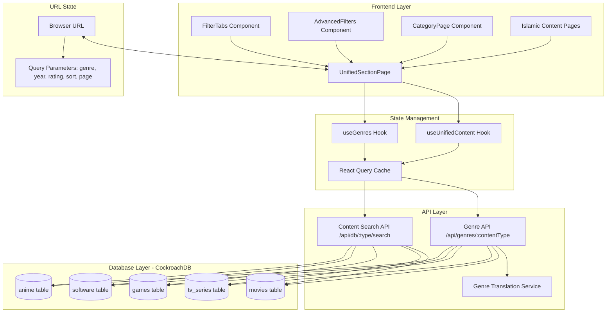
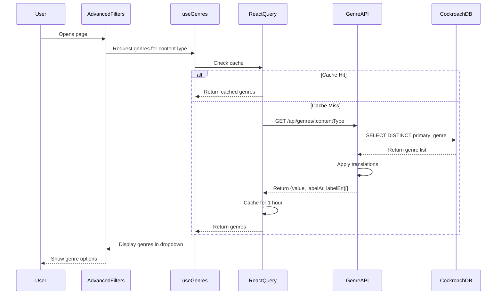
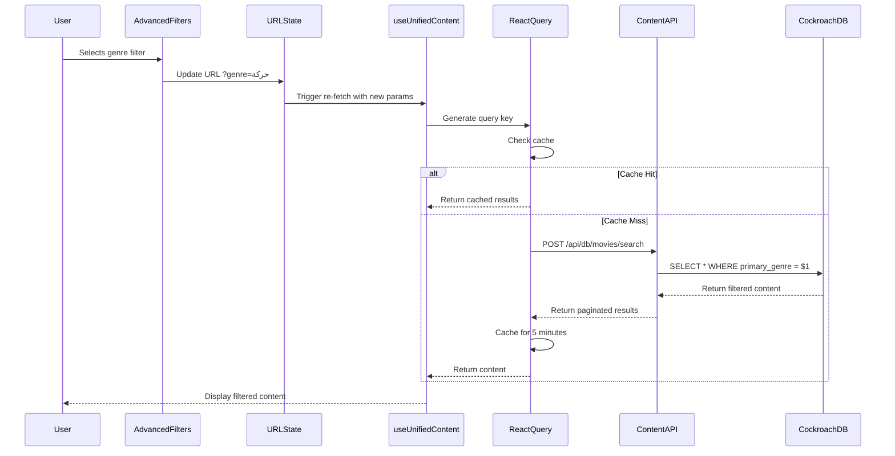
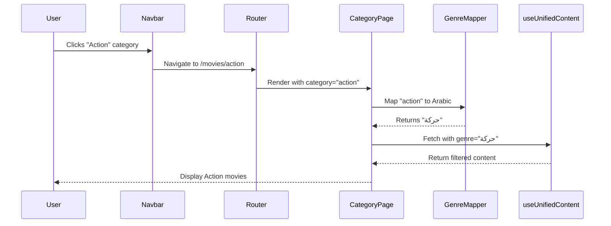

# Design Document - Dynamic Filters and Categories System
# مستند التصميم - نظام الفلاتر والتصنيفات الديناميكية

## Overview

This design document specifies the technical architecture for implementing a dynamic, database-driven filtering and categorization system for content (movies, series, anime, gaming, software). The system addresses critical issues in the current implementation including hardcoded filters, illogical "Upcoming" filters for released content, and missing Islamic content pages.

### Key Design Goals

1. **Dynamic Genre Fetching**: Replace hardcoded genre lists with database-driven genres from CockroachDB
2. **Consistent Navigation**: Align filter tabs with Navbar structure for unified user experience
3. **Optional Sorting**: Provide "All" option for viewing content without mandatory sorting
4. **Islamic Content Pages**: Create dedicated routes for Fatwas and Prophets Stories
5. **Category-Based Filtering**: Enable direct genre filtering from Navbar links
6. **Performance**: Implement React Query caching for fast filter responses
7. **Accessibility**: Ensure WCAG 2.1 AA compliance for all filter components
8. **Mobile Responsiveness**: Optimize filter UI for touch devices and small screens

### Architecture Principles

- **Database as Source of Truth**: All genre data fetched from CockroachDB (NOT Supabase)
- **URL-Driven State**: Filter state synchronized with URL parameters for bookmarking/sharing
- **Progressive Enhancement**: Core functionality works without JavaScript, enhanced with React
- **Separation of Concerns**: Clear boundaries between UI, state management, and data fetching
- **Error Resilience**: Graceful fallbacks when API requests fail

## Architecture

### System Components




### Component Hierarchy

```
UnifiedSectionPage
├── FilterTabs (Updated)
│   ├── Removes "Upcoming" tab
│   ├── Adds content-specific tabs (Classics, Summaries, etc.)
│   └── Matches Navbar structure
├── AdvancedFilters (Enhanced)
│   ├── Dynamic genre dropdown (from API)
│   ├── "All" option in sort dropdown
│   ├── Year filter
│   ├── Rating filter
│   └── Clear filters button
└── ContentGrid
    └── Displays filtered content items

CategoryPage (New)
├── Pre-selected genre from URL
├── Uses UnifiedSectionPage with genre filter
└── Updates page title with category name

IslamicContentPages (New)
├── FatwasPage (/fatwas)
│   └── Filters by category='fatwa'
└── ProphetsStoriesPage (/prophets-stories)
    └── Filters by category='prophets'
```

### Data Flow Diagrams

#### Genre Fetching Flow




#### Filter Application Flow



#### Category Navigation Flow



## Components and Interfaces

### Frontend Components

#### 1. FilterTabs Component (Updated)

**Purpose**: Display filter tabs matching Navbar structure, removing "Upcoming" filter

**Props Interface**:
```typescript
interface FilterTabsProps {
  contentType: ContentType
  activeFilter: FilterType
  lang: 'ar' | 'en'
}
```

**Key Changes**:
- Remove "Upcoming" tab from all content types
- Add content-specific tabs based on contentType:
  - Movies: "Classics", "Summaries"
  - Series: "Ramadan Series"
  - Plays: "Masrah Masr", "Adel Imam", "Gulf Plays", "Classics"
  - Anime: "Animation Movies", "Cartoon Series"
- Highlight active tab based on current route
- Use same labels as Navbar for consistency

**Implementation Notes**:
```typescript
// Tab configuration per content type
const getTabsForContentType = (contentType: ContentType) => {
  const baseTabs = [
    { id: 'all', labelAr: 'الكل', labelEn: 'All', path: `/${contentType}` },
    { id: 'trending', labelAr: 'الرائج', labelEn: 'Trending', path: `/${contentType}/trending` },
    { id: 'top-rated', labelAr: 'الأعلى تقييماً', labelEn: 'Top Rated', path: `/${contentType}/top-rated` },
    { id: 'latest', labelAr: 'الأحدث', labelEn: 'Latest', path: `/${contentType}/latest` }
  ]
  
  // Add content-specific tabs
  if (contentType === 'movies') {
    baseTabs.push(
      { id: 'classics', labelAr: 'كلاسيكيات', labelEn: 'Classics', path: '/classics' },
      { id: 'summaries', labelAr: 'ملخصات', labelEn: 'Summaries', path: '/summaries' }
    )
  }
  
  // ... similar for other content types
  
  return baseTabs
}
```


#### 2. AdvancedFilters Component (Enhanced)

**Purpose**: Provide dynamic genre filtering with database-driven options

**Props Interface**:
```typescript
interface AdvancedFiltersProps {
  contentType: ContentType
  genre?: string | null
  year?: number | null
  rating?: number | null
  sortBy?: string | null  // Changed: now nullable for "All" option
  onFilterChange: (key: string, value: string | number | null) => void
  lang: 'ar' | 'en'
}
```

**Key Changes**:
1. **Dynamic Genre Fetching**: Replace hardcoded genres with API call
2. **"All" Sort Option**: Add as first option with NULL value
3. **Loading States**: Show skeleton while fetching genres
4. **Error Handling**: Fall back to hardcoded genres on API failure
5. **React Query Integration**: Cache genre results for 1 hour

**Implementation**:
```typescript
export const AdvancedFilters: React.FC<AdvancedFiltersProps> = ({
  contentType,
  genre,
  year,
  rating,
  sortBy,
  onFilterChange,
  lang
}) => {
  // Fetch genres dynamically from API
  const { data: genres, isLoading, error } = useGenres(contentType, lang)
  
  // Fallback to hardcoded genres on error
  const displayGenres = error 
    ? getFallbackGenres(contentType, lang)
    : genres || []
  
  const sortOptions = [
    { value: null, labelAr: 'الكل', labelEn: 'All' },  // NEW: "All" option
    { value: 'popularity', labelAr: 'الأكثر شعبية', labelEn: 'Most Popular' },
    { value: 'vote_average', labelAr: 'الأعلى تقييماً', labelEn: 'Highest Rated' },
    { value: 'release_date', labelAr: 'الأحدث', labelEn: 'Newest' },
    { value: 'title', labelAr: 'الاسم (أ-ي)', labelEn: 'Title (A-Z)' }
  ]
  
  return (
    <div className="mb-6 flex flex-wrap gap-3">
      {/* Genre Filter with Loading State */}
      <select
        value={genre || ''}
        onChange={(e) => onFilterChange('genre', e.target.value || null)}
        disabled={isLoading}
        className="px-4 py-2 rounded-lg bg-lumen-surface border border-lumen-muted text-lumen-cream"
        aria-label={lang === 'ar' ? 'فلتر التصنيف' : 'Genre filter'}
      >
        <option value="">
          {isLoading 
            ? (lang === 'ar' ? 'جاري التحميل...' : 'Loading...')
            : (lang === 'ar' ? 'كل التصنيفات' : 'All Genres')
          }
        </option>
        {displayGenres.map((g) => (
          <option key={g.value} value={g.value}>
            {lang === 'ar' ? g.labelAr : g.labelEn}
          </option>
        ))}
      </select>
      
      {/* Sort Filter with "All" option */}
      <select
        value={sortBy || ''}
        onChange={(e) => onFilterChange('sort', e.target.value || null)}
        className="px-4 py-2 rounded-lg bg-lumen-surface border border-lumen-muted text-lumen-cream"
        aria-label={lang === 'ar' ? 'فلتر الترتيب' : 'Sort filter'}
      >
        {sortOptions.map((s) => (
          <option key={s.value || 'all'} value={s.value || ''}>
            {lang === 'ar' ? s.labelAr : s.labelEn}
          </option>
        ))}
      </select>
      
      {/* Year and Rating filters remain the same */}
    </div>
  )
}
```


#### 3. CategoryPage Component (New)

**Purpose**: Handle category-based filtering from Navbar links

**Route Pattern**: `/:contentType/:category`

**Implementation**:
```typescript
interface CategoryPageProps {
  contentType: ContentType
  category: string  // English slug from URL
}

export const CategoryPage: React.FC<CategoryPageProps> = ({ contentType, category }) => {
  const { lang } = useLanguage()
  const navigate = useNavigate()
  
  // Map English category slug to Arabic genre value
  const genreValue = mapCategorySlugToGenre(category)
  
  // Redirect to base page if invalid category
  if (!genreValue) {
    navigate(`/${contentType}`)
    return null
  }
  
  // Get category display name
  const categoryName = getGenreLabel(genreValue, lang)
  
  // Use UnifiedSectionPage with pre-selected genre
  return (
    <UnifiedSectionPage
      contentType={contentType}
      activeFilter="all"
      initialGenre={genreValue}
      pageTitle={`${getContentTypeLabel(contentType, lang)} - ${categoryName}`}
    />
  )
}
```

**Route Configuration**:
```typescript
// In router setup
<Route path="/movies/:category" element={<CategoryPage contentType="movies" />} />
<Route path="/series/:category" element={<CategoryPage contentType="series" />} />
<Route path="/anime/:category" element={<CategoryPage contentType="anime" />} />
<Route path="/gaming/:category" element={<CategoryPage contentType="gaming" />} />
<Route path="/software/:category" element={<CategoryPage contentType="software" />} />
```

#### 4. Islamic Content Pages (New)

**Purpose**: Dedicated pages for Fatwas and Prophets Stories

**Routes**:
- `/fatwas` - Fatwas content page
- `/prophets-stories` - Prophets Stories content page

**Implementation**:
```typescript
// FatwasPage.tsx
export const FatwasPage: React.FC = () => {
  const { lang } = useLanguage()
  
  return (
    <UnifiedSectionPage
      contentType="series"
      activeFilter="all"
      categoryFilter="fatwa"  // Filter by category column
      pageTitle={lang === 'ar' ? 'فتاوى' : 'Fatwas'}
      pageDescription={lang === 'ar' 
        ? 'تصفح مجموعة من الفتاوى الدينية'
        : 'Browse religious fatwas'
      }
    />
  )
}

// ProphetsStoriesPage.tsx
export const ProphetsStoriesPage: React.FC = () => {
  const { lang } = useLanguage()
  
  return (
    <UnifiedSectionPage
      contentType="series"
      activeFilter="all"
      categoryFilter="prophets"  // Filter by category column
      pageTitle={lang === 'ar' ? 'قصص الأنبياء' : 'Prophets Stories'}
      pageDescription={lang === 'ar'
        ? 'تصفح قصص الأنبياء والرسل'
        : 'Browse stories of prophets and messengers'
      }
    />
  )
}
```

**Navbar Updates**:
```typescript
// Update Navbar links from search to dedicated pages
const islamicLinks = [
  { labelAr: 'القرآن الكريم', labelEn: 'Quran', path: '/quran' },
  { labelAr: 'قصص الأنبياء', labelEn: 'Prophets Stories', path: '/prophets-stories' },  // Changed
  { labelAr: 'فتاوى', labelEn: 'Fatwas', path: '/fatwas' },  // Changed
  { labelAr: 'برامج دينية', labelEn: 'Religious Programs', path: '/religious-programs' }
]
```

### Backend Components

#### 1. Genre API Endpoint

**Endpoint**: `GET /api/genres/:contentType`

**Purpose**: Fetch distinct genre values from CockroachDB with translations

**Parameters**:
- `contentType` (path): movies | series | anime | gaming | software

**Response Schema**:
```typescript
interface GenreResponse {
  genres: GenreOption[]
  contentType: string
  count: number
}

interface GenreOption {
  value: string        // Arabic value from database
  labelAr: string      // Arabic display label
  labelEn: string      // English translation
}
```

**Implementation**:
```javascript
// server/api/genres.js
import { query } from '../db/cockroach.js'
import { genreTranslations } from '../lib/genre-translations.js'

export function registerGenreRoutes(app) {
  app.get('/api/genres/:contentType', async (req, res) => {
    const { contentType } = req.params
    
    // Validate content type
    const validTypes = ['movies', 'series', 'anime', 'gaming', 'software']
    if (!validTypes.includes(contentType)) {
      return res.status(400).json({ 
        error: 'Invalid content type',
        validTypes 
      })
    }
    
    try {
      // Map content type to table name
      const tableName = getTableName(contentType)
      
      // Build query for distinct genres
      let sql = `
        SELECT DISTINCT primary_genre 
        FROM ${tableName}
        WHERE primary_genre IS NOT NULL 
          AND primary_genre != ''
        ORDER BY primary_genre
        LIMIT 100
      `
      
      // Add category filter for anime
      if (contentType === 'anime') {
        sql = `
          SELECT DISTINCT primary_genre 
          FROM ${tableName}
          WHERE primary_genre IS NOT NULL 
            AND primary_genre != ''
            AND category = 'anime'
          ORDER BY primary_genre
          LIMIT 100
        `
      }
      
      const result = await query(sql)
      
      // Apply translations
      const genres = result.rows.map(row => {
        const arabicValue = row.primary_genre
        const englishLabel = genreTranslations[arabicValue] || arabicValue
        
        return {
          value: arabicValue,
          labelAr: arabicValue,
          labelEn: englishLabel
        }
      })
      
      // Log warning if many NULL values
      const totalCount = await query(`SELECT COUNT(*) FROM ${tableName}`)
      const nullCount = totalCount.rows[0].count - genres.length
      const nullPercentage = (nullCount / totalCount.rows[0].count) * 100
      
      if (nullPercentage > 10) {
        console.warn(`Warning: ${nullPercentage.toFixed(1)}% of ${contentType} have NULL primary_genre`)
      }
      
      res.json({
        genres,
        contentType,
        count: genres.length
      })
      
    } catch (error) {
      console.error('Genre API error:', error)
      res.status(500).json({ 
        error: 'Failed to fetch genres',
        message: error.message 
      })
    }
  })
}

function getTableName(contentType) {
  const tableMap = {
    movies: 'movies',
    series: 'tv_series',
    anime: 'anime',
    gaming: 'games',
    software: 'software'
  }
  return tableMap[contentType]
}
```


#### 2. Enhanced Content Search API

**Endpoints**:
- `POST /api/db/movies/search`
- `POST /api/db/tv/search`
- `POST /api/db/games/search`
- `POST /api/db/software/search`
- `POST /api/db/anime/search`

**Request Body**:
```typescript
interface SearchRequest {
  query?: string           // Text search query
  genre?: string | null    // Arabic genre value
  category?: string | null // Alias for genre (for Islamic content)
  year?: number | null
  min_rating?: number | null
  sortBy?: string | null   // NULL for "All" (no sorting)
  page?: number
  limit?: number
}
```

**Response Schema**:
```typescript
interface SearchResponse {
  data: ContentItem[]
  total: number
  page: number
  limit: number
  totalPages: number
}
```

**Key Enhancements**:
1. Accept `genre` parameter for filtering
2. Accept `category` parameter as alias (for Islamic content)
3. Support `sortBy: null` for no explicit sorting
4. Use parameterized queries to prevent SQL injection

**Implementation Changes**:
```javascript
// server/api/db.js - Enhanced search endpoint
app.post('/api/db/movies/search', async (req, res) => {
  const { 
    query: q, 
    genre,           // NEW: genre filter
    category,        // NEW: category alias
    min_rating, 
    year, 
    sortBy,          // NEW: nullable sort
    page = 1, 
    limit = 20 
  } = req.body || {}
  
  const safeLimit = Math.min(parseInt(limit) || 20, 100)
  const offset = (Math.max(parseInt(page) || 1, 1) - 1) * safeLimit
  
  // Build WHERE clauses
  const whereClauses = []
  const params = []
  let paramIndex = 1
  
  // Text search
  if (q) {
    whereClauses.push(`title ILIKE $${paramIndex}`)
    params.push(`%${q}%`)
    paramIndex++
  }
  
  // Genre filter (prefer genre over category)
  const genreValue = genre || category
  if (genreValue) {
    whereClauses.push(`primary_genre = $${paramIndex}`)
    params.push(genreValue)
    paramIndex++
  }
  
  // Year filter
  if (year) {
    whereClauses.push(`EXTRACT(YEAR FROM release_date) = $${paramIndex}`)
    params.push(year)
    paramIndex++
  }
  
  // Rating filter
  if (min_rating) {
    whereClauses.push(`vote_average >= $${paramIndex}`)
    params.push(min_rating)
    paramIndex++
  }
  
  // Build WHERE clause
  const whereSQL = whereClauses.length > 0 
    ? `WHERE ${whereClauses.join(' AND ')}`
    : ''
  
  // Build ORDER BY clause (NULL means no sorting)
  let orderBySQL = ''
  if (sortBy) {
    const sortMap = {
      'popularity': 'popularity DESC',
      'vote_average': 'vote_average DESC',
      'release_date': 'release_date DESC',
      'title': 'title ASC'
    }
    orderBySQL = `ORDER BY ${sortMap[sortBy] || 'popularity DESC'}`
  }
  
  // Build final query
  const sql = `
    SELECT id, slug, title, overview, poster_path, backdrop_path,
           release_date, vote_average, vote_count, popularity, 
           primary_genre, genres
    FROM movies
    ${whereSQL}
    ${orderBySQL}
    LIMIT $${paramIndex} OFFSET $${paramIndex + 1}
  `
  
  params.push(safeLimit, offset)
  
  try {
    if (!(await checkDB())) {
      return res.status(503).json({ error: 'DB unavailable' })
    }
    
    const result = await query(sql, params)
    
    // Get total count for pagination
    const countSQL = `
      SELECT COUNT(*) as total
      FROM movies
      ${whereSQL}
    `
    const countResult = await query(countSQL, params.slice(0, -2))
    const total = parseInt(countResult.rows[0]?.total || 0)
    
    res.json({
      data: result.rows,
      total,
      page: parseInt(page),
      limit: safeLimit,
      totalPages: Math.ceil(total / safeLimit)
    })
    
  } catch (e) {
    console.error('Search error:', e)
    res.status(500).json({ error: e.message })
  }
})
```


#### 3. Genre Translation Service

**Purpose**: Maintain bidirectional mapping between Arabic genre values and English translations

**File**: `server/lib/genre-translations.js`

**Implementation**:
```javascript
/**
 * Genre Translation Mapping
 * Maps Arabic genre values (stored in CockroachDB) to English translations
 */
export const genreTranslations = {
  // Movies & Series Genres
  'حركة': 'Action',
  'كوميديا': 'Comedy',
  'دراما': 'Drama',
  'رعب': 'Horror',
  'خيال-علمي': 'Sci-Fi',
  'رومانسي': 'Romance',
  'إثارة': 'Thriller',
  'مغامرة': 'Adventure',
  'جريمة': 'Crime',
  'غموض': 'Mystery',
  'فانتازيا': 'Fantasy',
  'رسوم-متحركة': 'Animation',
  'وثائقي': 'Documentary',
  'عائلي': 'Family',
  'موسيقي': 'Music',
  'تاريخي': 'History',
  'حرب': 'War',
  'غربي': 'Western',
  
  // Gaming Genres
  'أكشن': 'Action',
  'آر-بي-جي': 'RPG',
  'استراتيجية': 'Strategy',
  'رياضة': 'Sports',
  'سباق': 'Racing',
  'محاكاة': 'Simulation',
  
  // Software Categories
  'إنتاجية': 'Productivity',
  'تصميم': 'Design',
  'تطوير': 'Development',
  'وسائط-متعددة': 'Multimedia',
  'أمان': 'Security',
  'أدوات': 'Utilities'
}

/**
 * Reverse mapping: English to Arabic
 * Used for category slug to genre value conversion
 */
export const categorySlugToGenre = {
  // Movies & Series
  'action': 'حركة',
  'comedy': 'كوميديا',
  'drama': 'دراما',
  'horror': 'رعب',
  'science-fiction': 'خيال-علمي',
  'sci-fi': 'خيال-علمي',
  'romance': 'رومانسي',
  'thriller': 'إثارة',
  'adventure': 'مغامرة',
  'crime': 'جريمة',
  'mystery': 'غموض',
  'fantasy': 'فانتازيا',
  'animation': 'رسوم-متحركة',
  'documentary': 'وثائقي',
  'family': 'عائلي',
  'music': 'موسيقي',
  'history': 'تاريخي',
  'war': 'حرب',
  'western': 'غربي',
  
  // Gaming
  'rpg': 'آر-بي-جي',
  'strategy': 'استراتيجية',
  'sports': 'رياضة',
  'racing': 'سباق',
  'simulation': 'محاكاة',
  
  // Software
  'productivity': 'إنتاجية',
  'design': 'تصميم',
  'development': 'تطوير',
  'multimedia': 'وسائط-متعددة',
  'security': 'أمان',
  'utilities': 'أدوات'
}

/**
 * Parse and validate genre mapping
 * @param {Object} mapping - Genre mapping object
 * @returns {Object} Normalized mapping
 * @throws {Error} If mapping is invalid
 */
export function parseGenreMapping(mapping) {
  if (!mapping || typeof mapping !== 'object') {
    throw new Error('Genre mapping must be an object')
  }
  
  const errors = []
  const normalized = {}
  const values = new Set()
  
  for (const [key, value] of Object.entries(mapping)) {
    // Validate key
    if (!key || typeof key !== 'string' || key.trim() === '') {
      errors.push(`Invalid key: "${key}"`)
      continue
    }
    
    // Validate value
    if (!value || typeof value !== 'string' || value.trim() === '') {
      errors.push(`Invalid value for key "${key}": "${value}"`)
      continue
    }
    
    // Check for duplicate values
    if (values.has(value)) {
      errors.push(`Duplicate value: "${value}"`)
      continue
    }
    
    normalized[key.trim()] = value.trim()
    values.add(value.trim())
  }
  
  if (errors.length > 0) {
    throw new Error(`Genre mapping validation failed:\n${errors.join('\n')}`)
  }
  
  return normalized
}

/**
 * Pretty print genre mapping to JSON string
 * @param {Object} mapping - Genre mapping object
 * @returns {string} Formatted JSON string
 */
export function prettyPrintGenreMapping(mapping) {
  return JSON.stringify(mapping, null, 2)
}

/**
 * Round-trip test: parse -> stringify -> parse
 * @param {Object} mapping - Genre mapping object
 * @returns {boolean} True if round-trip succeeds
 * @throws {Error} If round-trip fails
 */
export function roundTripGenreMapping(mapping) {
  const parsed1 = parseGenreMapping(mapping)
  const stringified = prettyPrintGenreMapping(parsed1)
  const parsed2 = parseGenreMapping(JSON.parse(stringified))
  
  // Deep equality check
  const keys1 = Object.keys(parsed1).sort()
  const keys2 = Object.keys(parsed2).sort()
  
  if (keys1.length !== keys2.length) {
    throw new Error('Round-trip failed: key count mismatch')
  }
  
  for (let i = 0; i < keys1.length; i++) {
    if (keys1[i] !== keys2[i]) {
      throw new Error(`Round-trip failed: key mismatch at index ${i}`)
    }
    if (parsed1[keys1[i]] !== parsed2[keys2[i]]) {
      throw new Error(`Round-trip failed: value mismatch for key "${keys1[i]}"`)
    }
  }
  
  return true
}

/**
 * Map category slug to Arabic genre value
 * @param {string} slug - English category slug
 * @returns {string|null} Arabic genre value or null if not found
 */
export function mapCategorySlugToGenre(slug) {
  if (!slug || typeof slug !== 'string') {
    return null
  }
  
  const normalized = slug.toLowerCase().trim()
  return categorySlugToGenre[normalized] || null
}

/**
 * Get genre label in specified language
 * @param {string} arabicValue - Arabic genre value
 * @param {string} lang - Language code ('ar' or 'en')
 * @returns {string} Genre label
 */
export function getGenreLabel(arabicValue, lang = 'ar') {
  if (lang === 'en') {
    return genreTranslations[arabicValue] || arabicValue
  }
  return arabicValue
}
```

## Data Models

### TypeScript Interfaces

```typescript
// src/types/genre.ts

/**
 * Genre option for dropdown display
 */
export interface GenreOption {
  value: string        // Arabic value (stored in DB)
  labelAr: string      // Arabic display label
  labelEn: string      // English translation
}

/**
 * Genre API response
 */
export interface GenreResponse {
  genres: GenreOption[]
  contentType: ContentType
  count: number
}

/**
 * Genre mapping type (Arabic -> English)
 */
export type GenreMapping = Record<string, string>

/**
 * Category slug to genre mapping (English -> Arabic)
 */
export type CategorySlugMapping = Record<string, string>

/**
 * Filter state interface
 */
export interface FilterState {
  genre: string | null
  year: number | null
  rating: number | null
  sortBy: string | null  // NULL for "All" option
  page: number
}

/**
 * Content fetch parameters (updated)
 */
export interface ContentFetchParams {
  contentType: ContentType
  activeFilter: FilterType
  genre?: string | null
  category?: string | null  // Alias for genre
  year?: number | null
  rating?: number | null
  sortBy?: string | null    // NULL for no sorting
  page?: number
  limit?: number
}

/**
 * Updated FilterType (removed 'upcoming')
 */
export type FilterType = 'all' | 'trending' | 'top-rated' | 'latest'

/**
 * Content-specific filter types
 */
export type MovieFilterType = FilterType | 'classics' | 'summaries'
export type SeriesFilterType = FilterType | 'ramadan'
export type PlayFilterType = FilterType | 'masrah-masr' | 'adel-imam' | 'gulf' | 'classics'
export type AnimeFilterType = FilterType | 'animation-movies' | 'cartoon-series'
```


### Database Schema

**Note**: No schema changes required. Using existing CockroachDB tables.

**Existing Tables**:
```sql
-- movies table
CREATE TABLE movies (
  id SERIAL PRIMARY KEY,
  slug VARCHAR(255) UNIQUE NOT NULL,
  title VARCHAR(500),
  overview TEXT,
  poster_path VARCHAR(255),
  backdrop_path VARCHAR(255),
  release_date DATE,
  vote_average DECIMAL(3,1),
  vote_count INTEGER,
  popularity DECIMAL(10,3),
  primary_genre VARCHAR(100),  -- Arabic genre value
  genres JSONB,
  original_language VARCHAR(10),
  -- ... other columns
);

-- tv_series table
CREATE TABLE tv_series (
  id SERIAL PRIMARY KEY,
  slug VARCHAR(255) UNIQUE NOT NULL,
  name VARCHAR(500),
  overview TEXT,
  poster_path VARCHAR(255),
  backdrop_path VARCHAR(255),
  first_air_date DATE,
  vote_average DECIMAL(3,1),
  vote_count INTEGER,
  popularity DECIMAL(10,3),
  primary_genre VARCHAR(100),  -- Arabic genre value
  genres JSONB,
  category VARCHAR(50),        -- For Islamic content: 'fatwa', 'prophets'
  -- ... other columns
);

-- games table
CREATE TABLE games (
  id SERIAL PRIMARY KEY,
  slug VARCHAR(255) UNIQUE NOT NULL,
  title VARCHAR(500),
  overview TEXT,
  poster_path VARCHAR(255),
  backdrop_path VARCHAR(255),
  release_date DATE,
  vote_average DECIMAL(3,1),
  vote_count INTEGER,
  popularity DECIMAL(10,3),
  primary_genre VARCHAR(100),  -- Arabic genre value
  -- ... other columns
);

-- software table
CREATE TABLE software (
  id SERIAL PRIMARY KEY,
  slug VARCHAR(255) UNIQUE NOT NULL,
  title VARCHAR(500),
  overview TEXT,
  poster_path VARCHAR(255),
  backdrop_path VARCHAR(255),
  release_date DATE,
  vote_average DECIMAL(3,1),
  vote_count INTEGER,
  popularity DECIMAL(10,3),
  primary_genre VARCHAR(100),  -- Arabic genre value
  -- ... other columns
);

-- anime table
CREATE TABLE anime (
  id SERIAL PRIMARY KEY,
  slug VARCHAR(255) UNIQUE NOT NULL,
  name VARCHAR(500),
  overview TEXT,
  poster_path VARCHAR(255),
  backdrop_path VARCHAR(255),
  first_air_date DATE,
  vote_average DECIMAL(3,1),
  vote_count INTEGER,
  popularity DECIMAL(10,3),
  primary_genre VARCHAR(100),  -- Arabic genre value
  category VARCHAR(50),        -- 'anime' for anime content
  -- ... other columns
);
```

**Required Indexes** (for performance):
```sql
-- Add indexes on primary_genre for fast DISTINCT queries
CREATE INDEX IF NOT EXISTS idx_movies_primary_genre 
  ON movies(primary_genre) 
  WHERE primary_genre IS NOT NULL;

CREATE INDEX IF NOT EXISTS idx_tv_series_primary_genre 
  ON tv_series(primary_genre) 
  WHERE primary_genre IS NOT NULL;

CREATE INDEX IF NOT EXISTS idx_games_primary_genre 
  ON games(primary_genre) 
  WHERE primary_genre IS NOT NULL;

CREATE INDEX IF NOT EXISTS idx_software_primary_genre 
  ON software(primary_genre) 
  WHERE primary_genre IS NOT NULL;

CREATE INDEX IF NOT EXISTS idx_anime_primary_genre 
  ON anime(primary_genre) 
  WHERE primary_genre IS NOT NULL;

-- Add composite indexes for filtered queries
CREATE INDEX IF NOT EXISTS idx_movies_genre_rating 
  ON movies(primary_genre, vote_average) 
  WHERE primary_genre IS NOT NULL;

CREATE INDEX IF NOT EXISTS idx_tv_series_category 
  ON tv_series(category) 
  WHERE category IS NOT NULL;

CREATE INDEX IF NOT EXISTS idx_anime_category 
  ON anime(category) 
  WHERE category = 'anime';
```

**Data Validation Query**:
```sql
-- Check for NULL primary_genre values
SELECT 
  'movies' as table_name,
  COUNT(*) as total,
  COUNT(primary_genre) as with_genre,
  COUNT(*) - COUNT(primary_genre) as null_genre,
  ROUND(100.0 * (COUNT(*) - COUNT(primary_genre)) / COUNT(*), 2) as null_percentage
FROM movies
UNION ALL
SELECT 
  'tv_series',
  COUNT(*),
  COUNT(primary_genre),
  COUNT(*) - COUNT(primary_genre),
  ROUND(100.0 * (COUNT(*) - COUNT(primary_genre)) / COUNT(*), 2)
FROM tv_series
UNION ALL
SELECT 
  'games',
  COUNT(*),
  COUNT(primary_genre),
  COUNT(*) - COUNT(primary_genre),
  ROUND(100.0 * (COUNT(*) - COUNT(primary_genre)) / COUNT(*), 2)
FROM games
UNION ALL
SELECT 
  'software',
  COUNT(*),
  COUNT(primary_genre),
  COUNT(*) - COUNT(primary_genre),
  ROUND(100.0 * (COUNT(*) - COUNT(primary_genre)) / COUNT(*), 2)
FROM software
UNION ALL
SELECT 
  'anime',
  COUNT(*),
  COUNT(primary_genre),
  COUNT(*) - COUNT(primary_genre),
  ROUND(100.0 * (COUNT(*) - COUNT(primary_genre)) / COUNT(*), 2)
FROM anime;
```

## Correctness Properties

*A property is a characteristic or behavior that should hold true across all valid executions of a system—essentially, a formal statement about what the system should do. Properties serve as the bridge between human-readable specifications and machine-verifiable correctness guarantees.*

### Property Reflection

Before defining properties, I've analyzed the acceptance criteria to eliminate redundancy:

**Redundancies Identified**:
1. Requirements 1.1, 1.2, 1.3, 1.4 (no "Upcoming" filter for different content types) can be combined into one property about FilterTabs not rendering "Upcoming" for any content type
2. Requirements 2.2-2.6 (Genre API queries different tables) can be combined into one property about correct table selection
3. Requirements 6.3 and 6.4 (category slug mapping) are the same property
4. Requirements 7.8 and 7.9 (Arabic values in queries) can be combined
5. Requirements 2.13 and 12.1 (error fallback) are duplicates

**Consolidated Properties**:
After reflection, the following properties provide unique validation value without redundancy.


### Property 1: Genre Mapping Round-Trip Preservation

*For any* valid GenreMapping object, serializing with prettyPrintGenreMapping then parsing with parseGenreMapping should produce an equivalent object with identical keys and values.

**Validates: Requirements 8.6**

**Test Implementation**:
```typescript
// Property-based test using fast-check
import fc from 'fast-check'
import { parseGenreMapping, prettyPrintGenreMapping } from '../lib/genre-translations'

fc.assert(
  fc.property(
    fc.dictionary(
      fc.string({ minLength: 1 }).filter(s => s.trim().length > 0),
      fc.string({ minLength: 1 }).filter(s => s.trim().length > 0),
      { minKeys: 1, maxKeys: 50 }
    ),
    (genreMapping) => {
      // Round-trip: parse -> stringify -> parse
      const parsed1 = parseGenreMapping(genreMapping)
      const stringified = prettyPrintGenreMapping(parsed1)
      const parsed2 = parseGenreMapping(JSON.parse(stringified))
      
      // Check equivalence
      const keys1 = Object.keys(parsed1).sort()
      const keys2 = Object.keys(parsed2).sort()
      
      expect(keys1).toEqual(keys2)
      keys1.forEach(key => {
        expect(parsed1[key]).toBe(parsed2[key])
      })
    }
  ),
  { numRuns: 100 }
)
```

### Property 2: Genre API Returns Correct Table Data

*For any* valid contentType parameter, the Genre API should query the corresponding CockroachDB table and return only distinct, non-null, non-empty genre values from that table's primary_genre column.

**Validates: Requirements 2.2, 2.3, 2.4, 2.5, 2.6, 2.8**

**Test Implementation**:
```typescript
fc.assert(
  fc.property(
    fc.constantFrom('movies', 'series', 'anime', 'gaming', 'software'),
    async (contentType) => {
      const response = await fetch(`/api/genres/${contentType}`)
      const data = await response.json()
      
      // All genres should be non-null, non-empty
      data.genres.forEach(genre => {
        expect(genre.value).toBeTruthy()
        expect(genre.value.trim()).not.toBe('')
        expect(genre.labelAr).toBeTruthy()
        expect(genre.labelEn).toBeTruthy()
      })
      
      // Should have correct structure
      data.genres.forEach(genre => {
        expect(genre).toHaveProperty('value')
        expect(genre).toHaveProperty('labelAr')
        expect(genre).toHaveProperty('labelEn')
      })
    }
  ),
  { numRuns: 100 }
)
```

### Property 3: Genre List Alphabetical Sorting

*For any* genre list returned by the Genre API, the items should be sorted alphabetically by the Arabic label (labelAr field).

**Validates: Requirements 2.9**

**Test Implementation**:
```typescript
fc.assert(
  fc.property(
    fc.constantFrom('movies', 'series', 'anime', 'gaming', 'software'),
    async (contentType) => {
      const response = await fetch(`/api/genres/${contentType}`)
      const data = await response.json()
      
      // Extract Arabic labels
      const labels = data.genres.map(g => g.labelAr)
      
      // Check if sorted
      const sorted = [...labels].sort((a, b) => a.localeCompare(b, 'ar'))
      expect(labels).toEqual(sorted)
    }
  ),
  { numRuns: 100 }
)
```

### Property 4: Category Slug to Arabic Genre Mapping

*For any* valid English category slug, the mapCategorySlugToGenre function should return the corresponding Arabic genre value, and that Arabic value should exist in the genreTranslations mapping.

**Validates: Requirements 6.3, 6.4, 7.9**

**Test Implementation**:
```typescript
fc.assert(
  fc.property(
    fc.constantFrom(
      'action', 'comedy', 'drama', 'horror', 'sci-fi', 'romance',
      'thriller', 'adventure', 'crime', 'mystery', 'fantasy',
      'animation', 'documentary', 'family', 'music', 'history',
      'war', 'western', 'rpg', 'strategy', 'sports', 'racing',
      'simulation', 'productivity', 'design', 'development',
      'multimedia', 'security', 'utilities'
    ),
    (slug) => {
      const arabicValue = mapCategorySlugToGenre(slug)
      
      // Should return a value
      expect(arabicValue).toBeTruthy()
      
      // Arabic value should exist in translations
      expect(genreTranslations).toHaveProperty(arabicValue)
      
      // Round-trip: Arabic -> English -> Arabic should preserve value
      const englishLabel = genreTranslations[arabicValue]
      const slugFromEnglish = englishLabel.toLowerCase().replace(/\s+/g, '-')
      const arabicAgain = mapCategorySlugToGenre(slugFromEnglish)
      
      expect(arabicAgain).toBe(arabicValue)
    }
  ),
  { numRuns: 100 }
)
```

### Property 5: URL State Synchronization

*For any* filter selection (genre, year, rating, sort), updating the filter should update the corresponding URL query parameter, and navigating to a URL with query parameters should initialize filters to match those parameters.

**Validates: Requirements 10.1, 10.2, 10.3, 10.4, 10.6**

**Test Implementation**:
```typescript
fc.assert(
  fc.property(
    fc.record({
      genre: fc.option(fc.string(), { nil: null }),
      year: fc.option(fc.integer({ min: 1950, max: 2024 }), { nil: null }),
      rating: fc.option(fc.integer({ min: 6, max: 10 }), { nil: null }),
      sortBy: fc.option(fc.constantFrom('popularity', 'vote_average', 'release_date', 'title'), { nil: null })
    }),
    (filters) => {
      // Apply filters
      const searchParams = new URLSearchParams()
      if (filters.genre) searchParams.set('genre', filters.genre)
      if (filters.year) searchParams.set('year', String(filters.year))
      if (filters.rating) searchParams.set('rating', String(filters.rating))
      if (filters.sortBy) searchParams.set('sort', filters.sortBy)
      
      // Parse URL back to filters
      const parsedFilters = {
        genre: searchParams.get('genre'),
        year: searchParams.get('year') ? parseInt(searchParams.get('year')) : null,
        rating: searchParams.get('rating') ? parseFloat(searchParams.get('rating')) : null,
        sortBy: searchParams.get('sort')
      }
      
      // Should match original filters
      expect(parsedFilters.genre).toBe(filters.genre)
      expect(parsedFilters.year).toBe(filters.year)
      expect(parsedFilters.rating).toBe(filters.rating)
      expect(parsedFilters.sortBy).toBe(filters.sortBy)
    }
  ),
  { numRuns: 100 }
)
```

### Property 6: Query Parameter Preservation

*For any* existing set of URL query parameters, updating a single filter should preserve all other query parameters unchanged.

**Validates: Requirements 10.8**

**Test Implementation**:
```typescript
fc.assert(
  fc.property(
    fc.record({
      genre: fc.option(fc.string(), { nil: null }),
      year: fc.option(fc.integer({ min: 1950, max: 2024 }), { nil: null }),
      rating: fc.option(fc.integer({ min: 6, max: 10 }), { nil: null }),
      sortBy: fc.option(fc.string(), { nil: null }),
      page: fc.integer({ min: 1, max: 10 })
    }),
    fc.constantFrom('genre', 'year', 'rating', 'sortBy'),
    fc.string(),
    (initialParams, paramToUpdate, newValue) => {
      // Create initial URL
      const searchParams = new URLSearchParams()
      Object.entries(initialParams).forEach(([key, value]) => {
        if (value !== null) searchParams.set(key, String(value))
      })
      
      // Store other params
      const otherParams = { ...initialParams }
      delete otherParams[paramToUpdate]
      
      // Update single param
      searchParams.set(paramToUpdate, newValue)
      
      // Verify other params unchanged
      Object.entries(otherParams).forEach(([key, value]) => {
        if (value !== null) {
          expect(searchParams.get(key)).toBe(String(value))
        }
      })
    }
  ),
  { numRuns: 100 }
)
```

### Property 7: React Query Key Uniqueness

*For any* two different combinations of filter parameters (contentType, filter, genre, year, rating, sort, page), the generated React Query keys should be different.

**Validates: Requirements 11.2**

**Test Implementation**:
```typescript
fc.assert(
  fc.property(
    fc.record({
      contentType: fc.constantFrom('movies', 'series', 'anime', 'gaming', 'software'),
      activeFilter: fc.constantFrom('all', 'trending', 'top-rated', 'latest'),
      genre: fc.option(fc.string(), { nil: null }),
      year: fc.option(fc.integer({ min: 1950, max: 2024 }), { nil: null }),
      rating: fc.option(fc.integer({ min: 6, max: 10 }), { nil: null }),
      sortBy: fc.option(fc.string(), { nil: null }),
      page: fc.integer({ min: 1, max: 100 })
    }),
    fc.record({
      contentType: fc.constantFrom('movies', 'series', 'anime', 'gaming', 'software'),
      activeFilter: fc.constantFrom('all', 'trending', 'top-rated', 'latest'),
      genre: fc.option(fc.string(), { nil: null }),
      year: fc.option(fc.integer({ min: 1950, max: 2024 }), { nil: null }),
      rating: fc.option(fc.integer({ min: 6, max: 10 }), { nil: null }),
      sortBy: fc.option(fc.string(), { nil: null }),
      page: fc.integer({ min: 1, max: 100 })
    }),
    (params1, params2) => {
      // Skip if params are identical
      fc.pre(JSON.stringify(params1) !== JSON.stringify(params2))
      
      // Generate query keys
      const key1 = [
        'unified-content',
        params1.contentType,
        params1.activeFilter,
        params1.genre,
        params1.year,
        params1.rating,
        params1.sortBy,
        params1.page
      ]
      
      const key2 = [
        'unified-content',
        params2.contentType,
        params2.activeFilter,
        params2.genre,
        params2.year,
        params2.rating,
        params2.sortBy,
        params2.page
      ]
      
      // Keys should be different
      expect(JSON.stringify(key1)).not.toBe(JSON.stringify(key2))
    }
  ),
  { numRuns: 100 }
)
```


### Property 8: Arabic Genre Values in Database Queries

*For any* content search query that includes a genre filter, the genre value passed to the CockroachDB query should be in Arabic (matching the primary_genre column values), not English.

**Validates: Requirements 7.8, 7.9**

**Test Implementation**:
```typescript
fc.assert(
  fc.property(
    fc.constantFrom('movies', 'series', 'anime', 'gaming', 'software'),
    fc.constantFrom(...Object.keys(genreTranslations)),  // Arabic genre values
    async (contentType, arabicGenre) => {
      // Make search request with Arabic genre
      const response = await fetch(`/api/db/${contentType}/search`, {
        method: 'POST',
        headers: { 'Content-Type': 'application/json' },
        body: JSON.stringify({ genre: arabicGenre, limit: 1 })
      })
      
      const data = await response.json()
      
      // If results exist, they should have the correct genre
      if (data.data && data.data.length > 0) {
        data.data.forEach(item => {
          expect(item.primary_genre).toBe(arabicGenre)
        })
      }
    }
  ),
  { numRuns: 100 }
)
```

### Property 9: Genre Mapping Key-Value Uniqueness

*For any* valid genre mapping, all keys should be unique (by definition of object keys) and all values should be unique (no two genres map to the same English translation).

**Validates: Requirements 8.7, 8.9**

**Test Implementation**:
```typescript
fc.assert(
  fc.property(
    fc.dictionary(
      fc.string({ minLength: 1 }).filter(s => s.trim().length > 0),
      fc.string({ minLength: 1 }).filter(s => s.trim().length > 0),
      { minKeys: 2, maxKeys: 50 }
    ),
    (genreMapping) => {
      const parsed = parseGenreMapping(genreMapping)
      
      // Check all keys are non-empty
      Object.keys(parsed).forEach(key => {
        expect(key.trim()).not.toBe('')
      })
      
      // Check all values are unique
      const values = Object.values(parsed)
      const uniqueValues = new Set(values)
      expect(uniqueValues.size).toBe(values.length)
    }
  ),
  { numRuns: 100 }
)
```

### Property 10: SQL Injection Prevention

*For any* genre value provided to the search API (including malicious SQL strings), the query should use parameterized queries and not execute injected SQL.

**Validates: Requirements 9.11**

**Test Implementation**:
```typescript
fc.assert(
  fc.property(
    fc.constantFrom('movies', 'series', 'anime', 'gaming', 'software'),
    fc.constantFrom(
      "'; DROP TABLE movies; --",
      "' OR '1'='1",
      "'; DELETE FROM movies WHERE '1'='1",
      "' UNION SELECT * FROM users --",
      "admin'--",
      "' OR 1=1--"
    ),
    async (contentType, maliciousGenre) => {
      // Attempt SQL injection
      const response = await fetch(`/api/db/${contentType}/search`, {
        method: 'POST',
        headers: { 'Content-Type': 'application/json' },
        body: JSON.stringify({ genre: maliciousGenre, limit: 1 })
      })
      
      // Should either return empty results or error, but not execute SQL
      expect(response.status).toBeLessThan(500)
      
      // Verify database is still intact
      const verifyResponse = await fetch(`/api/db/${contentType}/search`, {
        method: 'POST',
        headers: { 'Content-Type': 'application/json' },
        body: JSON.stringify({ limit: 1 })
      })
      
      expect(verifyResponse.ok).toBe(true)
    }
  ),
  { numRuns: 100 }
)
```

### Property 11: Active Tab Highlighting Consistency

*For any* route path, the FilterTabs component should highlight the tab that corresponds to that route, and only one tab should be highlighted at a time.

**Validates: Requirements 5.13**

**Test Implementation**:
```typescript
fc.assert(
  fc.property(
    fc.constantFrom('movies', 'series', 'anime', 'gaming', 'software'),
    fc.constantFrom('', '/trending', '/top-rated', '/latest', '/classics', '/summaries'),
    (contentType, filterPath) => {
      const fullPath = `/${contentType}${filterPath}`
      
      // Render FilterTabs with this route
      const { container } = render(
        <MemoryRouter initialEntries={[fullPath]}>
          <FilterTabs contentType={contentType} activeFilter={getFilterFromPath(filterPath)} lang="en" />
        </MemoryRouter>
      )
      
      // Count highlighted tabs
      const highlightedTabs = container.querySelectorAll('[aria-current="page"]')
      
      // Exactly one tab should be highlighted
      expect(highlightedTabs.length).toBe(1)
    }
  ),
  { numRuns: 100 }
)
```

### Property 12: Keyboard Navigation Accessibility

*For any* filter control (dropdown, button, tab), it should be keyboard navigable using the Tab key and activatable using Enter/Space keys.

**Validates: Requirements 14.7**

**Test Implementation**:
```typescript
fc.assert(
  fc.property(
    fc.constantFrom('movies', 'series', 'anime', 'gaming', 'software'),
    (contentType) => {
      const { container } = render(
        <AdvancedFilters
          contentType={contentType}
          onFilterChange={jest.fn()}
          lang="en"
        />
      )
      
      // Get all interactive elements
      const interactiveElements = container.querySelectorAll('select, button, a')
      
      // All should have tabindex >= 0 or be naturally focusable
      interactiveElements.forEach(element => {
        const tabindex = element.getAttribute('tabindex')
        const isNaturallyFocusable = ['SELECT', 'BUTTON', 'A'].includes(element.tagName)
        
        expect(
          isNaturallyFocusable || (tabindex !== null && parseInt(tabindex) >= 0)
        ).toBe(true)
      })
    }
  ),
  { numRuns: 100 }
)
```

## Error Handling

### Error Scenarios and Responses

#### 1. Genre API Errors

**Scenario**: Genre API request fails (network error, database unavailable)

**Handling**:
```typescript
const { data: genres, error } = useGenres(contentType, lang)

if (error) {
  // Log error for debugging
  console.error('Genre API error:', error)
  
  // Fall back to hardcoded genres
  const fallbackGenres = getFallbackGenres(contentType, lang)
  
  // Display user-friendly message (optional)
  toast.error(
    lang === 'ar' 
      ? 'تعذر تحميل التصنيفات. استخدام القائمة الافتراضية.'
      : 'Failed to load genres. Using default list.'
  )
  
  return fallbackGenres
}
```

**Fallback Genres**:
```typescript
function getFallbackGenres(contentType: ContentType, lang: 'ar' | 'en'): GenreOption[] {
  // Return hardcoded genre list from filter-utils.ts
  return getGenresForContentType(contentType, lang)
}
```

#### 2. Content Search Errors

**Scenario**: Content search API fails or times out

**Handling**:
```typescript
const { data, error, isError, refetch } = useUnifiedContent(params)

if (isError) {
  return (
    <div className="text-center py-12">
      <p className="text-lumen-cream mb-4">
        {lang === 'ar' 
          ? 'حدث خطأ أثناء تحميل المحتوى'
          : 'An error occurred while loading content'
        }
      </p>
      <button
        onClick={() => refetch()}
        className="px-6 py-3 bg-lumen-gold text-lumen-void rounded-lg"
      >
        {lang === 'ar' ? 'إعادة المحاولة' : 'Retry'}
      </button>
    </div>
  )
}
```

#### 3. Invalid Category Slug

**Scenario**: User navigates to invalid category URL (e.g., /movies/invalid-genre)

**Handling**:
```typescript
export const CategoryPage: React.FC<CategoryPageProps> = ({ contentType, category }) => {
  const navigate = useNavigate()
  const genreValue = mapCategorySlugToGenre(category)
  
  // Redirect to base page if invalid
  useEffect(() => {
    if (!genreValue) {
      console.warn(`Invalid category slug: ${category}`)
      navigate(`/${contentType}`, { replace: true })
    }
  }, [genreValue, category, contentType, navigate])
  
  if (!genreValue) {
    return null  // Will redirect
  }
  
  // ... render page
}
```

#### 4. Database Connection Failure

**Scenario**: CockroachDB is unavailable

**Backend Response**:
```javascript
app.get('/api/genres/:contentType', async (req, res) => {
  try {
    if (!(await checkDB())) {
      return res.status(503).json({ 
        error: 'Database unavailable',
        message: 'The database is temporarily unavailable. Please try again later.',
        retryAfter: 60  // seconds
      })
    }
    
    // ... normal flow
  } catch (error) {
    console.error('Database error:', error)
    res.status(503).json({
      error: 'Service unavailable',
      message: error.message
    })
  }
})
```

**Frontend Handling**:
```typescript
const { data, error } = useQuery({
  queryKey: ['genres', contentType],
  queryFn: fetchGenres,
  retry: (failureCount, error: any) => {
    // Don't retry on 4xx errors
    if (error.status >= 400 && error.status < 500) {
      return false
    }
    // Retry up to 3 times for 5xx errors
    return failureCount < 3
  },
  retryDelay: (attemptIndex) => Math.min(1000 * 2 ** attemptIndex, 30000)
})
```

#### 5. Invalid Filter Parameters

**Scenario**: Invalid year, rating, or sort parameter

**Backend Validation**:
```javascript
app.post('/api/db/movies/search', async (req, res) => {
  const { year, min_rating, sortBy } = req.body || {}
  
  // Validate year
  if (year !== undefined && year !== null) {
    const yearNum = parseInt(year)
    if (isNaN(yearNum) || yearNum < 1900 || yearNum > 2100) {
      return res.status(400).json({
        error: 'Invalid year parameter',
        message: 'Year must be between 1900 and 2100'
      })
    }
  }
  
  // Validate rating
  if (min_rating !== undefined && min_rating !== null) {
    const ratingNum = parseFloat(min_rating)
    if (isNaN(ratingNum) || ratingNum < 0 || ratingNum > 10) {
      return res.status(400).json({
        error: 'Invalid rating parameter',
        message: 'Rating must be between 0 and 10'
      })
    }
  }
  
  // Validate sortBy
  const validSortOptions = ['popularity', 'vote_average', 'release_date', 'title']
  if (sortBy && !validSortOptions.includes(sortBy)) {
    return res.status(400).json({
      error: 'Invalid sortBy parameter',
      message: `sortBy must be one of: ${validSortOptions.join(', ')}`
    })
  }
  
  // ... continue with query
})
```


## Testing Strategy

### Dual Testing Approach

This feature requires both unit tests and property-based tests for comprehensive coverage:

**Unit Tests**: Verify specific examples, edge cases, and error conditions
- Specific genre mappings (e.g., "action" → "حركة")
- Error handling scenarios (API failures, invalid inputs)
- Component rendering with specific props
- Integration between components

**Property-Based Tests**: Verify universal properties across all inputs
- Genre mapping round-trip for any valid mapping
- URL state synchronization for any filter combination
- Query key uniqueness for any parameter set
- SQL injection prevention for any malicious input

Together, these approaches provide comprehensive coverage: unit tests catch concrete bugs, property tests verify general correctness.

### Property-Based Testing Configuration

**Library**: fast-check (JavaScript/TypeScript property-based testing library)

**Installation**:
```bash
npm install --save-dev fast-check @types/fast-check
```

**Configuration**:
```typescript
// vitest.config.ts or jest.config.js
export default {
  testMatch: ['**/*.property.test.ts', '**/*.test.ts'],
  testTimeout: 30000  // Property tests may take longer
}
```

**Test File Naming**:
- Unit tests: `*.test.ts`
- Property tests: `*.property.test.ts`

**Minimum Iterations**: 100 runs per property test (configured via `numRuns` option)

**Test Tags**: Each property test must reference its design document property

```typescript
/**
 * Feature: dynamic-filters-and-categories
 * Property 1: Genre Mapping Round-Trip Preservation
 * 
 * For any valid GenreMapping object, serializing with prettyPrintGenreMapping
 * then parsing with parseGenreMapping should produce an equivalent object.
 */
describe('Property 1: Genre Mapping Round-Trip', () => {
  it('should preserve genre mapping through round-trip', () => {
    fc.assert(
      fc.property(/* ... */),
      { numRuns: 100 }
    )
  })
})
```

### Test Organization

```
tests/
├── unit/
│   ├── components/
│   │   ├── FilterTabs.test.tsx
│   │   ├── AdvancedFilters.test.tsx
│   │   └── CategoryPage.test.tsx
│   ├── lib/
│   │   ├── genre-translations.test.ts
│   │   ├── filter-utils.test.ts
│   │   └── url-state.test.ts
│   └── api/
│       ├── genres.test.ts
│       └── search.test.ts
├── property/
│   ├── genre-mapping.property.test.ts
│   ├── url-state.property.test.ts
│   ├── query-keys.property.test.ts
│   ├── sql-injection.property.test.ts
│   └── accessibility.property.test.ts
├── integration/
│   ├── filter-workflow.test.ts
│   ├── category-navigation.test.ts
│   └── islamic-content.test.ts
└── e2e/
    ├── filter-selection.spec.ts
    ├── category-filtering.spec.ts
    └── mobile-filters.spec.ts
```

### Unit Test Examples

#### FilterTabs Component

```typescript
// tests/unit/components/FilterTabs.test.tsx
import { render, screen } from '@testing-library/react'
import { MemoryRouter } from 'react-router-dom'
import { FilterTabs } from '../../../src/components/features/filters/FilterTabs'

describe('FilterTabs Component', () => {
  it('should not display "Upcoming" tab for movies', () => {
    render(
      <MemoryRouter>
        <FilterTabs contentType="movies" activeFilter="all" lang="en" />
      </MemoryRouter>
    )
    
    expect(screen.queryByText('Upcoming')).not.toBeInTheDocument()
  })
  
  it('should display "Classics" tab for movies', () => {
    render(
      <MemoryRouter>
        <FilterTabs contentType="movies" activeFilter="all" lang="en" />
      </MemoryRouter>
    )
    
    expect(screen.getByText('Classics')).toBeInTheDocument()
  })
  
  it('should highlight active tab', () => {
    render(
      <MemoryRouter initialEntries={['/movies/trending']}>
        <FilterTabs contentType="movies" activeFilter="trending" lang="en" />
      </MemoryRouter>
    )
    
    const trendingTab = screen.getByText('Trending')
    expect(trendingTab).toHaveAttribute('aria-current', 'page')
  })
})
```

#### Genre Translation Service

```typescript
// tests/unit/lib/genre-translations.test.ts
import { 
  parseGenreMapping, 
  prettyPrintGenreMapping,
  mapCategorySlugToGenre,
  genreTranslations 
} from '../../../server/lib/genre-translations'

describe('Genre Translation Service', () => {
  describe('parseGenreMapping', () => {
    it('should parse valid genre mapping', () => {
      const mapping = { 'حركة': 'Action', 'كوميديا': 'Comedy' }
      const result = parseGenreMapping(mapping)
      
      expect(result).toEqual(mapping)
    })
    
    it('should throw error for empty keys', () => {
      const mapping = { '': 'Action' }
      
      expect(() => parseGenreMapping(mapping)).toThrow('Invalid key')
    })
    
    it('should throw error for duplicate values', () => {
      const mapping = { 'حركة': 'Action', 'أكشن': 'Action' }
      
      expect(() => parseGenreMapping(mapping)).toThrow('Duplicate value')
    })
  })
  
  describe('mapCategorySlugToGenre', () => {
    it('should map "action" to "حركة"', () => {
      expect(mapCategorySlugToGenre('action')).toBe('حركة')
    })
    
    it('should return null for invalid slug', () => {
      expect(mapCategorySlugToGenre('invalid-genre')).toBeNull()
    })
    
    it('should be case-insensitive', () => {
      expect(mapCategorySlugToGenre('ACTION')).toBe('حركة')
      expect(mapCategorySlugToGenre('Action')).toBe('حركة')
    })
  })
})
```

#### Genre API Endpoint

```typescript
// tests/unit/api/genres.test.ts
import request from 'supertest'
import { app } from '../../../server/index'

describe('Genre API', () => {
  it('should return genres for movies', async () => {
    const response = await request(app)
      .get('/api/genres/movies')
      .expect(200)
    
    expect(response.body).toHaveProperty('genres')
    expect(response.body).toHaveProperty('contentType', 'movies')
    expect(Array.isArray(response.body.genres)).toBe(true)
  })
  
  it('should return 400 for invalid content type', async () => {
    const response = await request(app)
      .get('/api/genres/invalid')
      .expect(400)
    
    expect(response.body).toHaveProperty('error')
  })
  
  it('should return genres with correct structure', async () => {
    const response = await request(app)
      .get('/api/genres/movies')
      .expect(200)
    
    response.body.genres.forEach(genre => {
      expect(genre).toHaveProperty('value')
      expect(genre).toHaveProperty('labelAr')
      expect(genre).toHaveProperty('labelEn')
      expect(typeof genre.value).toBe('string')
      expect(typeof genre.labelAr).toBe('string')
      expect(typeof genre.labelEn).toBe('string')
    })
  })
  
  it('should filter out NULL and empty genres', async () => {
    const response = await request(app)
      .get('/api/genres/movies')
      .expect(200)
    
    response.body.genres.forEach(genre => {
      expect(genre.value).toBeTruthy()
      expect(genre.value.trim()).not.toBe('')
    })
  })
})
```

### Integration Test Examples

```typescript
// tests/integration/filter-workflow.test.ts
import { render, screen, fireEvent, waitFor } from '@testing-library/react'
import { QueryClient, QueryClientProvider } from '@tanstack/react-query'
import { MemoryRouter } from 'react-router-dom'
import { UnifiedSectionPage } from '../../../src/pages/discovery/UnifiedSectionPage'

describe('Filter Workflow Integration', () => {
  it('should filter content when genre is selected', async () => {
    const queryClient = new QueryClient()
    
    render(
      <QueryClientProvider client={queryClient}>
        <MemoryRouter initialEntries={['/movies']}>
          <UnifiedSectionPage contentType="movies" activeFilter="all" />
        </MemoryRouter>
      </QueryClientProvider>
    )
    
    // Wait for genres to load
    await waitFor(() => {
      expect(screen.getByLabelText(/genre filter/i)).toBeEnabled()
    })
    
    // Select a genre
    const genreSelect = screen.getByLabelText(/genre filter/i)
    fireEvent.change(genreSelect, { target: { value: 'حركة' } })
    
    // Wait for filtered content
    await waitFor(() => {
      expect(screen.getByText(/action/i)).toBeInTheDocument()
    })
    
    // Verify URL updated
    expect(window.location.search).toContain('genre=%D8%AD%D8%B1%D9%83%D8%A9')
  })
})
```

### End-to-End Test Examples

```typescript
// tests/e2e/filter-selection.spec.ts
import { test, expect } from '@playwright/test'

test.describe('Filter Selection', () => {
  test('should filter movies by genre from navbar', async ({ page }) => {
    await page.goto('/')
    
    // Hover over Movies in navbar
    await page.hover('text=Movies')
    
    // Click Action category
    await page.click('text=Action')
    
    // Should navigate to /movies/action
    await expect(page).toHaveURL('/movies/action')
    
    // Genre filter should be pre-selected
    const genreSelect = page.locator('select[aria-label*="Genre"]')
    await expect(genreSelect).toHaveValue('حركة')
    
    // Content should be filtered
    const contentItems = page.locator('[data-testid="content-item"]')
    await expect(contentItems.first()).toBeVisible()
  })
  
  test('should persist filters in URL', async ({ page }) => {
    await page.goto('/movies')
    
    // Select filters
    await page.selectOption('select[aria-label*="Genre"]', 'حركة')
    await page.selectOption('select[aria-label*="Year"]', '2023')
    await page.selectOption('select[aria-label*="Rating"]', '8')
    
    // URL should contain all filters
    await expect(page).toHaveURL(/genre=%D8%AD%D8%B1%D9%83%D8%A9/)
    await expect(page).toHaveURL(/year=2023/)
    await expect(page).toHaveURL(/rating=8/)
    
    // Reload page
    await page.reload()
    
    // Filters should be restored
    await expect(page.locator('select[aria-label*="Genre"]')).toHaveValue('حركة')
    await expect(page.locator('select[aria-label*="Year"]')).toHaveValue('2023')
    await expect(page.locator('select[aria-label*="Rating"]')).toHaveValue('8')
  })
})
```

### Performance Tests

```typescript
// tests/performance/filter-rendering.test.ts
import { render } from '@testing-library/react'
import { AdvancedFilters } from '../../../src/components/features/filters/AdvancedFilters'

describe('Filter Performance', () => {
  it('should render genre dropdown in under 100ms', () => {
    const genres = Array.from({ length: 100 }, (_, i) => ({
      value: `genre-${i}`,
      labelAr: `تصنيف ${i}`,
      labelEn: `Genre ${i}`
    }))
    
    const startTime = performance.now()
    
    render(
      <AdvancedFilters
        contentType="movies"
        onFilterChange={jest.fn()}
        lang="en"
      />
    )
    
    const endTime = performance.now()
    const renderTime = endTime - startTime
    
    expect(renderTime).toBeLessThan(100)
    
    if (renderTime > 100) {
      console.warn(`Filter render time: ${renderTime.toFixed(2)}ms (exceeds 100ms threshold)`)
    }
  })
})
```

### Accessibility Tests

```typescript
// tests/accessibility/filter-a11y.test.ts
import { render } from '@testing-library/react'
import { axe, toHaveNoViolations } from 'jest-axe'
import { FilterTabs } from '../../../src/components/features/filters/FilterTabs'
import { AdvancedFilters } from '../../../src/components/features/filters/AdvancedFilters'

expect.extend(toHaveNoViolations)

describe('Filter Accessibility', () => {
  it('FilterTabs should have no accessibility violations', async () => {
    const { container } = render(
      <FilterTabs contentType="movies" activeFilter="all" lang="en" />
    )
    
    const results = await axe(container)
    expect(results).toHaveNoViolations()
  })
  
  it('AdvancedFilters should have no accessibility violations', async () => {
    const { container } = render(
      <AdvancedFilters
        contentType="movies"
        onFilterChange={jest.fn()}
        lang="en"
      />
    )
    
    const results = await axe(container)
    expect(results).toHaveNoViolations()
  })
  
  it('should have proper ARIA labels', () => {
    const { container } = render(
      <FilterTabs contentType="movies" activeFilter="all" lang="en" />
    )
    
    const nav = container.querySelector('nav')
    expect(nav).toHaveAttribute('aria-label', 'Content filters')
  })
})
```

### Test Coverage Goals

- **Overall Coverage**: Minimum 80% for filter-related modules
- **Unit Test Coverage**: 90%+ for utility functions
- **Integration Test Coverage**: 70%+ for component interactions
- **Property Test Coverage**: 100% of defined correctness properties
- **E2E Test Coverage**: Critical user workflows (filter selection, category navigation)


## Performance Optimizations

### 1. Database Indexing

**Purpose**: Optimize DISTINCT genre queries and filtered content searches

**Implementation**:
```sql
-- Primary genre indexes for fast DISTINCT queries
CREATE INDEX CONCURRENTLY IF NOT EXISTS idx_movies_primary_genre 
  ON movies(primary_genre) 
  WHERE primary_genre IS NOT NULL;

CREATE INDEX CONCURRENTLY IF NOT EXISTS idx_tv_series_primary_genre 
  ON tv_series(primary_genre) 
  WHERE primary_genre IS NOT NULL;

CREATE INDEX CONCURRENTLY IF NOT EXISTS idx_games_primary_genre 
  ON games(primary_genre) 
  WHERE primary_genre IS NOT NULL;

CREATE INDEX CONCURRENTLY IF NOT EXISTS idx_software_primary_genre 
  ON software(primary_genre) 
  WHERE primary_genre IS NOT NULL;

CREATE INDEX CONCURRENTLY IF NOT EXISTS idx_anime_primary_genre 
  ON anime(primary_genre) 
  WHERE primary_genre IS NOT NULL;

-- Composite indexes for filtered queries
CREATE INDEX CONCURRENTLY IF NOT EXISTS idx_movies_genre_rating_date 
  ON movies(primary_genre, vote_average, release_date DESC) 
  WHERE primary_genre IS NOT NULL AND vote_average IS NOT NULL;

CREATE INDEX CONCURRENTLY IF NOT EXISTS idx_tv_series_genre_rating_date 
  ON tv_series(primary_genre, vote_average, first_air_date DESC) 
  WHERE primary_genre IS NOT NULL AND vote_average IS NOT NULL;
```

**Expected Impact**:
- Genre API response time: < 200ms (from ~500ms without index)
- Filtered search response time: < 500ms (from ~1000ms without index)

### 2. React Query Caching Strategy

**Genre List Caching**:
```typescript
// Cache genres for 1 hour (genres rarely change)
export function useGenres(contentType: ContentType, lang: 'ar' | 'en') {
  return useQuery({
    queryKey: ['genres', contentType],
    queryFn: () => fetchGenres(contentType),
    staleTime: 60 * 60 * 1000,  // 1 hour
    gcTime: 2 * 60 * 60 * 1000,  // 2 hours
    retry: 2
  })
}
```

**Content Caching**:
```typescript
// Cache content for 5 minutes
export function useUnifiedContent(params: ContentFetchParams) {
  return useQuery({
    queryKey: [
      'unified-content',
      params.contentType,
      params.activeFilter,
      params.genre,
      params.year,
      params.rating,
      params.sortBy,
      params.page
    ],
    queryFn: () => fetchContent(params),
    staleTime: 5 * 60 * 1000,  // 5 minutes
    gcTime: 10 * 60 * 1000,     // 10 minutes
    retry: 2
  })
}
```

**Prefetching Next Page**:
```typescript
// Prefetch next page when user scrolls to 80%
export function usePrefetchNextPage(params: ContentFetchParams) {
  const queryClient = useQueryClient()
  
  useEffect(() => {
    const handleScroll = () => {
      const scrollPercentage = 
        (window.scrollY + window.innerHeight) / document.documentElement.scrollHeight
      
      if (scrollPercentage > 0.8) {
        const nextPageParams = { ...params, page: params.page + 1 }
        queryClient.prefetchQuery({
          queryKey: ['unified-content', /* ... */],
          queryFn: () => fetchContent(nextPageParams)
        })
      }
    }
    
    window.addEventListener('scroll', handleScroll)
    return () => window.removeEventListener('scroll', handleScroll)
  }, [params, queryClient])
}
```

### 3. Component Memoization

**FilterTabs Memoization**:
```typescript
export const FilterTabs = React.memo<FilterTabsProps>(
  ({ contentType, activeFilter, lang }) => {
    // Component implementation
  },
  (prevProps, nextProps) => {
    // Custom comparison for re-render optimization
    return (
      prevProps.contentType === nextProps.contentType &&
      prevProps.activeFilter === nextProps.activeFilter &&
      prevProps.lang === nextProps.lang
    )
  }
)
```

**AdvancedFilters Memoization**:
```typescript
export const AdvancedFilters = React.memo<AdvancedFiltersProps>(
  ({ contentType, genre, year, rating, sortBy, onFilterChange, lang }) => {
    // Memoize genre list
    const genres = useMemo(
      () => getGenresForContentType(contentType, lang),
      [contentType, lang]
    )
    
    // Debounce filter changes
    const debouncedFilterChange = useMemo(
      () => debounce(onFilterChange, 300),
      [onFilterChange]
    )
    
    // Component implementation
  }
)
```

### 4. Virtualization for Large Lists

**Implementation** (if genre list exceeds 50 items):
```typescript
import { useVirtualizer } from '@tanstack/react-virtual'

export const VirtualizedGenreSelect: React.FC<GenreSelectProps> = ({ genres, value, onChange }) => {
  const parentRef = useRef<HTMLDivElement>(null)
  
  const virtualizer = useVirtualizer({
    count: genres.length,
    getScrollElement: () => parentRef.current,
    estimateSize: () => 40,  // Estimated height of each option
    overscan: 10  // Render 10 extra items for smooth scrolling
  })
  
  if (genres.length <= 50) {
    // Use native select for small lists
    return (
      <select value={value} onChange={onChange}>
        {genres.map(g => (
          <option key={g.value} value={g.value}>{g.label}</option>
        ))}
      </select>
    )
  }
  
  // Use virtualized list for large lists
  return (
    <div ref={parentRef} className="max-h-60 overflow-auto">
      <div style={{ height: `${virtualizer.getTotalSize()}px`, position: 'relative' }}>
        {virtualizer.getVirtualItems().map(virtualItem => (
          <div
            key={virtualItem.key}
            style={{
              position: 'absolute',
              top: 0,
              left: 0,
              width: '100%',
              height: `${virtualItem.size}px`,
              transform: `translateY(${virtualItem.start}px)`
            }}
            onClick={() => onChange(genres[virtualItem.index].value)}
          >
            {genres[virtualItem.index].label}
          </div>
        ))}
      </div>
    </div>
  )
}
```

### 5. Debouncing Filter Changes

**Purpose**: Reduce API calls when user rapidly changes filters

**Implementation**:
```typescript
import { debounce } from 'lodash-es'

export const AdvancedFilters: React.FC<AdvancedFiltersProps> = ({ onFilterChange, ...props }) => {
  // Debounce filter changes by 300ms
  const debouncedFilterChange = useMemo(
    () => debounce((key: string, value: any) => {
      onFilterChange(key, value)
    }, 300),
    [onFilterChange]
  )
  
  // Cleanup on unmount
  useEffect(() => {
    return () => {
      debouncedFilterChange.cancel()
    }
  }, [debouncedFilterChange])
  
  return (
    <div>
      <select onChange={(e) => debouncedFilterChange('genre', e.target.value)}>
        {/* ... */}
      </select>
    </div>
  )
}
```

### 6. Server-Side Caching

**Implementation**:
```javascript
// server/api/genres.js
import NodeCache from 'node-cache'

const genreCache = new NodeCache({ 
  stdTTL: 3600,  // 1 hour
  checkperiod: 600  // Check for expired keys every 10 minutes
})

app.get('/api/genres/:contentType', async (req, res) => {
  const { contentType } = req.params
  const cacheKey = `genres-${contentType}`
  
  // Check cache
  const cached = genreCache.get(cacheKey)
  if (cached) {
    return res.json(cached)
  }
  
  // Fetch from database
  const genres = await fetchGenresFromDB(contentType)
  
  // Cache result
  genreCache.set(cacheKey, genres)
  
  res.json(genres)
})
```

### 7. Mobile Performance Optimizations

**Native Select Elements**:
```typescript
// Use native select on mobile for better performance
const isMobile = /iPhone|iPad|iPod|Android/i.test(navigator.userAgent)

export const AdvancedFilters: React.FC<AdvancedFiltersProps> = (props) => {
  if (isMobile) {
    return <NativeAdvancedFilters {...props} />
  }
  return <CustomAdvancedFilters {...props} />
}
```

**Lazy Loading**:
```typescript
// Lazy load advanced filters on mobile
const AdvancedFilters = lazy(() => import('./AdvancedFilters'))

export const UnifiedSectionPage: React.FC = () => {
  const [showFilters, setShowFilters] = useState(false)
  
  return (
    <div>
      <button onClick={() => setShowFilters(true)}>
        Show Filters
      </button>
      
      {showFilters && (
        <Suspense fallback={<FiltersSkeleton />}>
          <AdvancedFilters {...props} />
        </Suspense>
      )}
    </div>
  )
}
```

### Performance Benchmarks

**Target Metrics**:
- Genre API response time: < 500ms (95th percentile)
- Content search response time: < 1000ms (95th percentile)
- Filter dropdown render time: < 100ms
- Time to Interactive (TTI): < 3 seconds
- First Contentful Paint (FCP): < 1.5 seconds
- Cache hit rate: > 70% for repeated queries

**Monitoring**:
```typescript
// Performance monitoring in development
if (process.env.NODE_ENV === 'development') {
  const startTime = performance.now()
  
  // Render component
  render(<AdvancedFilters {...props} />)
  
  const endTime = performance.now()
  const renderTime = endTime - startTime
  
  if (renderTime > 100) {
    console.warn(`⚠️ Filter render time: ${renderTime.toFixed(2)}ms (exceeds 100ms threshold)`)
  }
}
```

## Security Considerations

### 1. SQL Injection Prevention

**Always use parameterized queries**:
```javascript
// ✅ CORRECT: Parameterized query
const sql = 'SELECT * FROM movies WHERE primary_genre = $1'
const result = await query(sql, [genreValue])

// ❌ WRONG: String concatenation
const sql = `SELECT * FROM movies WHERE primary_genre = '${genreValue}'`
```

### 2. Input Validation

**Validate all user inputs**:
```javascript
function validateGenreParameter(genre) {
  if (!genre || typeof genre !== 'string') {
    throw new Error('Invalid genre parameter')
  }
  
  // Limit length to prevent DoS
  if (genre.length > 100) {
    throw new Error('Genre parameter too long')
  }
  
  // Check against allowed characters (Arabic, English, hyphens)
  const validPattern = /^[\u0600-\u06FF\u0750-\u077F\u08A0-\u08FFa-zA-Z\s\-]+$/
  if (!validPattern.test(genre)) {
    throw new Error('Genre contains invalid characters')
  }
  
  return genre.trim()
}
```

### 3. Rate Limiting

**Prevent API abuse**:
```javascript
import rateLimit from 'express-rate-limit'

const genreApiLimiter = rateLimit({
  windowMs: 15 * 60 * 1000,  // 15 minutes
  max: 100,  // Limit each IP to 100 requests per windowMs
  message: 'Too many requests from this IP, please try again later.'
})

app.get('/api/genres/:contentType', genreApiLimiter, async (req, res) => {
  // ... handler
})
```

### 4. CORS Configuration

**Restrict API access to allowed origins**:
```javascript
import cors from 'cors'

const corsOptions = {
  origin: process.env.ALLOWED_ORIGINS?.split(',') || ['http://localhost:5173'],
  methods: ['GET', 'POST'],
  credentials: true
}

app.use('/api', cors(corsOptions))
```

### 5. Content Security Policy

**Prevent XSS attacks**:
```typescript
// In HTML head
<meta 
  http-equiv="Content-Security-Policy" 
  content="default-src 'self'; script-src 'self' 'unsafe-inline'; style-src 'self' 'unsafe-inline';"
/>
```

## Deployment Strategy

### Phase 1: Backend Deployment (Week 1)

1. **Database Indexes**:
   ```bash
   # Run index creation script
   psql $COCKROACHDB_URL -f migrations/add-genre-indexes.sql
   ```

2. **Genre API Endpoint**:
   - Deploy Genre API endpoint to production
   - Test with curl/Postman
   - Monitor response times

3. **Enhanced Search Endpoints**:
   - Deploy updated search endpoints with genre parameter
   - Verify parameterized queries
   - Test SQL injection prevention

### Phase 2: Frontend Deployment (Week 2)

1. **Updated Components**:
   - Deploy FilterTabs without "Upcoming" tab
   - Deploy AdvancedFilters with dynamic genres
   - Deploy CategoryPage component

2. **Islamic Content Pages**:
   - Deploy /fatwas route
   - Deploy /prophets-stories route
   - Update Navbar links

3. **Feature Flag**:
   ```typescript
   const ENABLE_DYNAMIC_FILTERS = process.env.VITE_ENABLE_DYNAMIC_FILTERS === 'true'
   
   export const FilterTabs = (props) => {
     if (ENABLE_DYNAMIC_FILTERS) {
       return <NewFilterTabs {...props} />
     }
     return <OldFilterTabs {...props} />
   }
   ```

### Phase 3: Gradual Rollout (Week 3)

1. **10% Traffic**: Enable for 10% of users
2. **Monitor Metrics**:
   - Error rates
   - API response times
   - User engagement
   - Cache hit rates

3. **50% Traffic**: If metrics are good, increase to 50%
4. **100% Traffic**: Full rollout

### Phase 4: Cleanup (Week 4)

1. Remove old filter code
2. Remove feature flags
3. Update documentation
4. Archive old components

### Rollback Plan

If critical issues are detected:

1. **Immediate**: Disable feature flag
2. **Revert**: Roll back to previous deployment
3. **Investigate**: Analyze logs and error reports
4. **Fix**: Address issues in development
5. **Redeploy**: Follow gradual rollout again

## Monitoring and Analytics

### Key Metrics to Track

1. **API Performance**:
   - Genre API response time (p50, p95, p99)
   - Search API response time
   - Database query time
   - Cache hit rate

2. **User Engagement**:
   - Filter usage rate (% of users who use filters)
   - Most popular genres per content type
   - Average filters per session
   - Filter abandonment rate

3. **Error Rates**:
   - API error rate (4xx, 5xx)
   - Frontend error rate
   - Failed genre fetches
   - Invalid category navigations

4. **Performance**:
   - Time to Interactive (TTI)
   - First Contentful Paint (FCP)
   - Largest Contentful Paint (LCP)
   - Cumulative Layout Shift (CLS)

### Monitoring Implementation

```typescript
// Analytics tracking
export function trackFilterUsage(filterType: string, value: string) {
  if (typeof window !== 'undefined' && window.gtag) {
    window.gtag('event', 'filter_used', {
      event_category: 'filters',
      event_label: filterType,
      value: value
    })
  }
}

// Error tracking
export function trackFilterError(error: Error, context: any) {
  console.error('Filter error:', error, context)
  
  if (typeof window !== 'undefined' && window.Sentry) {
    window.Sentry.captureException(error, {
      tags: {
        component: 'filters',
        contentType: context.contentType
      },
      extra: context
    })
  }
}
```

## Documentation Updates

### Files to Update

1. **README.md**: Add section on dynamic filters
2. **API.md**: Document new Genre API endpoint
3. **CONTRIBUTING.md**: Add guidelines for adding new genres
4. **CHANGELOG.md**: Document all changes

### Developer Documentation

Create `docs/DYNAMIC_FILTERS.md`:
```markdown
# Dynamic Filters System

## Overview
This document explains the dynamic filtering system...

## Adding New Genres
To add a new genre:
1. Add to `genreTranslations` in `server/lib/genre-translations.js`
2. Add to `categorySlugToGenre` mapping
3. Run tests to verify round-trip
4. Update database if needed

## Troubleshooting
...
```

## Migration Guide

### For Developers

**Before**:
```typescript
// Old hardcoded genres
const genres = [
  { value: 'action', label: 'Action' },
  { value: 'comedy', label: 'Comedy' }
]
```

**After**:
```typescript
// New dynamic genres from API
const { data: genres } = useGenres(contentType, lang)
```

### For Users

**Changes**:
- "Upcoming" filter removed (content is already released)
- Genre options now match actual database content
- New Islamic content pages (/fatwas, /prophets-stories)
- Filter selections saved in URL for bookmarking

**Benefits**:
- More accurate genre filtering
- Faster filter responses (caching)
- Better mobile experience
- Consistent navigation structure

---

## Summary

This design document specifies a comprehensive dynamic filtering system that:

1. **Removes illogical filters**: No more "Upcoming" for released content
2. **Fetches genres dynamically**: From CockroachDB, not hardcoded
3. **Provides optional sorting**: "All" option for natural database order
4. **Creates Islamic content pages**: Dedicated routes for Fatwas and Prophets Stories
5. **Enables category filtering**: Direct genre filtering from Navbar
6. **Implements caching**: React Query for fast responses
7. **Ensures accessibility**: WCAG 2.1 AA compliance
8. **Optimizes for mobile**: Touch-friendly, responsive design
9. **Maintains security**: SQL injection prevention, input validation
10. **Provides comprehensive testing**: Unit, property-based, integration, and E2E tests

The system is designed for performance, maintainability, and user experience, with clear separation of concerns and robust error handling.

---

**Document Metadata**:
- **Feature**: dynamic-filters-and-categories
- **Workflow**: Requirements-First
- **Phase**: Design
- **Created**: 2026-04-04
- **Status**: Ready for Review
- **Correctness Properties**: 12
- **Test Coverage Target**: 80%+

