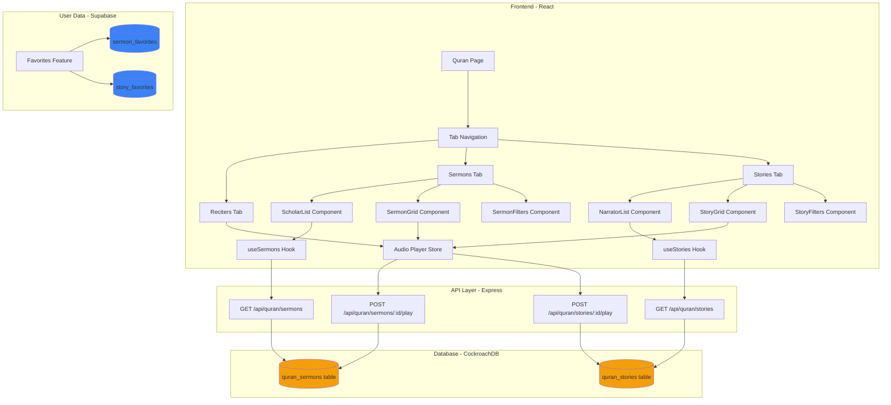
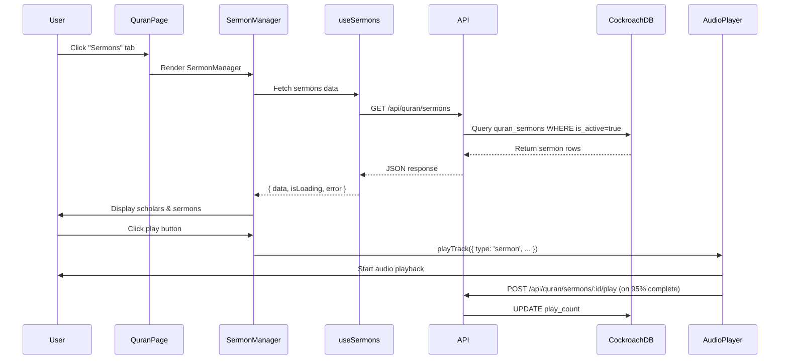

# Quran Sermons and Stories - Technical Design Document

## Overview

This design document specifies the technical implementation for adding Sermons (الخطب) and Stories (القصص) sections to the Quran page. The feature extends the existing Quran audio player infrastructure to support Islamic sermons and Quranic stories, maintaining the spiritual design aesthetic and CockroachDB-first architecture.

### Key Design Goals

1. **Consistency**: Follow existing Quran page patterns (ReciterList, SurahGrid, FilterBar)
2. **Reusability**: Create modular components that mirror reciter functionality
3. **Performance**: Implement efficient caching and lazy loading strategies
4. **Accessibility**: Ensure WCAG AA compliance with proper ARIA labels and keyboard navigation
5. **Database Architecture**: Store ALL content in CockroachDB (sermons, stories), use Supabase ONLY for user data (favorites)

### Technology Stack

- **Frontend**: React 18, TypeScript, Framer Motion, React Query
- **Backend**: Node.js Express API
- **Database**: CockroachDB (content), Supabase (user data only)
- **Audio**: HTML5 Audio API with existing Quran player integration
- **Styling**: Tailwind CSS with amber/gold spiritual theme

---

## Architecture

### High-Level Architecture Diagram



### Data Flow Architecture



---

## Components and Interfaces

### Component Hierarchy


```
QuranPage
├── TabNavigation
│   ├── RecitersTab (existing)
│   ├── SermonsTab (new)
│   └── StoriesTab (new)
│
├── SermonsTab
│   ├── ScholarList (mirrors ReciterList)
│   │   ├── SearchInput
│   │   ├── FeaturedToggle
│   │   └── ScholarCard[]
│   │
│   └── SermonContent
│       ├── ScholarHeader (mirrors ReciterHeader)
│       ├── SermonFilters (mirrors FilterBar)
│       │   ├── SearchInput
│       │   ├── CategoryFilter
│       │   └── ViewModeToggle
│       └── SermonGrid (mirrors SurahGrid)
│           └── SermonCard[]
│
└── StoriesTab
    ├── NarratorList (mirrors ReciterList)
    │   ├── SearchInput
    │   ├── FeaturedToggle
    │   └── NarratorCard[]
    │
    └── StoryContent
        ├── NarratorHeader (mirrors ReciterHeader)
        ├── StoryFilters (mirrors FilterBar)
        │   ├── SearchInput
        │   ├── CategoryFilter
        │   └── ViewModeToggle
        └── StoryGrid (mirrors SurahGrid)
            └── StoryCard[]
```

### TypeScript Interfaces

#### Core Types

```typescript
// src/types/quran-sermons.ts

export type SermonCategory = 
  | 'friday-khutbah'
  | 'ramadan'
  | 'hajj'
  | 'eid'
  | 'general-guidance'
  | 'youth'
  | 'family'
  | 'tafsir'

export type Sermon = {
  id: number
  title_ar: string
  title_en: string
  scholar_name_ar: string
  scholar_name_en: string
  scholar_image: string | null
  audio_url: string
  duration_seconds: number
  description_ar: string | null
  description_en: string | null
  category: SermonCategory
  featured: boolean
  is_active: boolean
  play_count: number
  created_at: string
  updated_at: string
}

export type Scholar = {
  name_ar: string
  name_en: string
  image: string | null
  sermon_count: number
  featured: boolean
  sermons: Sermon[]
}
```


```typescript
// src/types/quran-stories.ts

export type StoryCategory = 
  | 'prophets'
  | 'companions'
  | 'quranic-stories'
  | 'historical-events'
  | 'moral-lessons'
  | 'miracles'
  | 'battles'
  | 'women-in-islam'

export type Story = {
  id: number
  title_ar: string
  title_en: string
  narrator_name_ar: string
  narrator_name_en: string
  narrator_image: string | null
  audio_url: string
  duration_seconds: number
  description_ar: string | null
  description_en: string | null
  category: StoryCategory
  source_reference: string | null
  featured: boolean
  is_active: boolean
  play_count: number
  created_at: string
  updated_at: string
}

export type Narrator = {
  name_ar: string
  name_en: string
  image: string | null
  story_count: number
  featured: boolean
  stories: Story[]
}
```

#### Extended Audio Player Types

```typescript
// src/types/quran-player.ts (additions)

export type TrackType = 'recitation' | 'sermon' | 'story'

export type QuranTrack = {
  id: number | string
  title: string
  reciter: string // For sermons: scholar name, for stories: narrator name
  url: string
  image?: string | null
  type: TrackType // NEW: Track type identifier
  
  // Existing metadata
  surahNumber?: number
  surahType?: 'Meccan' | 'Medinan'
  ayahCount?: number
  arabicName?: string
  englishName?: string
  
  // NEW: Sermon/Story metadata
  category?: string
  duration?: number // Duration in seconds
  description?: string
}
```

### Component Props Interfaces

```typescript
// ScholarList Component Props
interface ScholarListProps {
  scholars: Scholar[]
  selectedScholar: Scholar | null
  onSelect: (scholar: Scholar) => void
  isLoading: boolean
}

// SermonGrid Component Props
interface SermonGridProps {
  sermons: Sermon[]
  selectedScholar: Scholar | null
  viewMode: 'grid' | 'list'
  isPlaying: boolean
  currentTrack: QuranTrack | null
  onPlaySermon: (sermon: Sermon) => void
}

// SermonFilters Component Props
interface SermonFiltersProps {
  searchQuery: string
  setSearchQuery: (value: string) => void
  selectedCategories: SermonCategory[]
  setSelectedCategories: (categories: SermonCategory[]) => void
  viewMode: 'grid' | 'list'
  setViewMode: (mode: 'grid' | 'list') => void
  filteredCount: number
}
```

---

## Data Models

### Database Schema - CockroachDB

#### quran_sermons Table

```sql
CREATE TABLE quran_sermons (
  id SERIAL PRIMARY KEY,
  title_ar TEXT NOT NULL,
  title_en TEXT NOT NULL,
  scholar_name_ar TEXT NOT NULL,
  scholar_name_en TEXT NOT NULL,
  scholar_image TEXT,
  audio_url TEXT NOT NULL,
  duration_seconds INTEGER NOT NULL,
  description_ar TEXT,
  description_en TEXT,
  category TEXT NOT NULL,
  featured BOOLEAN DEFAULT FALSE,
  is_active BOOLEAN DEFAULT TRUE,
  play_count INTEGER DEFAULT 0,
  created_at TIMESTAMPTZ DEFAULT NOW(),
  updated_at TIMESTAMPTZ DEFAULT NOW(),
  
  -- Constraints
  CONSTRAINT valid_audio_url CHECK (audio_url ~ '^https?://'),
  CONSTRAINT valid_duration CHECK (duration_seconds > 0),
  CONSTRAINT valid_category CHECK (category IN (
    'friday-khutbah', 'ramadan', 'hajj', 'eid',
    'general-guidance', 'youth', 'family', 'tafsir'
  ))
);

-- Indexes for performance
CREATE INDEX idx_sermons_category ON quran_sermons(category);
CREATE INDEX idx_sermons_featured ON quran_sermons(featured);
CREATE INDEX idx_sermons_is_active ON quran_sermons(is_active);
CREATE INDEX idx_sermons_scholar_ar ON quran_sermons(scholar_name_ar);
CREATE INDEX idx_sermons_scholar_en ON quran_sermons(scholar_name_en);
CREATE INDEX idx_sermons_play_count ON quran_sermons(play_count DESC);

-- Trigger for updated_at
CREATE OR REPLACE FUNCTION update_updated_at_column()
RETURNS TRIGGER AS $$
BEGIN
  NEW.updated_at = NOW();
  RETURN NEW;
END;
$$ language 'plpgsql';

CREATE TRIGGER update_sermons_updated_at BEFORE UPDATE ON quran_sermons
FOR EACH ROW EXECUTE FUNCTION update_updated_at_column();
```


#### quran_stories Table

```sql
CREATE TABLE quran_stories (
  id SERIAL PRIMARY KEY,
  title_ar TEXT NOT NULL,
  title_en TEXT NOT NULL,
  narrator_name_ar TEXT NOT NULL,
  narrator_name_en TEXT NOT NULL,
  narrator_image TEXT,
  audio_url TEXT NOT NULL,
  duration_seconds INTEGER NOT NULL,
  description_ar TEXT,
  description_en TEXT,
  category TEXT NOT NULL,
  source_reference TEXT,
  featured BOOLEAN DEFAULT FALSE,
  is_active BOOLEAN DEFAULT TRUE,
  play_count INTEGER DEFAULT 0,
  created_at TIMESTAMPTZ DEFAULT NOW(),
  updated_at TIMESTAMPTZ DEFAULT NOW(),
  
  -- Constraints
  CONSTRAINT valid_audio_url CHECK (audio_url ~ '^https?://'),
  CONSTRAINT valid_duration CHECK (duration_seconds > 0),
  CONSTRAINT valid_category CHECK (category IN (
    'prophets', 'companions', 'quranic-stories', 'historical-events',
    'moral-lessons', 'miracles', 'battles', 'women-in-islam'
  ))
);

-- Indexes for performance
CREATE INDEX idx_stories_category ON quran_stories(category);
CREATE INDEX idx_stories_featured ON quran_stories(featured);
CREATE INDEX idx_stories_is_active ON quran_stories(is_active);
CREATE INDEX idx_stories_narrator_ar ON quran_stories(narrator_name_ar);
CREATE INDEX idx_stories_narrator_en ON quran_stories(narrator_name_en);
CREATE INDEX idx_stories_play_count ON quran_stories(play_count DESC);

-- Trigger for updated_at
CREATE TRIGGER update_stories_updated_at BEFORE UPDATE ON quran_stories
FOR EACH ROW EXECUTE FUNCTION update_updated_at_column();
```

### User Data Schema - Supabase (Optional Features)

**CRITICAL**: These tables are ONLY for user-specific data, NOT content.

```sql
-- Supabase: sermon_favorites table
CREATE TABLE sermon_favorites (
  id UUID PRIMARY KEY DEFAULT uuid_generate_v4(),
  user_id UUID NOT NULL REFERENCES auth.users(id) ON DELETE CASCADE,
  sermon_id INTEGER NOT NULL, -- References CockroachDB quran_sermons.id
  created_at TIMESTAMPTZ DEFAULT NOW(),
  
  UNIQUE(user_id, sermon_id)
);

CREATE INDEX idx_sermon_favorites_user ON sermon_favorites(user_id);
CREATE INDEX idx_sermon_favorites_sermon ON sermon_favorites(sermon_id);

-- Supabase: story_favorites table
CREATE TABLE story_favorites (
  id UUID PRIMARY KEY DEFAULT uuid_generate_v4(),
  user_id UUID NOT NULL REFERENCES auth.users(id) ON DELETE CASCADE,
  story_id INTEGER NOT NULL, -- References CockroachDB quran_stories.id
  created_at TIMESTAMPTZ DEFAULT NOW(),
  
  UNIQUE(user_id, story_id)
);

CREATE INDEX idx_story_favorites_user ON story_favorites(user_id);
CREATE INDEX idx_story_favorites_story ON story_favorites(story_id);
```

### Data Transformation Layer

```typescript
// src/lib/sermon-utils.ts

/**
 * Groups sermons by scholar and calculates metadata
 */
export function groupSermonsByScholar(sermons: Sermon[]): Scholar[] {
  const scholarMap = new Map<string, Scholar>()
  
  sermons.forEach(sermon => {
    const key = sermon.scholar_name_en
    
    if (!scholarMap.has(key)) {
      scholarMap.set(key, {
        name_ar: sermon.scholar_name_ar,
        name_en: sermon.scholar_name_en,
        image: sermon.scholar_image,
        sermon_count: 0,
        featured: sermon.featured,
        sermons: []
      })
    }
    
    const scholar = scholarMap.get(key)!
    scholar.sermons.push(sermon)
    scholar.sermon_count++
    
    // Mark scholar as featured if any sermon is featured
    if (sermon.featured) {
      scholar.featured = true
    }
  })
  
  return Array.from(scholarMap.values())
    .sort((a, b) => {
      // Featured first
      if (a.featured && !b.featured) return -1
      if (!a.featured && b.featured) return 1
      
      // Then by sermon count
      return b.sermon_count - a.sermon_count
    })
}

/**
 * Formats duration in seconds to MM:SS or HH:MM:SS
 */
export function formatDuration(seconds: number): string {
  const hours = Math.floor(seconds / 3600)
  const minutes = Math.floor((seconds % 3600) / 60)
  const secs = seconds % 60
  
  if (hours > 0) {
    return `${hours}:${minutes.toString().padStart(2, '0')}:${secs.toString().padStart(2, '0')}`
  }
  
  return `${minutes}:${secs.toString().padStart(2, '0')}`
}

/**
 * Formats play count with K/M suffixes
 */
export function formatPlayCount(count: number): string {
  if (count >= 1000000) {
    return `${(count / 1000000).toFixed(1)}M`
  }
  if (count >= 1000) {
    return `${(count / 1000).toFixed(1)}K`
  }
  return count.toString()
}
```

---


## API Endpoints

### Sermons API

#### GET /api/quran/sermons

Fetches all active sermons with optional filtering.

**Query Parameters:**
- `category` (optional): Filter by sermon category
- `featured` (optional): If "true", return only featured sermons
- `scholar` (optional): Filter by scholar name (matches Arabic or English)

**Response:**
```typescript
{
  sermons: Sermon[]
}
```

**Implementation:**
```javascript
// server/api/quran/sermons.js
import { query } from '../../db/index.js'

export async function GET(req, res) {
  try {
    const { category, featured, scholar } = req.query
    
    let sql = 'SELECT * FROM quran_sermons WHERE is_active = true'
    const params = []
    let paramIndex = 1
    
    if (category) {
      sql += ` AND category = $${paramIndex++}`
      params.push(category)
    }
    
    if (featured === 'true') {
      sql += ` AND featured = true`
    }
    
    if (scholar) {
      sql += ` AND (scholar_name_ar ILIKE $${paramIndex} OR scholar_name_en ILIKE $${paramIndex})`
      params.push(`%${scholar}%`)
      paramIndex++
    }
    
    sql += ' ORDER BY featured DESC, play_count DESC, created_at DESC'
    
    const result = await query(sql, params)
    
    res.json({ sermons: result.rows })
  } catch (error) {
    console.error('Error fetching sermons:', error)
    res.status(500).json({ 
      error: 'Failed to fetch sermons',
      message: error.message 
    })
  }
}
```

#### POST /api/quran/sermons/:id/play

Increments play count for a sermon.

**Request Body:** None

**Response:**
```typescript
{
  success: boolean
  play_count: number
}
```

**Implementation:**
```javascript
// server/api/quran/sermons/[id]/play.js
import { query } from '../../../db/index.js'

export async function POST(req, res) {
  try {
    const { id } = req.params
    
    const result = await query(
      `UPDATE quran_sermons 
       SET play_count = play_count + 1 
       WHERE id = $1 AND is_active = true
       RETURNING play_count`,
      [id]
    )
    
    if (result.rows.length === 0) {
      return res.status(404).json({ error: 'Sermon not found' })
    }
    
    res.json({ 
      success: true, 
      play_count: result.rows[0].play_count 
    })
  } catch (error) {
    console.error('Error incrementing sermon play count:', error)
    res.status(500).json({ 
      error: 'Failed to update play count',
      message: error.message 
    })
  }
}
```

### Stories API

#### GET /api/quran/stories

Fetches all active stories with optional filtering.

**Query Parameters:**
- `category` (optional): Filter by story category
- `featured` (optional): If "true", return only featured stories
- `narrator` (optional): Filter by narrator name (matches Arabic or English)

**Response:**
```typescript
{
  stories: Story[]
}
```

**Implementation:**
```javascript
// server/api/quran/stories.js
import { query } from '../../db/index.js'

export async function GET(req, res) {
  try {
    const { category, featured, narrator } = req.query
    
    let sql = 'SELECT * FROM quran_stories WHERE is_active = true'
    const params = []
    let paramIndex = 1
    
    if (category) {
      sql += ` AND category = $${paramIndex++}`
      params.push(category)
    }
    
    if (featured === 'true') {
      sql += ` AND featured = true`
    }
    
    if (narrator) {
      sql += ` AND (narrator_name_ar ILIKE $${paramIndex} OR narrator_name_en ILIKE $${paramIndex})`
      params.push(`%${narrator}%`)
      paramIndex++
    }
    
    sql += ' ORDER BY featured DESC, play_count DESC, created_at DESC'
    
    const result = await query(sql, params)
    
    res.json({ stories: result.rows })
  } catch (error) {
    console.error('Error fetching stories:', error)
    res.status(500).json({ 
      error: 'Failed to fetch stories',
      message: error.message 
    })
  }
}
```

#### POST /api/quran/stories/:id/play

Increments play count for a story.

**Implementation:** (Same pattern as sermons)

---

## React Hooks

### useSermons Hook

```typescript
// src/hooks/useSermons.ts
import { useQuery } from '@tanstack/react-query'
import { errorLogger } from '../services/errorLogging'
import type { Sermon } from '../types/quran-sermons'

const API_BASE = import.meta.env.VITE_API_BASE_URL || ''

interface UseSermonsOptions {
  category?: string
  featured?: boolean
  scholar?: string
}

export const useSermons = (options: UseSermonsOptions = {}) => {
  return useQuery({
    queryKey: ['quran-sermons', options],
    queryFn: async () => {
      try {
        const params = new URLSearchParams()
        
        if (options.category) params.append('category', options.category)
        if (options.featured) params.append('featured', 'true')
        if (options.scholar) params.append('scholar', options.scholar)
        
        const url = `${API_BASE}/api/quran/sermons${params.toString() ? `?${params}` : ''}`
        const response = await fetch(url)
        
        if (!response.ok) {
          throw new Error(`HTTP error! status: ${response.status}`)
        }
        
        const data = await response.json()
        return data.sermons as Sermon[]
      } catch (error) {
        errorLogger.logError({
          message: 'Error fetching Quran sermons',
          severity: 'medium',
          category: 'api',
          context: { error, options }
        })
        throw error
      }
    },
    staleTime: 1000 * 60 * 5, // 5 minutes
    retry: 3,
    retryDelay: (attemptIndex) => Math.min(1000 * 2 ** attemptIndex, 30000)
  })
}
```


### useStories Hook

```typescript
// src/hooks/useStories.ts
import { useQuery } from '@tanstack/react-query'
import { errorLogger } from '../services/errorLogging'
import type { Story } from '../types/quran-stories'

const API_BASE = import.meta.env.VITE_API_BASE_URL || ''

interface UseStoriesOptions {
  category?: string
  featured?: boolean
  narrator?: string
}

export const useStories = (options: UseStoriesOptions = {}) => {
  return useQuery({
    queryKey: ['quran-stories', options],
    queryFn: async () => {
      try {
        const params = new URLSearchParams()
        
        if (options.category) params.append('category', options.category)
        if (options.featured) params.append('featured', 'true')
        if (options.narrator) params.append('narrator', options.narrator)
        
        const url = `${API_BASE}/api/quran/stories${params.toString() ? `?${params}` : ''}`
        const response = await fetch(url)
        
        if (!response.ok) {
          throw new Error(`HTTP error! status: ${response.status}`)
        }
        
        const data = await response.json()
        return data.stories as Story[]
      } catch (error) {
        errorLogger.logError({
          message: 'Error fetching Quran stories',
          severity: 'medium',
          category: 'api',
          context: { error, options }
        })
        throw error
      }
    },
    staleTime: 1000 * 60 * 5, // 5 minutes
    retry: 3,
    retryDelay: (attemptIndex) => Math.min(1000 * 2 ** attemptIndex, 30000)
  })
}
```

### useSermonAudio Hook

```typescript
// src/hooks/useSermonAudio.ts
import { useCallback } from 'react'
import { useQuranPlayerStore } from '../state/useQuranPlayerStore'
import type { Sermon } from '../types/quran-sermons'
import { logger } from '../lib/logger'

const API_BASE = import.meta.env.VITE_API_BASE_URL || ''

export const useSermonAudio = () => {
  const { playTrack, currentTrack, isPlaying } = useQuranPlayerStore()

  const playSermon = useCallback((sermon: Sermon) => {
    // Ensure HTTPS URL
    let audioUrl = sermon.audio_url
    if (audioUrl.startsWith('http:')) {
      audioUrl = audioUrl.replace('http:', 'https:')
    }
    
    // Ensure scholar image is HTTPS
    let imageUrl = sermon.scholar_image
    if (imageUrl && imageUrl.startsWith('http:')) {
      imageUrl = imageUrl.replace('http:', 'https:')
    }

    playTrack({
      id: `sermon-${sermon.id}`,
      title: sermon.title_ar, // Will be switched based on lang in player
      reciter: sermon.scholar_name_ar, // Scholar name
      url: audioUrl,
      image: imageUrl,
      type: 'sermon',
      category: sermon.category,
      duration: sermon.duration_seconds,
      description: sermon.description_ar
    })
  }, [playTrack])

  const isCurrentSermon = useCallback((sermonId: number) => {
    if (!currentTrack) return false
    return currentTrack.id === `sermon-${sermonId}`
  }, [currentTrack])
  
  // Track play completion for analytics
  const trackPlayCompletion = useCallback(async (sermonId: number) => {
    try {
      await fetch(`${API_BASE}/api/quran/sermons/${sermonId}/play`, {
        method: 'POST'
      })
    } catch (error) {
      logger.error('Failed to track sermon play completion:', error)
      // Don't throw - this is analytics, shouldn't break playback
    }
  }, [])

  return {
    playSermon,
    isCurrentSermon,
    trackPlayCompletion,
    isPlaying,
    currentTrack
  }
}
```

### useStoryAudio Hook

```typescript
// src/hooks/useStoryAudio.ts
import { useCallback } from 'react'
import { useQuranPlayerStore } from '../state/useQuranPlayerStore'
import type { Story } from '../types/quran-stories'
import { logger } from '../lib/logger'

const API_BASE = import.meta.env.VITE_API_BASE_URL || ''

export const useStoryAudio = () => {
  const { playTrack, currentTrack, isPlaying } = useQuranPlayerStore()

  const playStory = useCallback((story: Story) => {
    // Ensure HTTPS URL
    let audioUrl = story.audio_url
    if (audioUrl.startsWith('http:')) {
      audioUrl = audioUrl.replace('http:', 'https:')
    }
    
    // Ensure narrator image is HTTPS
    let imageUrl = story.narrator_image
    if (imageUrl && imageUrl.startsWith('http:')) {
      imageUrl = imageUrl.replace('http:', 'https:')
    }

    playTrack({
      id: `story-${story.id}`,
      title: story.title_ar,
      reciter: story.narrator_name_ar, // Narrator name
      url: audioUrl,
      image: imageUrl,
      type: 'story',
      category: story.category,
      duration: story.duration_seconds,
      description: story.description_ar
    })
  }, [playTrack])

  const isCurrentStory = useCallback((storyId: number) => {
    if (!currentTrack) return false
    return currentTrack.id === `story-${storyId}`
  }, [currentTrack])
  
  const trackPlayCompletion = useCallback(async (storyId: number) => {
    try {
      await fetch(`${API_BASE}/api/quran/stories/${storyId}/play`, {
        method: 'POST'
      })
    } catch (error) {
      logger.error('Failed to track story play completion:', error)
    }
  }, [])

  return {
    playStory,
    isCurrentStory,
    trackPlayCompletion,
    isPlaying,
    currentTrack
  }
}
```

---

## Audio Player Integration

### Player Store Updates

The existing `useQuranPlayerStore` needs minimal updates to support sermon and story tracks:

```typescript
// src/state/useQuranPlayerStore.ts (additions)

interface QuranPlayerState {
  // ... existing state
  
  // Track play completion for analytics
  onTrackComplete?: (trackId: string | number, trackType: TrackType) => void
}

// In the audio event listeners
audioRef.current.addEventListener('timeupdate', () => {
  const progress = (audioRef.current.currentTime / audioRef.current.duration) * 100
  
  // Track completion at 95%
  if (progress >= 95 && !trackCompletedRef.current) {
    trackCompletedRef.current = true
    
    const track = get().currentTrack
    if (track && get().onTrackComplete) {
      get().onTrackComplete(track.id, track.type || 'recitation')
    }
  }
})
```

### Play Count Tracking

```typescript
// src/lib/play-tracking.ts

const PLAY_TRACKING_KEY = 'quran_play_tracking'
const TRACKING_WINDOW = 60 * 60 * 1000 // 1 hour in milliseconds

interface PlayTrackingEntry {
  trackId: string
  trackType: 'recitation' | 'sermon' | 'story'
  timestamp: number
}

/**
 * Checks if a track was recently played (within 1 hour)
 * to prevent duplicate play count increments
 */
export function wasRecentlyPlayed(trackId: string, trackType: string): boolean {
  try {
    const stored = localStorage.getItem(PLAY_TRACKING_KEY)
    if (!stored) return false
    
    const entries: PlayTrackingEntry[] = JSON.parse(stored)
    const now = Date.now()
    
    // Clean old entries
    const validEntries = entries.filter(e => now - e.timestamp < TRACKING_WINDOW)
    
    // Check if this track was recently played
    const found = validEntries.find(e => 
      e.trackId === trackId && e.trackType === trackType
    )
    
    // Update storage with cleaned entries
    localStorage.setItem(PLAY_TRACKING_KEY, JSON.stringify(validEntries))
    
    return !!found
  } catch (error) {
    console.error('Error checking play tracking:', error)
    return false
  }
}

/**
 * Records that a track was played
 */
export function recordPlayTracking(trackId: string, trackType: string): void {
  try {
    const stored = localStorage.getItem(PLAY_TRACKING_KEY)
    const entries: PlayTrackingEntry[] = stored ? JSON.parse(stored) : []
    
    entries.push({
      trackId,
      trackType,
      timestamp: Date.now()
    })
    
    localStorage.setItem(PLAY_TRACKING_KEY, JSON.stringify(entries))
  } catch (error) {
    console.error('Error recording play tracking:', error)
  }
}
```

---


## Component Implementation Examples

### ScholarList Component

```typescript
// src/components/features/quran/ScholarList.tsx
import { useState, useMemo } from 'react'
import { motion, AnimatePresence } from 'framer-motion'
import { Search, User, Heart } from 'lucide-react'
import { useLang } from '../../../state/useLang'
import { GlassInput } from '../../common/GlassInput'
import type { Scholar } from '../../../types/quran-sermons'

interface ScholarListProps {
  scholars: Scholar[]
  selectedScholar: Scholar | null
  onSelect: (scholar: Scholar) => void
  isLoading: boolean
}

export const ScholarList = ({ scholars, selectedScholar, onSelect, isLoading }: ScholarListProps) => {
  const { lang } = useLang()
  const [searchQuery, setSearchQuery] = useState('')
  const [showFeaturedOnly, setShowFeaturedOnly] = useState(false)

  const filteredScholars = useMemo(() => {
    return scholars.filter(scholar => {
      if (showFeaturedOnly && !scholar.featured) return false
      if (!searchQuery) return true
      
      const q = searchQuery.toLowerCase()
      return (
        scholar.name_ar.toLowerCase().includes(q) ||
        scholar.name_en.toLowerCase().includes(q)
      )
    })
  }, [scholars, searchQuery, showFeaturedOnly])

  return (
    <div className="w-full lg:w-64 xl:w-72 shrink-0 flex flex-col bg-amber-950/20 backdrop-blur-2xl border border-amber-500/10 rounded-3xl overflow-hidden shadow-[0_0_40px_rgba(0,0,0,0.5)] lg:h-full h-[350px] relative z-10">
      <div className="p-4 border-b border-amber-500/10 bg-gradient-to-b from-amber-500/5 to-transparent shrink-0">
        <div className="flex items-center justify-between mb-4">
          <h2 className="text-xl font-bold font-amiri flex items-center gap-3 text-amber-400">
            <div className="w-8 h-8 rounded-lg bg-amber-500/10 flex items-center justify-center border border-amber-500/20">
              <User size={18} />
            </div>
            {lang === 'ar' ? 'العلماء' : 'Scholars'}
            <span className="text-xs text-amber-600/60 font-sans">({filteredScholars.length})</span>
          </h2>
          <button
            onClick={() => setShowFeaturedOnly(!showFeaturedOnly)}
            className={`flex items-center gap-2 px-3 py-1.5 rounded-full text-xs font-bold transition-all duration-300 ${
              showFeaturedOnly 
                ? 'bg-amber-500 text-black shadow-[0_0_15px_rgba(245,158,11,0.4)]' 
                : 'bg-amber-500/5 text-amber-400 border border-amber-500/20 hover:bg-amber-500/10'
            }`}
          >
            {lang === 'ar' ? 'المميزين' : 'Featured'}
          </button>
        </div>

        <GlassInput 
          placeholder={lang === 'ar' ? 'بحث عن عالم...' : 'Search scholar...'}
          value={searchQuery}
          onChange={(e) => setSearchQuery(e.target.value)}
          className="py-2.5"
        />
      </div>

      <div className="flex-1 overflow-y-auto custom-scrollbar p-2 space-y-2">
        {isLoading ? (
          <div className="flex flex-col items-center justify-center h-40 text-amber-500/50 gap-4">
            <div className="w-10 h-10 border-2 border-amber-500 border-t-transparent rounded-full animate-spin" />
            <span className="text-xs font-bold uppercase tracking-widest">
              {lang === 'ar' ? 'جاري التحميل...' : 'Loading...'}
            </span>
          </div>
        ) : filteredScholars.length > 0 ? (
          <AnimatePresence mode="popLayout">
            {filteredScholars.map((scholar, idx) => (
              <motion.button
                layout
                initial={{ opacity: 0, x: -20 }}
                animate={{ opacity: 1, x: 0 }}
                transition={{ delay: idx * 0.03 }}
                key={scholar.name_en}
                onClick={() => onSelect(scholar)}
                className={`w-full flex items-center gap-3 p-2.5 rounded-2xl transition-all duration-300 group relative overflow-hidden ${
                  selectedScholar?.name_en === scholar.name_en
                    ? 'bg-amber-500/10 border border-amber-500/30 shadow-[0_0_20px_rgba(245,158,11,0.05)]' 
                    : 'hover:bg-amber-500/5 border border-transparent'
                }`}
              >
                {selectedScholar?.name_en === scholar.name_en && (
                  <motion.div 
                    layoutId="active-scholar"
                    className="absolute left-0 top-0 w-1 h-full bg-amber-500"
                  />
                )}
                
                <div className={`relative w-10 h-10 rounded-xl overflow-hidden border-2 transition-all duration-500 shrink-0 ${
                  selectedScholar?.name_en === scholar.name_en
                    ? 'border-amber-500 rotate-3 scale-110 shadow-lg' 
                    : 'border-amber-500/10 group-hover:border-amber-500/30'
                }`}>
                  {scholar.image ? (
                    
                  ) : (
                    <div className="w-full h-full bg-amber-900/20 flex items-center justify-center">
                      <User size={20} className="text-amber-500/50" />
                    </div>
                  )}
                  <div className="absolute inset-0 bg-amber-900/10 group-hover:bg-transparent transition-colors" />
                </div>
                
                <div className="flex-1 text-left overflow-hidden">
                  <h3 className={`font-bold font-amiri truncate text-sm ${
                    selectedScholar?.name_en === scholar.name_en
                      ? 'text-amber-400' 
                      : 'text-amber-100/70 group-hover:text-white'
                  }`}>
                    {lang === 'ar' ? scholar.name_ar : scholar.name_en}
                  </h3>
                  <p className={`text-[10px] font-sans truncate transition-colors ${
                    selectedScholar?.name_en === scholar.name_en
                      ? 'text-amber-500/60' 
                      : 'text-amber-900'
                  }`}>
                    {scholar.sermon_count} {lang === 'ar' ? 'خطبة' : 'sermons'}
                  </p>
                </div>
                
                {scholar.featured && (
                  <Heart size={14} className={`shrink-0 transition-colors ${
                    selectedScholar?.name_en === scholar.name_en
                      ? 'text-amber-400 fill-amber-400' 
                      : 'text-amber-900 group-hover:text-amber-500'
                  }`} />
                )}
              </motion.button>
            ))}
          </AnimatePresence>
        ) : (
          <div className="flex flex-col items-center justify-center py-12 text-amber-900 gap-3">
            <Search size={32} strokeWidth={1} />
            <span className="text-sm font-amiri">
              {lang === 'ar' ? 'لم يتم العثور على العالم' : 'Scholar not found'}
            </span>
          </div>
        )}
      </div>
    </div>
  )
}
```


### SermonCard Component

```typescript
// src/components/features/quran/SermonCard.tsx
import { motion } from 'framer-motion'
import { Play, Pause, Clock } from 'lucide-react'
import { useLang } from '../../../state/useLang'
import { formatDuration, formatPlayCount } from '../../../lib/sermon-utils'
import type { Sermon } from '../../../types/quran-sermons'

interface SermonCardProps {
  sermon: Sermon
  active: boolean
  isPlaying: boolean
  onClick: () => void
  idx: number
  viewMode: 'grid' | 'list'
}

export const SermonCard = ({ sermon, active, isPlaying, onClick, idx, viewMode }: SermonCardProps) => {
  const { lang } = useLang()
  
  const categoryColors: Record<string, string> = {
    'friday-khutbah': 'bg-emerald-500/10 text-emerald-400 border-emerald-500/20',
    'ramadan': 'bg-purple-500/10 text-purple-400 border-purple-500/20',
    'hajj': 'bg-orange-500/10 text-orange-400 border-orange-500/20',
    'eid': 'bg-pink-500/10 text-pink-400 border-pink-500/20',
    'general-guidance': 'bg-blue-500/10 text-blue-400 border-blue-500/20',
    'youth': 'bg-cyan-500/10 text-cyan-400 border-cyan-500/20',
    'family': 'bg-rose-500/10 text-rose-400 border-rose-500/20',
    'tafsir': 'bg-amber-500/10 text-amber-400 border-amber-500/20'
  }
  
  const categoryLabels: Record<string, { ar: string; en: string }> = {
    'friday-khutbah': { ar: 'خطبة الجمعة', en: 'Friday Khutbah' },
    'ramadan': { ar: 'رمضان', en: 'Ramadan' },
    'hajj': { ar: 'الحج', en: 'Hajj' },
    'eid': { ar: 'العيد', en: 'Eid' },
    'general-guidance': { ar: 'إرشادات عامة', en: 'General' },
    'youth': { ar: 'الشباب', en: 'Youth' },
    'family': { ar: 'الأسرة', en: 'Family' },
    'tafsir': { ar: 'التفسير', en: 'Tafsir' }
  }

  if (viewMode === 'list') {
    return (
      <motion.button
        layout
        initial={{ opacity: 0, y: 20 }}
        animate={{ opacity: 1, y: 0 }}
        exit={{ opacity: 0, scale: 0.9 }}
        transition={{ delay: idx * 0.02 }}
        onClick={onClick}
        className={`w-full flex items-center gap-4 p-4 rounded-2xl transition-all duration-300 group ${
          active 
            ? 'bg-amber-500/10 border-2 border-amber-500/30 shadow-[0_0_20px_rgba(245,158,11,0.1)]' 
            : 'bg-[#0a0a0a]/50 border-2 border-white/5 hover:border-amber-500/20 hover:bg-amber-500/5'
        }`}
      >
        <div className={`w-12 h-12 rounded-xl flex items-center justify-center transition-all duration-300 ${
          active ? 'bg-amber-500 text-black' : 'bg-amber-900/20 text-amber-500 group-hover:bg-amber-500/20'
        }`}>
          {active && isPlaying ? (
            <Pause size={20} className="animate-pulse" />
          ) : (
            <Play size={20} />
          )}
        </div>
        
        <div className="flex-1 text-left">
          <h3 className={`font-bold font-amiri text-base mb-1 ${
            active ? 'text-amber-400' : 'text-white group-hover:text-amber-100'
          }`}>
            {lang === 'ar' ? sermon.title_ar : sermon.title_en}
          </h3>
          <div className="flex items-center gap-3 text-xs text-amber-100/50">
            <span className="flex items-center gap-1">
              <Clock size={12} />
              {formatDuration(sermon.duration_seconds)}
            </span>
            <span>•</span>
            <span>{formatPlayCount(sermon.play_count)} plays</span>
          </div>
        </div>
        
        <div className={`px-3 py-1 rounded-full text-xs font-bold border ${categoryColors[sermon.category]}`}>
          {lang === 'ar' ? categoryLabels[sermon.category].ar : categoryLabels[sermon.category].en}
        </div>
      </motion.button>
    )
  }

  // Grid view
  return (
    <motion.button
      layout
      initial={{ opacity: 0, scale: 0.8 }}
      animate={{ opacity: 1, scale: 1 }}
      exit={{ opacity: 0, scale: 0.8 }}
      transition={{ delay: idx * 0.02 }}
      onClick={onClick}
      className={`relative flex flex-col items-center justify-center p-4 rounded-2xl transition-all duration-300 group overflow-hidden ${
        active 
          ? 'bg-amber-500/10 border-2 border-amber-500/30 shadow-[0_0_20px_rgba(245,158,11,0.1)]' 
          : 'bg-[#0a0a0a]/50 border-2 border-white/5 hover:border-amber-500/20 hover:bg-amber-500/5'
      }`}
    >
      <div className={`w-16 h-16 rounded-full flex items-center justify-center mb-3 transition-all duration-300 ${
        active ? 'bg-amber-500 text-black scale-110' : 'bg-amber-900/20 text-amber-500 group-hover:bg-amber-500/20 group-hover:scale-105'
      }`}>
        {active && isPlaying ? (
          <Pause size={24} className="animate-pulse" />
        ) : (
          <Play size={24} />
        )}
      </div>
      
      <h3 className={`font-bold font-amiri text-sm text-center mb-2 line-clamp-2 ${
        active ? 'text-amber-400' : 'text-white group-hover:text-amber-100'
      }`}>
        {lang === 'ar' ? sermon.title_ar : sermon.title_en}
      </h3>
      
      <div className="flex flex-col items-center gap-1 text-xs text-amber-100/50 mb-2">
        <span className="flex items-center gap-1">
          <Clock size={12} />
          {formatDuration(sermon.duration_seconds)}
        </span>
        <span>{formatPlayCount(sermon.play_count)} plays</span>
      </div>
      
      <div className={`px-2 py-0.5 rounded-full text-[10px] font-bold border ${categoryColors[sermon.category]}`}>
        {lang === 'ar' ? categoryLabels[sermon.category].ar : categoryLabels[sermon.category].en}
      </div>
    </motion.button>
  )
}
```

### SermonFilters Component

```typescript
// src/components/features/quran/SermonFilters.tsx
import { Filter, Grid, List } from 'lucide-react'
import { GlassInput } from '../../common/GlassInput'
import { GlassButton } from '../../common/GlassButton'
import { useLang } from '../../../state/useLang'
import type { SermonCategory } from '../../../types/quran-sermons'

interface SermonFiltersProps {
  searchQuery: string
  setSearchQuery: (value: string) => void
  selectedCategories: SermonCategory[]
  setSelectedCategories: (categories: SermonCategory[]) => void
  viewMode: 'grid' | 'list'
  setViewMode: (mode: 'grid' | 'list') => void
  filteredCount: number
}

export const SermonFilters = ({
  searchQuery,
  setSearchQuery,
  selectedCategories,
  setSelectedCategories,
  viewMode,
  setViewMode,
  filteredCount
}: SermonFiltersProps) => {
  const { lang } = useLang()
  
  const categories: { value: SermonCategory; label: { ar: string; en: string } }[] = [
    { value: 'friday-khutbah', label: { ar: 'خطبة الجمعة', en: 'Friday' } },
    { value: 'ramadan', label: { ar: 'رمضان', en: 'Ramadan' } },
    { value: 'hajj', label: { ar: 'الحج', en: 'Hajj' } },
    { value: 'eid', label: { ar: 'العيد', en: 'Eid' } },
    { value: 'general-guidance', label: { ar: 'عامة', en: 'General' } },
    { value: 'youth', label: { ar: 'الشباب', en: 'Youth' } },
    { value: 'family', label: { ar: 'الأسرة', en: 'Family' } },
    { value: 'tafsir', label: { ar: 'التفسير', en: 'Tafsir' } }
  ]
  
  const toggleCategory = (category: SermonCategory) => {
    if (selectedCategories.includes(category)) {
      setSelectedCategories(selectedCategories.filter(c => c !== category))
    } else {
      setSelectedCategories([...selectedCategories, category])
    }
  }

  return (
    <div className="shrink-0 mb-6 space-y-4">
      <div className="flex flex-wrap items-center gap-4">
        <div className="relative flex-1 min-w-[280px]">
          <GlassInput
            placeholder={lang === 'ar' ? 'بحث عن خطبة...' : 'Search sermon...'}
            value={searchQuery}
            onChange={(e) => setSearchQuery(e.target.value)}
          />
        </div>
        
        <div className="flex items-center gap-1 bg-amber-950/60 border border-amber-500/20 rounded-xl p-1.5 backdrop-blur-md">
          <GlassButton
            size="icon"
            active={viewMode === 'grid'}
            onClick={() => setViewMode('grid')}
            title="Grid View"
          >
            <Grid size={16} />
          </GlassButton>
          <GlassButton
            size="icon"
            active={viewMode === 'list'}
            onClick={() => setViewMode('list')}
            title="List View"
          >
            <List size={16} />
          </GlassButton>
        </div>
      </div>
      
      <div className="flex flex-wrap items-center gap-2">
        {categories.map(cat => (
          <button
            key={cat.value}
            onClick={() => toggleCategory(cat.value)}
            className={`px-3 py-1.5 rounded-lg text-xs font-bold transition-all duration-300 ${
              selectedCategories.includes(cat.value)
                ? 'bg-amber-500 text-black shadow-[0_0_10px_rgba(245,158,11,0.3)]'
                : 'bg-amber-950/40 text-amber-400 border border-amber-500/20 hover:bg-amber-500/10'
            }`}
          >
            {lang === 'ar' ? cat.label.ar : cat.label.en}
          </button>
        ))}
      </div>
      
      <div className="flex items-center justify-between text-xs text-amber-700/60 font-amiri px-1">
        <span className="flex items-center gap-2">
          <Filter size={12} />
          {filteredCount} {lang === 'ar' ? 'خطبة' : 'sermons'}
        </span>
      </div>
    </div>
  )
}
```

---


## Correctness Properties

*A property is a characteristic or behavior that should hold true across all valid executions of a system—essentially, a formal statement about what the system should do. Properties serve as the bridge between human-readable specifications and machine-verifiable correctness guarantees.*

### Property Reflection

After analyzing all acceptance criteria, I identified the following testable properties. I've eliminated redundancy by:
- Combining properties that test the same underlying behavior
- Removing implementation-detail properties that are covered by higher-level properties
- Consolidating similar properties across sermons and stories into generalized properties

### Core Data Properties

#### Property 1: URL Validation for Audio Files

*For any* sermon or story record, if the audio_url field is provided, it must match a valid HTTP/HTTPS URL format.

**Validates: Requirements 1.5, 2.5**

#### Property 2: Active Content Filtering

*For any* API request to `/api/quran/sermons` or `/api/quran/stories`, all returned records must have `is_active = true`.

**Validates: Requirements 3.1, 4.1**

#### Property 3: Sorting Order Consistency

*For any* list of sermons or stories returned by the API, the records must be ordered by: featured DESC, then play_count DESC, then created_at DESC.

**Validates: Requirements 3.3, 4.3**

### Filtering Properties

#### Property 4: Category Filtering Accuracy

*For any* category filter parameter provided to the API, all returned sermons/stories must have a category field matching the specified category.

**Validates: Requirements 3.4, 4.4**

#### Property 5: Featured Content Filtering

*For any* API request with `featured=true` parameter, all returned sermons/stories must have `featured = true`.

**Validates: Requirements 3.5, 4.5**

#### Property 6: Scholar/Narrator Name Filtering

*For any* scholar or narrator name search query, all returned sermons/stories must match the query in either the Arabic or English name field (case-insensitive).

**Validates: Requirements 3.6, 4.6**

### UI Component Properties

#### Property 7: Search Filtering Completeness

*For any* search query in the scholar/narrator list, all displayed scholars/narrators must match the query in either Arabic or English name.

**Validates: Requirements 5.2, 6.2**

#### Property 8: Featured Toggle Filtering

*For any* state where the "Featured" toggle is enabled, all displayed scholars/narrators must have at least one featured sermon/story.

**Validates: Requirements 5.3, 6.3**

#### Property 9: Sermon/Story Card Required Fields

*For any* sermon or story card rendered in the UI, the card must display: title, duration, category, and play button.

**Validates: Requirements 5.5, 6.5**

#### Property 10: Content Search Filtering

*For any* search query in the sermon/story filters, all displayed sermons/stories must match the query in either title or category fields.

**Validates: Requirements 5.6, 6.6**

#### Property 11: Category Filter Accuracy

*For any* selected category in the filters, all displayed sermons/stories must belong to that category.

**Validates: Requirements 5.7, 6.7**

### Audio Player Properties

#### Property 12: Track Type Support

*For any* sermon track with type='sermon' or story track with type='story', the audio player must be able to play the track.

**Validates: Requirements 7.1, 7.2**

#### Property 13: Track Metadata Display

*For any* playing sermon or story, the audio player UI must display the correct scholar/narrator name and title.

**Validates: Requirements 7.3, 7.4**

#### Property 14: Playback State Preservation

*For any* tab switch operation (Reciters/Sermons/Stories), if a track is currently playing, playback must continue without interruption.

**Validates: Requirements 7.6, 9.8**

#### Property 15: Play Count Increment

*For any* sermon or story that reaches 95% playback completion, the play_count in the database must increase by exactly 1.

**Validates: Requirements 7.8, 17.1, 17.2**

### React Hook Properties

#### Property 16: Hook Return Shape

*For any* call to useSermons or useStories hooks, the return value must be an object containing `{ data, isLoading, error }` fields.

**Validates: Requirement 8.3**

#### Property 17: Filter Parameter Propagation

*For any* filter parameters passed to useSermons or useStories hooks, those parameters must be included in the API request query string.

**Validates: Requirement 8.5**

#### Property 18: Retry Logic on Failure

*For any* failed API request from useSermons or useStories hooks, the hook must automatically retry up to 3 times with exponential backoff.

**Validates: Requirement 8.7**

### Navigation Properties

#### Property 19: URL State Synchronization

*For any* tab selection (reciters/sermons/stories), the URL query parameter `?tab=` must reflect the active tab.

**Validates: Requirement 9.4**

#### Property 20: URL-Driven Tab Activation

*For any* page load with a valid `?tab=` query parameter, the system must activate the specified tab.

**Validates: Requirement 9.5**

### Category Management Properties

#### Property 21: Multi-Category Filtering

*For any* set of selected categories, all displayed sermons/stories must match at least one of the selected categories.

**Validates: Requirements 10.3, 11.3**

#### Property 22: Category Validation

*For any* category value submitted for database insertion, the insertion must only succeed if the category is in the predefined list.

**Validates: Requirements 10.4, 11.4**

#### Property 23: Category Count Accuracy

*For any* category displayed in the filter UI, the count shown must equal the actual number of sermons/stories in that category.

**Validates: Requirements 10.5, 11.5**

### Profile and Sorting Properties

#### Property 24: Scholar/Narrator Grouping

*For any* list of sermons/stories, when grouped by scholar/narrator, each group must contain only sermons/stories from that specific scholar/narrator.

**Validates: Requirements 12.1, 12.2**

#### Property 25: Profile Display Completeness

*For any* scholar/narrator displayed in the sidebar, the UI must show: name (Arabic and English), image or placeholder, sermon/story count, and featured badge if applicable.

**Validates: Requirement 12.3**

#### Property 26: Scholar/Narrator Sorting Order

*For any* list of scholars/narrators, the order must be: featured scholars/narrators first, then sorted by sermon/story count in descending order.

**Validates: Requirement 12.4**

### Search Properties

#### Property 27: Real-time Search with Debouncing

*For any* rapid sequence of search input changes, the search filtering must debounce with a 300ms delay before applying filters.

**Validates: Requirement 13.3**

#### Property 28: Unicode Search Support

*For any* search query containing Arabic Unicode characters, the search must correctly match Arabic text in titles and names.

**Validates: Requirement 13.4**

#### Property 29: Advanced Search Matching

*For any* search query, the system must support partial word matching and diacritics-insensitive matching for Arabic text.

**Validates: Requirement 13.7**

### Caching Properties

#### Property 30: API Response Caching

*For any* API request to sermons or stories endpoints, if the same request is made within 5 minutes, the cached response must be returned without making a new database query.

**Validates: Requirement 15.1**

### Analytics Properties

#### Property 31: Duplicate Play Prevention

*For any* sermon or story played twice within 1 hour by the same user, the play_count must only increment once.

**Validates: Requirement 17.5**

#### Property 32: Play Count Formatting

*For any* play count number displayed in the UI, numbers >= 1000 must be formatted with K suffix, and numbers >= 1000000 must be formatted with M suffix.

**Validates: Requirement 17.8**

---

## Error Handling

### Error Scenarios and Responses

#### Database Connection Failures

```typescript
// API Error Handler
try {
  const result = await query(sql, params)
  res.json({ sermons: result.rows })
} catch (error) {
  console.error('Database error:', error)
  
  // Log to error tracking service
  errorLogger.logError({
    message: 'Database query failed',
    severity: 'high',
    category: 'database',
    context: { sql, params, error: error.message }
  })
  
  res.status(500).json({
    error: 'Database temporarily unavailable',
    message: 'Please try again in a moment',
    code: 'DB_CONNECTION_ERROR'
  })
}
```

#### Audio Loading Failures

```typescript
// Audio Player Error Handler
audioRef.current.addEventListener('error', (e) => {
  const error = audioRef.current.error
  
  let errorMessage = 'Failed to load audio'
  
  switch (error?.code) {
    case MediaError.MEDIA_ERR_NETWORK:
      errorMessage = 'Network error while loading audio'
      break
    case MediaError.MEDIA_ERR_DECODE:
      errorMessage = 'Audio file is corrupted or unsupported'
      break
    case MediaError.MEDIA_ERR_SRC_NOT_SUPPORTED:
      errorMessage = 'Audio format not supported'
      break
  }
  
  // Show user-friendly error notification
  toast.error(errorMessage, {
    action: {
      label: 'Retry',
      onClick: () => audioRef.current?.load()
    }
  })
  
  // Log error but don't interrupt user experience
  errorLogger.logError({
    message: 'Audio playback error',
    severity: 'medium',
    category: 'audio',
    context: { 
      trackId: currentTrack?.id,
      errorCode: error?.code,
      url: currentTrack?.url
    }
  })
})
```

#### API Request Failures

```typescript
// React Query Error Handling
export const useSermons = (options: UseSermonsOptions = {}) => {
  return useQuery({
    queryKey: ['quran-sermons', options],
    queryFn: async () => {
      // ... fetch logic
    },
    retry: 3,
    retryDelay: (attemptIndex) => Math.min(1000 * 2 ** attemptIndex, 30000),
    onError: (error) => {
      // Show user-friendly error message
      toast.error(
        lang === 'ar' 
          ? 'فشل تحميل الخطب. يرجى المحاولة مرة أخرى.' 
          : 'Failed to load sermons. Please try again.',
        {
          action: {
            label: lang === 'ar' ? 'إعادة المحاولة' : 'Retry',
            onClick: () => queryClient.invalidateQueries(['quran-sermons'])
          }
        }
      )
    }
  })
}
```

### Loading States

```typescript
// Skeleton Loader Component
export const SermonCardSkeleton = () => (
  <div className="p-4 rounded-2xl bg-[#0a0a0a]/50 border-2 border-white/5 animate-pulse">
    <div className="w-16 h-16 rounded-full bg-amber-900/20 mx-auto mb-3" />
    <div className="h-4 bg-amber-900/20 rounded mb-2" />
    <div className="h-3 bg-amber-900/20 rounded w-2/3 mx-auto mb-2" />
    <div className="h-6 bg-amber-900/20 rounded-full w-20 mx-auto" />
  </div>
)

// Usage in SermonGrid
{isLoading ? (
  <div className="grid grid-cols-2 sm:grid-cols-3 md:grid-cols-4 lg:grid-cols-6 xl:grid-cols-8 gap-2">
    {Array.from({ length: 24 }).map((_, i) => (
      <SermonCardSkeleton key={i} />
    ))}
  </div>
) : (
  <SermonGrid sermons={sermons} ... />
)}
```

---


## Testing Strategy

### Dual Testing Approach

This feature requires both unit tests and property-based tests for comprehensive coverage:

- **Unit tests**: Verify specific examples, edge cases, and error conditions
- **Property tests**: Verify universal properties across all inputs

Both approaches are complementary and necessary. Unit tests catch concrete bugs in specific scenarios, while property tests verify general correctness across a wide range of inputs.

### Property-Based Testing Configuration

**Library**: Use `fast-check` for JavaScript/TypeScript property-based testing

**Configuration**:
- Minimum 100 iterations per property test (due to randomization)
- Each property test must reference its design document property
- Tag format: `Feature: quran-sermons-and-stories, Property {number}: {property_text}`

**Example Property Test**:

```typescript
// src/__tests__/quran-sermons/api-filtering.property.test.ts
import fc from 'fast-check'
import { describe, it, expect } from 'vitest'

/**
 * Feature: quran-sermons-and-stories
 * Property 4: Category Filtering Accuracy
 * 
 * For any category filter parameter provided to the API,
 * all returned sermons must have a category field matching the specified category.
 */
describe('Property 4: Category Filtering Accuracy', () => {
  it('should return only sermons matching the specified category', async () => {
    await fc.assert(
      fc.asyncProperty(
        fc.constantFrom(
          'friday-khutbah', 'ramadan', 'hajj', 'eid',
          'general-guidance', 'youth', 'family', 'tafsir'
        ),
        async (category) => {
          const response = await fetch(
            `http://localhost:3000/api/quran/sermons?category=${category}`
          )
          const data = await response.json()
          
          // All returned sermons must match the category
          expect(data.sermons.every(s => s.category === category)).toBe(true)
        }
      ),
      { numRuns: 100 }
    )
  })
})

/**
 * Feature: quran-sermons-and-stories
 * Property 15: Play Count Increment
 * 
 * For any sermon that reaches 95% playback completion,
 * the play_count in the database must increase by exactly 1.
 */
describe('Property 15: Play Count Increment', () => {
  it('should increment play_count by 1 when sermon completes', async () => {
    await fc.assert(
      fc.asyncProperty(
        fc.integer({ min: 1, max: 1000 }), // sermon ID
        async (sermonId) => {
          // Get initial play count
          const initialResponse = await fetch(
            `http://localhost:3000/api/quran/sermons`
          )
          const initialData = await initialResponse.json()
          const sermon = initialData.sermons.find(s => s.id === sermonId)
          
          if (!sermon) return true // Skip if sermon doesn't exist
          
          const initialCount = sermon.play_count
          
          // Trigger play completion
          await fetch(
            `http://localhost:3000/api/quran/sermons/${sermonId}/play`,
            { method: 'POST' }
          )
          
          // Get updated play count
          const updatedResponse = await fetch(
            `http://localhost:3000/api/quran/sermons`
          )
          const updatedData = await updatedResponse.json()
          const updatedSermon = updatedData.sermons.find(s => s.id === sermonId)
          
          // Play count must increase by exactly 1
          expect(updatedSermon.play_count).toBe(initialCount + 1)
        }
      ),
      { numRuns: 100 }
    )
  })
})
```

### Unit Testing Examples

```typescript
// src/__tests__/quran-sermons/sermon-utils.test.ts
import { describe, it, expect } from 'vitest'
import { groupSermonsByScholar, formatDuration, formatPlayCount } from '../../lib/sermon-utils'

describe('groupSermonsByScholar', () => {
  it('should group sermons by scholar name', () => {
    const sermons = [
      { scholar_name_en: 'Scholar A', scholar_name_ar: 'عالم أ', featured: true, /* ... */ },
      { scholar_name_en: 'Scholar A', scholar_name_ar: 'عالم أ', featured: false, /* ... */ },
      { scholar_name_en: 'Scholar B', scholar_name_ar: 'عالم ب', featured: false, /* ... */ }
    ]
    
    const scholars = groupSermonsByScholar(sermons)
    
    expect(scholars).toHaveLength(2)
    expect(scholars[0].sermon_count).toBe(2)
    expect(scholars[1].sermon_count).toBe(1)
  })
  
  it('should mark scholar as featured if any sermon is featured', () => {
    const sermons = [
      { scholar_name_en: 'Scholar A', featured: true, /* ... */ },
      { scholar_name_en: 'Scholar A', featured: false, /* ... */ }
    ]
    
    const scholars = groupSermonsByScholar(sermons)
    
    expect(scholars[0].featured).toBe(true)
  })
  
  it('should sort featured scholars first', () => {
    const sermons = [
      { scholar_name_en: 'Scholar A', featured: false, /* ... */ },
      { scholar_name_en: 'Scholar B', featured: true, /* ... */ }
    ]
    
    const scholars = groupSermonsByScholar(sermons)
    
    expect(scholars[0].name_en).toBe('Scholar B')
  })
})

describe('formatDuration', () => {
  it('should format seconds as MM:SS', () => {
    expect(formatDuration(125)).toBe('2:05')
    expect(formatDuration(59)).toBe('0:59')
  })
  
  it('should format long durations as HH:MM:SS', () => {
    expect(formatDuration(3665)).toBe('1:01:05')
    expect(formatDuration(7200)).toBe('2:00:00')
  })
})

describe('formatPlayCount', () => {
  it('should format numbers with K suffix', () => {
    expect(formatPlayCount(1500)).toBe('1.5K')
    expect(formatPlayCount(999)).toBe('999')
  })
  
  it('should format numbers with M suffix', () => {
    expect(formatPlayCount(1500000)).toBe('1.5M')
    expect(formatPlayCount(999999)).toBe('1000.0K')
  })
})
```

### Component Testing

```typescript
// src/__tests__/quran-sermons/ScholarList.test.tsx
import { describe, it, expect, vi } from 'vitest'
import { render, screen, fireEvent } from '@testing-library/react'
import { ScholarList } from '../../components/features/quran/ScholarList'

describe('ScholarList Component', () => {
  const mockScholars = [
    {
      name_ar: 'عالم أ',
      name_en: 'Scholar A',
      image: null,
      sermon_count: 10,
      featured: true,
      sermons: []
    },
    {
      name_ar: 'عالم ب',
      name_en: 'Scholar B',
      image: null,
      sermon_count: 5,
      featured: false,
      sermons: []
    }
  ]
  
  it('should render all scholars', () => {
    render(
      <ScholarList 
        scholars={mockScholars}
        selectedScholar={null}
        onSelect={vi.fn()}
        isLoading={false}
      />
    )
    
    expect(screen.getByText('Scholar A')).toBeInTheDocument()
    expect(screen.getByText('Scholar B')).toBeInTheDocument()
  })
  
  it('should filter scholars by search query', () => {
    render(
      <ScholarList 
        scholars={mockScholars}
        selectedScholar={null}
        onSelect={vi.fn()}
        isLoading={false}
      />
    )
    
    const searchInput = screen.getByPlaceholderText(/search scholar/i)
    fireEvent.change(searchInput, { target: { value: 'Scholar A' } })
    
    expect(screen.getByText('Scholar A')).toBeInTheDocument()
    expect(screen.queryByText('Scholar B')).not.toBeInTheDocument()
  })
  
  it('should show only featured scholars when toggle is active', () => {
    render(
      <ScholarList 
        scholars={mockScholars}
        selectedScholar={null}
        onSelect={vi.fn()}
        isLoading={false}
      />
    )
    
    const featuredToggle = screen.getByText(/featured/i)
    fireEvent.click(featuredToggle)
    
    expect(screen.getByText('Scholar A')).toBeInTheDocument()
    expect(screen.queryByText('Scholar B')).not.toBeInTheDocument()
  })
  
  it('should call onSelect when scholar is clicked', () => {
    const onSelect = vi.fn()
    
    render(
      <ScholarList 
        scholars={mockScholars}
        selectedScholar={null}
        onSelect={onSelect}
        isLoading={false}
      />
    )
    
    fireEvent.click(screen.getByText('Scholar A'))
    
    expect(onSelect).toHaveBeenCalledWith(mockScholars[0])
  })
})
```

### Integration Testing

```typescript
// src/__tests__/quran-sermons/sermon-flow.integration.test.ts
import { describe, it, expect, beforeAll, afterAll } from 'vitest'
import { setupServer } from 'msw/node'
import { http, HttpResponse } from 'msw'

const server = setupServer(
  http.get('/api/quran/sermons', () => {
    return HttpResponse.json({
      sermons: [
        {
          id: 1,
          title_ar: 'خطبة 1',
          title_en: 'Sermon 1',
          scholar_name_ar: 'عالم',
          scholar_name_en: 'Scholar',
          category: 'friday-khutbah',
          featured: true,
          is_active: true,
          play_count: 100,
          duration_seconds: 1800,
          audio_url: 'https://example.com/sermon1.mp3'
        }
      ]
    })
  })
)

beforeAll(() => server.listen())
afterAll(() => server.close())

describe('Sermon Flow Integration', () => {
  it('should fetch sermons, display them, and handle playback', async () => {
    // This would be a full E2E test with Playwright or Cypress
    // Testing: API fetch → UI render → User interaction → Audio playback
  })
})
```

### Accessibility Testing

```typescript
// src/__tests__/quran-sermons/accessibility.test.tsx
import { describe, it, expect } from 'vitest'
import { render } from '@testing-library/react'
import { axe, toHaveNoViolations } from 'jest-axe'
import { ScholarList } from '../../components/features/quran/ScholarList'

expect.extend(toHaveNoViolations)

describe('Accessibility Compliance', () => {
  it('should have no accessibility violations', async () => {
    const { container } = render(
      <ScholarList 
        scholars={[]}
        selectedScholar={null}
        onSelect={() => {}}
        isLoading={false}
      />
    )
    
    const results = await axe(container)
    expect(results).toHaveNoViolations()
  })
})
```

---


## Performance Optimizations

### Caching Strategy

```typescript
// React Query Configuration
const queryClient = new QueryClient({
  defaultOptions: {
    queries: {
      staleTime: 1000 * 60 * 5, // 5 minutes
      cacheTime: 1000 * 60 * 30, // 30 minutes
      refetchOnWindowFocus: false,
      refetchOnReconnect: true,
      retry: 3,
      retryDelay: (attemptIndex) => Math.min(1000 * 2 ** attemptIndex, 30000)
    }
  }
})
```

### Lazy Loading Images

```typescript
// src/components/features/quran/LazyImage.tsx
import { useState, useEffect, useRef } from 'react'

interface LazyImageProps {
  src: string | null
  alt: string
  className?: string
  fallback?: React.ReactNode
}

export const LazyImage = ({ src, alt, className, fallback }: LazyImageProps) => {
  const [isLoaded, setIsLoaded] = useState(false)
  const [isInView, setIsInView] = useState(false)
  const imgRef = useRef<HTMLImageElement>(null)

  useEffect(() => {
    if (!imgRef.current) return

    const observer = new IntersectionObserver(
      ([entry]) => {
        if (entry.isIntersecting) {
          setIsInView(true)
          observer.disconnect()
        }
      },
      { rootMargin: '50px' }
    )

    observer.observe(imgRef.current)

    return () => observer.disconnect()
  }, [])

  if (!src) {
    return <>{fallback}</>
  }

  return (
     setIsLoaded(true)}
      style={{ opacity: isLoaded ? 1 : 0, transition: 'opacity 0.3s' }}
    />
  )
}
```

### Pagination/Infinite Scroll

```typescript
// src/hooks/useInfiniteSermons.ts
import { useInfiniteQuery } from '@tanstack/react-query'

const SERMONS_PER_PAGE = 50

export const useInfiniteSermons = (options: UseSermonsOptions = {}) => {
  return useInfiniteQuery({
    queryKey: ['quran-sermons-infinite', options],
    queryFn: async ({ pageParam = 0 }) => {
      const params = new URLSearchParams({
        ...options,
        offset: pageParam.toString(),
        limit: SERMONS_PER_PAGE.toString()
      })
      
      const response = await fetch(`${API_BASE}/api/quran/sermons?${params}`)
      const data = await response.json()
      
      return {
        sermons: data.sermons,
        nextOffset: data.sermons.length === SERMONS_PER_PAGE 
          ? pageParam + SERMONS_PER_PAGE 
          : undefined
      }
    },
    getNextPageParam: (lastPage) => lastPage.nextOffset,
    staleTime: 1000 * 60 * 5
  })
}

// Usage in component
const { data, fetchNextPage, hasNextPage, isFetchingNextPage } = useInfiniteSermons()

// Intersection Observer for infinite scroll
useEffect(() => {
  const observer = new IntersectionObserver(
    ([entry]) => {
      if (entry.isIntersecting && hasNextPage && !isFetchingNextPage) {
        fetchNextPage()
      }
    },
    { rootMargin: '200px' }
  )
  
  if (loadMoreRef.current) {
    observer.observe(loadMoreRef.current)
  }
  
  return () => observer.disconnect()
}, [hasNextPage, isFetchingNextPage, fetchNextPage])
```

### Database Query Optimization

```sql
-- Add composite indexes for common query patterns
CREATE INDEX idx_sermons_active_featured_playcount 
ON quran_sermons(is_active, featured DESC, play_count DESC, created_at DESC);

CREATE INDEX idx_sermons_active_category 
ON quran_sermons(is_active, category);

CREATE INDEX idx_stories_active_featured_playcount 
ON quran_stories(is_active, featured DESC, play_count DESC, created_at DESC);

CREATE INDEX idx_stories_active_category 
ON quran_stories(is_active, category);

-- Analyze query performance
EXPLAIN ANALYZE 
SELECT * FROM quran_sermons 
WHERE is_active = true AND category = 'friday-khutbah'
ORDER BY featured DESC, play_count DESC, created_at DESC;
```

### Audio Preloading

```typescript
// Preload next sermon in queue
useEffect(() => {
  if (!currentTrack || !queue.length) return
  
  const currentIndex = queue.findIndex(t => t.id === currentTrack.id)
  const nextTrack = queue[currentIndex + 1]
  
  if (nextTrack) {
    // Preload audio metadata without downloading full file
    const audio = new Audio()
    audio.preload = 'metadata'
    audio.src = nextTrack.url
  }
}, [currentTrack, queue])
```

---

## Accessibility Implementation

### ARIA Labels and Roles

```typescript
// Accessible Sermon Card
<button
  onClick={onClick}
  className="sermon-card"
  aria-label={`Play sermon: ${sermon.title_en} by ${sermon.scholar_name_en}`}
  aria-pressed={active}
  role="button"
  tabIndex={0}
>
  <div aria-hidden="true">
    {active && isPlaying ? <Pause /> : <Play />}
  </div>
  <h3 id={`sermon-title-${sermon.id}`}>{sermon.title_en}</h3>
  <span aria-label={`Duration: ${formatDuration(sermon.duration_seconds)}`}>
    {formatDuration(sermon.duration_seconds)}
  </span>
</button>
```

### Keyboard Navigation

```typescript
// Keyboard navigation for sermon grid
const handleKeyDown = (e: React.KeyboardEvent, index: number) => {
  const columns = viewMode === 'grid' ? 8 : 1
  
  switch (e.key) {
    case 'ArrowRight':
      e.preventDefault()
      focusSermon(index + 1)
      break
    case 'ArrowLeft':
      e.preventDefault()
      focusSermon(index - 1)
      break
    case 'ArrowDown':
      e.preventDefault()
      focusSermon(index + columns)
      break
    case 'ArrowUp':
      e.preventDefault()
      focusSermon(index - columns)
      break
    case 'Enter':
    case ' ':
      e.preventDefault()
      onPlaySermon(sermons[index])
      break
  }
}
```

### Focus Management

```typescript
// Focus trap for modal dialogs
import { useFocusTrap } from '../hooks/useFocusTrap'

export const SermonDetailsModal = ({ sermon, onClose }) => {
  const modalRef = useFocusTrap()
  
  return (
    <div
      ref={modalRef}
      role="dialog"
      aria-modal="true"
      aria-labelledby="sermon-title"
      aria-describedby="sermon-description"
    >
      <h2 id="sermon-title">{sermon.title_en}</h2>
      <p id="sermon-description">{sermon.description_en}</p>
      <button onClick={onClose} aria-label="Close dialog">
        Close
      </button>
    </div>
  )
}
```

### Screen Reader Announcements

```typescript
// Live region for playback state changes
const [announcement, setAnnouncement] = useState('')

useEffect(() => {
  if (isPlaying && currentTrack) {
    setAnnouncement(
      `Now playing: ${currentTrack.title} by ${currentTrack.reciter}`
    )
  } else if (!isPlaying && currentTrack) {
    setAnnouncement('Playback paused')
  }
}, [isPlaying, currentTrack])

return (
  <>
    <div 
      role="status" 
      aria-live="polite" 
      aria-atomic="true"
      className="sr-only"
    >
      {announcement}
    </div>
    {/* Rest of component */}
  </>
)
```

### Reduced Motion Support

```css
/* src/styles/quran-sermons.css */

@media (prefers-reduced-motion: reduce) {
  .sermon-card,
  .scholar-card,
  .tab-transition {
    animation: none !important;
    transition: none !important;
  }
  
  .animate-pulse,
  .animate-spin {
    animation: none !important;
  }
}
```

---

## SEO Optimization

### Meta Tags Generation

```typescript
// src/pages/discovery/Quran.tsx
import { SeoHead } from '../../components/common/SeoHead'

export const QuranPage = () => {
  const { lang } = useLang()
  const [activeTab, setActiveTab] = useState<'reciters' | 'sermons' | 'stories'>('reciters')
  
  const getMetaTitle = () => {
    switch (activeTab) {
      case 'sermons':
        return lang === 'ar' 
          ? 'خطب إسلامية - استماع وتحميل' 
          : 'Islamic Sermons - Listen and Download'
      case 'stories':
        return lang === 'ar'
          ? 'قصص قرآنية وإسلامية - استماع'
          : 'Quranic and Islamic Stories - Listen'
      default:
        return lang === 'ar'
          ? 'القرآن الكريم - استماع وتلاوة'
          : 'Holy Quran - Listen and Recitation'
    }
  }
  
  const getMetaDescription = () => {
    switch (activeTab) {
      case 'sermons':
        return lang === 'ar'
          ? 'استمع إلى خطب إسلامية من علماء ودعاة مختلفين. خطب الجمعة، رمضان، الحج، والمزيد.'
          : 'Listen to Islamic sermons from various scholars. Friday khutbahs, Ramadan, Hajj, and more.'
      case 'stories':
        return lang === 'ar'
          ? 'استمع إلى قصص قرآنية وإسلامية مروية. قصص الأنبياء، الصحابة، والأحداث التاريخية.'
          : 'Listen to narrated Quranic and Islamic stories. Stories of prophets, companions, and historical events.'
      default:
        return lang === 'ar'
          ? 'استمع إلى القرآن الكريم بأصوات نخبة من القراء. تلاوات خاشعة بجودة عالية.'
          : 'Listen to the Holy Quran with elite reciters. High quality recitations.'
    }
  }
  
  return (
    <>
      <SeoHead
        title={getMetaTitle()}
        description={getMetaDescription()}
        type="website"
        ogImage="/images/quran-og.jpg"
      />
      {/* Rest of component */}
    </>
  )
}
```

### JSON-LD Structured Data

```typescript
// src/components/features/quran/SermonStructuredData.tsx
export const SermonStructuredData = ({ sermon }: { sermon: Sermon }) => {
  const structuredData = {
    '@context': 'https://schema.org',
    '@type': 'AudioObject',
    name: sermon.title_en,
    description: sermon.description_en,
    contentUrl: sermon.audio_url,
    duration: `PT${sermon.duration_seconds}S`,
    encodingFormat: 'audio/mpeg',
    author: {
      '@type': 'Person',
      name: sermon.scholar_name_en
    },
    genre: sermon.category,
    inLanguage: 'ar',
    interactionStatistic: {
      '@type': 'InteractionCounter',
      interactionType: 'https://schema.org/ListenAction',
      userInteractionCount: sermon.play_count
    }
  }
  
  return (
    <script
      type="application/ld+json"
      dangerouslySetInnerHTML={{ __html: JSON.stringify(structuredData) }}
    />
  )
}
```

---


## Migration and Seeding

### Database Migration Script

```sql
-- migrations/001_create_quran_sermons_and_stories.sql

-- Create quran_sermons table
CREATE TABLE IF NOT EXISTS quran_sermons (
  id SERIAL PRIMARY KEY,
  title_ar TEXT NOT NULL,
  title_en TEXT NOT NULL,
  scholar_name_ar TEXT NOT NULL,
  scholar_name_en TEXT NOT NULL,
  scholar_image TEXT,
  audio_url TEXT NOT NULL,
  duration_seconds INTEGER NOT NULL,
  description_ar TEXT,
  description_en TEXT,
  category TEXT NOT NULL,
  featured BOOLEAN DEFAULT FALSE,
  is_active BOOLEAN DEFAULT TRUE,
  play_count INTEGER DEFAULT 0,
  created_at TIMESTAMPTZ DEFAULT NOW(),
  updated_at TIMESTAMPTZ DEFAULT NOW(),
  
  CONSTRAINT valid_audio_url CHECK (audio_url ~ '^https?://'),
  CONSTRAINT valid_duration CHECK (duration_seconds > 0),
  CONSTRAINT valid_category CHECK (category IN (
    'friday-khutbah', 'ramadan', 'hajj', 'eid',
    'general-guidance', 'youth', 'family', 'tafsir'
  ))
);

-- Create indexes for quran_sermons
CREATE INDEX idx_sermons_category ON quran_sermons(category);
CREATE INDEX idx_sermons_featured ON quran_sermons(featured);
CREATE INDEX idx_sermons_is_active ON quran_sermons(is_active);
CREATE INDEX idx_sermons_scholar_ar ON quran_sermons(scholar_name_ar);
CREATE INDEX idx_sermons_scholar_en ON quran_sermons(scholar_name_en);
CREATE INDEX idx_sermons_play_count ON quran_sermons(play_count DESC);
CREATE INDEX idx_sermons_active_featured_playcount 
  ON quran_sermons(is_active, featured DESC, play_count DESC, created_at DESC);
CREATE INDEX idx_sermons_active_category 
  ON quran_sermons(is_active, category);

-- Create quran_stories table
CREATE TABLE IF NOT EXISTS quran_stories (
  id SERIAL PRIMARY KEY,
  title_ar TEXT NOT NULL,
  title_en TEXT NOT NULL,
  narrator_name_ar TEXT NOT NULL,
  narrator_name_en TEXT NOT NULL,
  narrator_image TEXT,
  audio_url TEXT NOT NULL,
  duration_seconds INTEGER NOT NULL,
  description_ar TEXT,
  description_en TEXT,
  category TEXT NOT NULL,
  source_reference TEXT,
  featured BOOLEAN DEFAULT FALSE,
  is_active BOOLEAN DEFAULT TRUE,
  play_count INTEGER DEFAULT 0,
  created_at TIMESTAMPTZ DEFAULT NOW(),
  updated_at TIMESTAMPTZ DEFAULT NOW(),
  
  CONSTRAINT valid_audio_url CHECK (audio_url ~ '^https?://'),
  CONSTRAINT valid_duration CHECK (duration_seconds > 0),
  CONSTRAINT valid_category CHECK (category IN (
    'prophets', 'companions', 'quranic-stories', 'historical-events',
    'moral-lessons', 'miracles', 'battles', 'women-in-islam'
  ))
);

-- Create indexes for quran_stories
CREATE INDEX idx_stories_category ON quran_stories(category);
CREATE INDEX idx_stories_featured ON quran_stories(featured);
CREATE INDEX idx_stories_is_active ON quran_stories(is_active);
CREATE INDEX idx_stories_narrator_ar ON quran_stories(narrator_name_ar);
CREATE INDEX idx_stories_narrator_en ON quran_stories(narrator_name_en);
CREATE INDEX idx_stories_play_count ON quran_stories(play_count DESC);
CREATE INDEX idx_stories_active_featured_playcount 
  ON quran_stories(is_active, featured DESC, play_count DESC, created_at DESC);
CREATE INDEX idx_stories_active_category 
  ON quran_stories(is_active, category);

-- Create trigger function for updated_at
CREATE OR REPLACE FUNCTION update_updated_at_column()
RETURNS TRIGGER AS $$
BEGIN
  NEW.updated_at = NOW();
  RETURN NEW;
END;
$$ language 'plpgsql';

-- Create triggers
CREATE TRIGGER update_sermons_updated_at 
  BEFORE UPDATE ON quran_sermons
  FOR EACH ROW EXECUTE FUNCTION update_updated_at_column();

CREATE TRIGGER update_stories_updated_at 
  BEFORE UPDATE ON quran_stories
  FOR EACH ROW EXECUTE FUNCTION update_updated_at_column();

-- Grant permissions (adjust as needed)
GRANT SELECT, INSERT, UPDATE ON quran_sermons TO PUBLIC;
GRANT SELECT, INSERT, UPDATE ON quran_stories TO PUBLIC;
GRANT USAGE, SELECT ON SEQUENCE quran_sermons_id_seq TO PUBLIC;
GRANT USAGE, SELECT ON SEQUENCE quran_stories_id_seq TO PUBLIC;
```

### Seeding Script

```javascript
// scripts/seed-quran-sermons-stories.js
import { query } from '../server/db/index.js'
import fs from 'fs'
import path from 'path'
import { fileURLToPath } from 'url'

const __filename = fileURLToPath(import.meta.url)
const __dirname = path.dirname(__filename)

async function seedSermons() {
  console.log('🌱 Seeding quran_sermons table...')
  
  // Read sermons data from JSON file
  const sermonsData = JSON.parse(
    fs.readFileSync(path.join(__dirname, 'data', 'sermons.json'), 'utf-8')
  )
  
  let inserted = 0
  let skipped = 0
  
  for (const sermon of sermonsData) {
    try {
      // Validate required fields
      if (!sermon.title_ar || !sermon.title_en || !sermon.audio_url) {
        console.warn(`⚠️  Skipping invalid sermon: ${sermon.title_en}`)
        skipped++
        continue
      }
      
      // Validate URL format
      if (!sermon.audio_url.match(/^https?:\/\//)) {
        console.warn(`⚠️  Invalid URL for sermon: ${sermon.title_en}`)
        skipped++
        continue
      }
      
      // Insert sermon
      await query(
        `INSERT INTO quran_sermons (
          title_ar, title_en, scholar_name_ar, scholar_name_en,
          scholar_image, audio_url, duration_seconds, description_ar,
          description_en, category, featured
        ) VALUES ($1, $2, $3, $4, $5, $6, $7, $8, $9, $10, $11)
        ON CONFLICT DO NOTHING`,
        [
          sermon.title_ar,
          sermon.title_en,
          sermon.scholar_name_ar,
          sermon.scholar_name_en,
          sermon.scholar_image || null,
          sermon.audio_url,
          sermon.duration_seconds,
          sermon.description_ar || null,
          sermon.description_en || null,
          sermon.category,
          sermon.featured || false
        ]
      )
      
      inserted++
      
      if (inserted % 10 === 0) {
        console.log(`   Inserted ${inserted} sermons...`)
      }
    } catch (error) {
      console.error(`❌ Error inserting sermon ${sermon.title_en}:`, error.message)
      skipped++
    }
  }
  
  console.log(`✅ Sermons seeding complete: ${inserted} inserted, ${skipped} skipped`)
}

async function seedStories() {
  console.log('🌱 Seeding quran_stories table...')
  
  // Read stories data from JSON file
  const storiesData = JSON.parse(
    fs.readFileSync(path.join(__dirname, 'data', 'stories.json'), 'utf-8')
  )
  
  let inserted = 0
  let skipped = 0
  
  for (const story of storiesData) {
    try {
      // Validate required fields
      if (!story.title_ar || !story.title_en || !story.audio_url) {
        console.warn(`⚠️  Skipping invalid story: ${story.title_en}`)
        skipped++
        continue
      }
      
      // Validate URL format
      if (!story.audio_url.match(/^https?:\/\//)) {
        console.warn(`⚠️  Invalid URL for story: ${story.title_en}`)
        skipped++
        continue
      }
      
      // Insert story
      await query(
        `INSERT INTO quran_stories (
          title_ar, title_en, narrator_name_ar, narrator_name_en,
          narrator_image, audio_url, duration_seconds, description_ar,
          description_en, category, source_reference, featured
        ) VALUES ($1, $2, $3, $4, $5, $6, $7, $8, $9, $10, $11, $12)
        ON CONFLICT DO NOTHING`,
        [
          story.title_ar,
          story.title_en,
          story.narrator_name_ar,
          story.narrator_name_en,
          story.narrator_image || null,
          story.audio_url,
          story.duration_seconds,
          story.description_ar || null,
          story.description_en || null,
          story.category,
          story.source_reference || null,
          story.featured || false
        ]
      )
      
      inserted++
      
      if (inserted % 10 === 0) {
        console.log(`   Inserted ${inserted} stories...`)
      }
    } catch (error) {
      console.error(`❌ Error inserting story ${story.title_en}:`, error.message)
      skipped++
    }
  }
  
  console.log(`✅ Stories seeding complete: ${inserted} inserted, ${skipped} skipped`)
}

async function main() {
  try {
    console.log('🚀 Starting Quran Sermons and Stories seeding...\n')
    
    await seedSermons()
    console.log('')
    await seedStories()
    
    console.log('\n🎉 All seeding complete!')
    process.exit(0)
  } catch (error) {
    console.error('❌ Seeding failed:', error)
    process.exit(1)
  }
}

main()
```

### Sample Data Format

```json
// scripts/data/sermons.json
[
  {
    "title_ar": "خطبة الجمعة - التقوى",
    "title_en": "Friday Khutbah - Taqwa",
    "scholar_name_ar": "الشيخ محمد العريفي",
    "scholar_name_en": "Sheikh Muhammad Al-Arifi",
    "scholar_image": "https://example.com/scholars/arifi.jpg",
    "audio_url": "https://example.com/sermons/taqwa.mp3",
    "duration_seconds": 1800,
    "description_ar": "خطبة عن التقوى وأهميتها في حياة المسلم",
    "description_en": "Sermon about Taqwa and its importance in a Muslim's life",
    "category": "friday-khutbah",
    "featured": true
  }
]
```

```json
// scripts/data/stories.json
[
  {
    "title_ar": "قصة نبي الله موسى عليه السلام",
    "title_en": "Story of Prophet Musa (Moses)",
    "narrator_name_ar": "عمر عبد الكافي",
    "narrator_name_en": "Omar Abdel-Kafi",
    "narrator_image": "https://example.com/narrators/omar.jpg",
    "audio_url": "https://example.com/stories/musa.mp3",
    "duration_seconds": 2400,
    "description_ar": "قصة نبي الله موسى من القرآن الكريم",
    "description_en": "Story of Prophet Musa from the Holy Quran",
    "category": "prophets",
    "source_reference": "Quran: Surah Al-Qasas",
    "featured": true
  }
]
```

---

## Deployment Checklist

### Pre-Deployment

- [ ] Run database migration script on CockroachDB
- [ ] Verify all indexes are created successfully
- [ ] Seed initial sermon and story data
- [ ] Test API endpoints with Postman/Insomnia
- [ ] Run all unit tests and property tests
- [ ] Run accessibility tests with axe-core
- [ ] Test responsive layouts on multiple devices
- [ ] Verify RTL support for Arabic language
- [ ] Test audio playback across browsers (Chrome, Firefox, Safari, Edge)
- [ ] Verify HTTPS URLs for all audio files
- [ ] Test error handling scenarios
- [ ] Verify caching behavior
- [ ] Test play count tracking and duplicate prevention

### Post-Deployment

- [ ] Monitor API response times
- [ ] Check error logs for any issues
- [ ] Verify database query performance
- [ ] Monitor Core Web Vitals (LCP, FID, CLS)
- [ ] Test production audio playback
- [ ] Verify SEO meta tags and structured data
- [ ] Check social media preview cards
- [ ] Monitor user engagement metrics
- [ ] Gather user feedback
- [ ] Plan content updates and additions

---

## Future Enhancements (Phase 3)

### User Favorites (Requires Authentication)

```typescript
// src/hooks/useSermonFavorites.ts
import { useQuery, useMutation, useQueryClient } from '@tanstack/react-query'
import { supabase } from '../lib/supabase'

export const useSermonFavorites = (userId: string | undefined) => {
  const queryClient = useQueryClient()
  
  // Fetch user's favorite sermons
  const { data: favorites } = useQuery({
    queryKey: ['sermon-favorites', userId],
    queryFn: async () => {
      if (!userId) return []
      
      const { data, error } = await supabase
        .from('sermon_favorites')
        .select('sermon_id')
        .eq('user_id', userId)
      
      if (error) throw error
      return data.map(f => f.sermon_id)
    },
    enabled: !!userId
  })
  
  // Add favorite
  const addFavorite = useMutation({
    mutationFn: async (sermonId: number) => {
      if (!userId) throw new Error('User not authenticated')
      
      const { error } = await supabase
        .from('sermon_favorites')
        .insert({ user_id: userId, sermon_id: sermonId })
      
      if (error) throw error
    },
    onSuccess: () => {
      queryClient.invalidateQueries(['sermon-favorites', userId])
    }
  })
  
  // Remove favorite
  const removeFavorite = useMutation({
    mutationFn: async (sermonId: number) => {
      if (!userId) throw new Error('User not authenticated')
      
      const { error } = await supabase
        .from('sermon_favorites')
        .delete()
        .eq('user_id', userId)
        .eq('sermon_id', sermonId)
      
      if (error) throw error
    },
    onSuccess: () => {
      queryClient.invalidateQueries(['sermon-favorites', userId])
    }
  })
  
  return {
    favorites: favorites || [],
    addFavorite: addFavorite.mutate,
    removeFavorite: removeFavorite.mutate,
    isLoading: addFavorite.isLoading || removeFavorite.isLoading
  }
}
```

### Offline Support (PWA)

```typescript
// src/service-worker.ts
import { precacheAndRoute } from 'workbox-precaching'
import { registerRoute } from 'workbox-routing'
import { CacheFirst, NetworkFirst } from 'workbox-strategies'
import { ExpirationPlugin } from 'workbox-expiration'

// Precache static assets
precacheAndRoute(self.__WB_MANIFEST)

// Cache audio files
registerRoute(
  ({ url }) => url.pathname.endsWith('.mp3') || url.pathname.endsWith('.m4a'),
  new CacheFirst({
    cacheName: 'quran-audio-cache',
    plugins: [
      new ExpirationPlugin({
        maxEntries: 50,
        maxAgeSeconds: 30 * 24 * 60 * 60, // 30 days
        purgeOnQuotaError: true
      })
    ]
  })
)

// Cache API responses
registerRoute(
  ({ url }) => url.pathname.startsWith('/api/quran/'),
  new NetworkFirst({
    cacheName: 'quran-api-cache',
    plugins: [
      new ExpirationPlugin({
        maxEntries: 100,
        maxAgeSeconds: 5 * 60 // 5 minutes
      })
    ]
  })
)
```

### Admin Dashboard

```typescript
// src/pages/admin/QuranContent.tsx
export const QuranContentAdmin = () => {
  const [activeTab, setActiveTab] = useState<'sermons' | 'stories'>('sermons')
  
  return (
    <AdminLayout>
      <h1>Quran Content Management</h1>
      
      <Tabs value={activeTab} onValueChange={setActiveTab}>
        <TabsList>
          <TabsTrigger value="sermons">Sermons</TabsTrigger>
          <TabsTrigger value="stories">Stories</TabsTrigger>
        </TabsList>
        
        <TabsContent value="sermons">
          <SermonManagement />
        </TabsContent>
        
        <TabsContent value="stories">
          <StoryManagement />
        </TabsContent>
      </Tabs>
    </AdminLayout>
  )
}
```

---

## Summary

This design document provides a comprehensive technical specification for implementing the Quran Sermons and Stories feature. Key highlights:

1. **Architecture**: Follows existing Quran page patterns with modular, reusable components
2. **Database**: CockroachDB for all content (sermons, stories), Supabase only for user data (favorites)
3. **Performance**: Caching, lazy loading, pagination, and optimized database queries
4. **Accessibility**: WCAG AA compliance with ARIA labels, keyboard navigation, and screen reader support
5. **Testing**: Dual approach with unit tests and property-based tests (32 properties identified)
6. **SEO**: Meta tags, structured data, and semantic HTML
7. **Error Handling**: Graceful degradation with user-friendly error messages
8. **Future-Ready**: Designed for easy extension with favorites, offline support, and admin controls

The implementation maintains consistency with the spiritual design aesthetic (amber/gold colors, Islamic patterns, glassy effects) while ensuring high performance, accessibility, and maintainability.

---

**Document Version:** 1.0  
**Created:** 2026-04-04  
**Status:** Ready for Implementation

