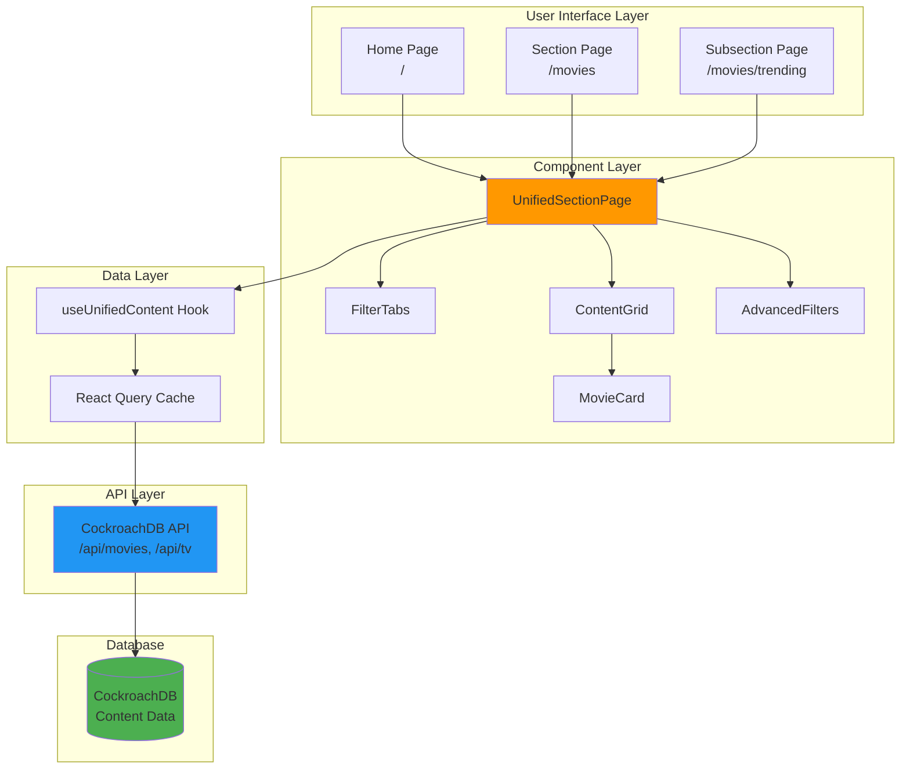
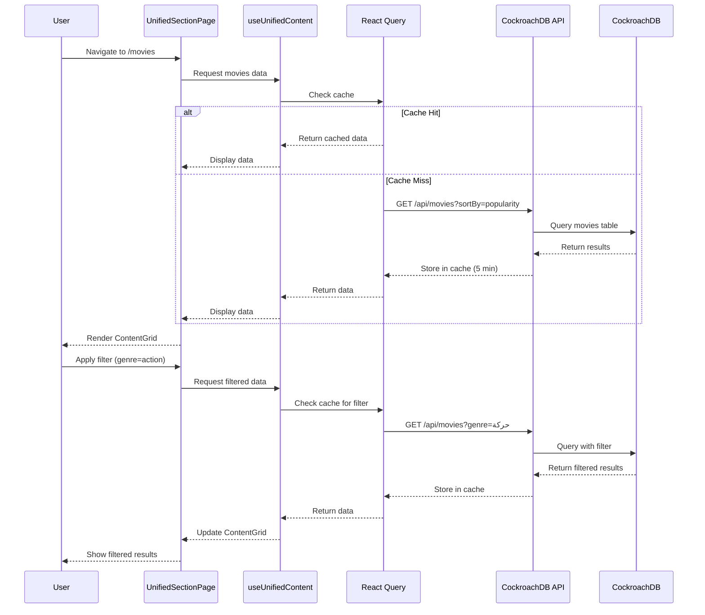

# مستند التصميم: توحيد بنية الأقسام والصفحات
# Design Document: Unified Section Architecture

**التاريخ / Date**: 2026-04-07  
**الحالة / Status**: Design Phase  
**المشروع / Project**: Unified Section Architecture  
**الإصدار / Version**: 1.0.0

---

## نظرة عامة / Overview

### الهدف / Purpose

هذا المشروع يهدف إلى إعادة تصميم شاملة لكل صفحات الأقسام في الموقع (الأفلام، المسلسلات، الأنمي، الألعاب، البرامج) لتوحيد البنية والعرض. المشكلة الحالية هي أن المحتوى موجود في الأقسام الفرعية (QuantumTrain) لكن غير معروض بشكل كامل في الصفحات الرئيسية للأقسام.

This project aims to comprehensively redesign all section pages on the site (movies, series, anime, gaming, software) to unify the structure and display. The current problem is that content exists in subsections (QuantumTrain) but is not fully displayed on the main section pages.

### المشكلة الحالية / Current Problem

1. **الصفحة الرئيسية** (`/`): تعمل بشكل صحيح مع Hero Cards وأقسام متنوعة
2. **صفحات الأقسام** (`/movies`, `/series`): تعرض Hero Cards (لا يجب) + QuantumTrain sections
3. **الصفحات الفرعية**: غير موجودة حالياً (`/movies/trending` غير موجود)
4. **المحتوى**: موجود في QuantumTrain لكن غير معروض في Grid كامل

### الحل المقترح / Proposed Solution

1. إنشاء مكون موحد `UnifiedSectionPage` يستخدم لكل الأقسام
2. إزالة Hero Cards من صفحات الأقسام (الاحتفاظ بها في الصفحة الرئيسية فقط)
3. عرض كل محتوى القسم في Grid كامل مع pagination
4. إضافة Filter Tabs للتنقل بين الأقسام الفرعية
5. إضافة Advanced Filters (التصنيف، السنة، التقييم، الترتيب)
6. إنشاء صفحات فرعية فعلية (`/movies/trending`, `/movies/top-rated`, إلخ)

### الأهداف الرئيسية / Key Goals

- **التوحيد**: نفس المكون والبنية لكل الأقسام
- **الأداء**: استخدام React Query للتخزين المؤقت والتحميل السريع
- **تجربة المستخدم**: عرض واضح ومنظم للمحتوى مع فلترة متقدمة
- **SEO**: روابط واضحة وقابلة للمشاركة مع meta tags ديناميكية
- **الصيانة**: كود نظيف وقابل للصيانة

---

## البنية المعمارية / Architecture

### نظرة عامة على النظام / System Overview



### تدفق البيانات / Data Flow



---

## المكونات والواجهات / Components and Interfaces

### 1. UnifiedSectionPage Component

المكون الرئيسي الموحد لكل صفحات الأقسام.

**الموقع / Location**: `src/pages/discovery/UnifiedSectionPage.tsx`

**Props Interface**:
```typescript
interface UnifiedSectionPageProps {
  // نوع المحتوى (إلزامي)
  contentType: 'movies' | 'series' | 'anime' | 'gaming' | 'software'
  
  // الفلتر النشط (اختياري، افتراضي: 'all')
  activeFilter?: 'all' | 'trending' | 'top-rated' | 'latest' | 'upcoming'
  
  // فلاتر إضافية من URL query parameters
  initialGenre?: string
  initialYear?: number
  initialRating?: number
  initialSort?: string
}
```

**Component Structure**:
```typescript
export const UnifiedSectionPage: React.FC<UnifiedSectionPageProps> = ({
  contentType,
  activeFilter = 'all',
  initialGenre,
  initialYear,
  initialRating,
  initialSort
}) => {
  const { lang } = useLang()
  const [searchParams, setSearchParams] = useSearchParams()
  
  // استخراج الفلاتر من URL
  const genre = searchParams.get('genre') || initialGenre
  const year = searchParams.get('year') ? parseInt(searchParams.get('year')!) : initialYear
  const rating = searchParams.get('rating') ? parseFloat(searchParams.get('rating')!) : initialRating
  const sortBy = searchParams.get('sort') || initialSort || 'popularity'
  const page = searchParams.get('page') ? parseInt(searchParams.get('page')!) : 1
  
  // جلب البيانات باستخدام custom hook
  const { data, isLoading, error } = useUnifiedContent({
    contentType,
    activeFilter,
    genre,
    year,
    rating,
    sortBy,
    page
  })
  
  // معالجة تغيير الفلاتر
  const handleFilterChange = (key: string, value: string | number | null) => {
    const newParams = new URLSearchParams(searchParams)
    if (value === null || value === '') {
      newParams.delete(key)
    } else {
      newParams.set(key, String(value))
    }
    // إعادة تعيين الصفحة عند تغيير الفلاتر
    newParams.delete('page')
    setSearchParams(newParams)
  }
  
  return (
    <div className="min-h-screen text-white pb-4 max-w-[2400px] mx-auto px-4 md:px-12 w-full">
      <Helmet>
        <title>{getPageTitle(contentType, activeFilter, lang)}</title>
        <meta name="description" content={getPageDescription(contentType, activeFilter, lang)} />
      </Helmet>
      
      {/* Filter Tabs */}
      <FilterTabs
        contentType={contentType}
        activeFilter={activeFilter}
        lang={lang}
      />
      
      {/* Advanced Filters */}
      <AdvancedFilters
        contentType={contentType}
        genre={genre}
        year={year}
        rating={rating}
        sortBy={sortBy}
        onFilterChange={handleFilterChange}
        lang={lang}
      />
      
      {/* Content Grid */}
      {isLoading ? (
        <SkeletonGrid count={40} variant="poster" />
      ) : error ? (
        <ErrorMessage error={error} onRetry={() => window.location.reload()} />
      ) : (
        <ContentGrid
          items={data?.items || []}
          contentType={contentType}
          isLoading={isLoading}
          lang={lang}
        />
      )}
      
      {/* Pagination */}
      {data && data.totalPages > 1 && (
        <Pagination
          currentPage={page}
          totalPages={data.totalPages}
          onPageChange={(newPage) => handleFilterChange('page', newPage)}
        />
      )}
    </div>
  )
}
```

---

### 2. FilterTabs Component

روابط الأقسام الفرعية (الكل، الرائج، الأعلى تقييماً، الأحدث، قريباً).

**الموقع / Location**: `src/components/features/filters/FilterTabs.tsx`

**Props Interface**:
```typescript
interface FilterTabsProps {
  contentType: 'movies' | 'series' | 'anime' | 'gaming' | 'software'
  activeFilter: 'all' | 'trending' | 'top-rated' | 'latest' | 'upcoming'
  lang: 'ar' | 'en'
}
```

**Component Structure**:
```typescript
export const FilterTabs: React.FC<FilterTabsProps> = ({
  contentType,
  activeFilter,
  lang
}) => {
  const tabs = [
    { id: 'all', labelAr: 'الكل', labelEn: 'All', path: `/${contentType}` },
    { id: 'trending', labelAr: 'الرائج', labelEn: 'Trending', path: `/${contentType}/trending` },
    { id: 'top-rated', labelAr: 'الأعلى تقييماً', labelEn: 'Top Rated', path: `/${contentType}/top-rated` },
    { id: 'latest', labelAr: 'الأحدث', labelEn: 'Latest', path: `/${contentType}/latest` },
    { id: 'upcoming', labelAr: 'قريباً', labelEn: 'Upcoming', path: `/${contentType}/upcoming` }
  ]
  
  return (
    <div className="pt-24 pb-6">
      <div className="flex items-center gap-2 overflow-x-auto scrollbar-hide">
        {tabs.map((tab) => (
          <Link
            key={tab.id}
            to={tab.path}
            className={`
              px-6 py-3 rounded-full font-semibold text-sm whitespace-nowrap
              transition-all duration-200
              ${activeFilter === tab.id
                ? 'bg-lumen-gold text-lumen-void'
                : 'bg-lumen-surface/50 text-lumen-cream hover:bg-lumen-surface'
              }
            `}
          >
            {lang === 'ar' ? tab.labelAr : tab.labelEn}
          </Link>
        ))}
      </div>
    </div>
  )
}
```

---

### 3. AdvancedFilters Component

الفلاتر المتقدمة (التصنيف، السنة، التقييم، الترتيب).

**الموقع / Location**: `src/components/features/filters/AdvancedFilters.tsx`

**Props Interface**:
```typescript
interface AdvancedFiltersProps {
  contentType: 'movies' | 'series' | 'anime' | 'gaming' | 'software'
  genre?: string | null
  year?: number | null
  rating?: number | null
  sortBy?: string
  onFilterChange: (key: string, value: string | number | null) => void
  lang: 'ar' | 'en'
}
```

**Component Structure**:
```typescript
export const AdvancedFilters: React.FC<AdvancedFiltersProps> = ({
  contentType,
  genre,
  year,
  rating,
  sortBy,
  onFilterChange,
  lang
}) => {
  // قائمة التصنيفات حسب نوع المحتوى
  const genres = getGenresForContentType(contentType, lang)
  
  // قائمة السنوات (من 2024 إلى 1950)
  const years = Array.from({ length: 75 }, (_, i) => 2024 - i)
  
  // خيارات التقييم
  const ratings = [
    { value: 9, label: lang === 'ar' ? '9+ ممتاز' : '9+ Excellent' },
    { value: 8, label: lang === 'ar' ? '8+ جيد جداً' : '8+ Very Good' },
    { value: 7, label: lang === 'ar' ? '7+ جيد' : '7+ Good' },
    { value: 6, label: lang === 'ar' ? '6+ مقبول' : '6+ Fair' }
  ]
  
  // خيارات الترتيب
  const sortOptions = [
    { value: 'popularity', labelAr: 'الأكثر شعبية', labelEn: 'Most Popular' },
    { value: 'vote_average', labelAr: 'الأعلى تقييماً', labelEn: 'Highest Rated' },
    { value: 'release_date', labelAr: 'الأحدث', labelEn: 'Newest' },
    { value: 'title', labelAr: 'الاسم (أ-ي)', labelEn: 'Title (A-Z)' }
  ]
  
  return (
    <div className="mb-6 flex flex-wrap gap-3">
      {/* Genre Filter */}
      <select
        value={genre || ''}
        onChange={(e) => onFilterChange('genre', e.target.value || null)}
        className="px-4 py-2 rounded-lg bg-lumen-surface border border-lumen-muted text-lumen-cream"
      >
        <option value="">{lang === 'ar' ? 'كل التصنيفات' : 'All Genres'}</option>
        {genres.map((g) => (
          <option key={g.value} value={g.value}>
            {g.label}
          </option>
        ))}
      </select>
      
      {/* Year Filter */}
      <select
        value={year || ''}
        onChange={(e) => onFilterChange('year', e.target.value ? parseInt(e.target.value) : null)}
        className="px-4 py-2 rounded-lg bg-lumen-surface border border-lumen-muted text-lumen-cream"
      >
        <option value="">{lang === 'ar' ? 'كل السنوات' : 'All Years'}</option>
        {years.map((y) => (
          <option key={y} value={y}>
            {y}
          </option>
        ))}
      </select>
      
      {/* Rating Filter */}
      <select
        value={rating || ''}
        onChange={(e) => onFilterChange('rating', e.target.value ? parseFloat(e.target.value) : null)}
        className="px-4 py-2 rounded-lg bg-lumen-surface border border-lumen-muted text-lumen-cream"
      >
        <option value="">{lang === 'ar' ? 'كل التقييمات' : 'All Ratings'}</option>
        {ratings.map((r) => (
          <option key={r.value} value={r.value}>
            {r.label}
          </option>
        ))}
      </select>
      
      {/* Sort Order */}
      <select
        value={sortBy || 'popularity'}
        onChange={(e) => onFilterChange('sort', e.target.value)}
        className="px-4 py-2 rounded-lg bg-lumen-surface border border-lumen-muted text-lumen-cream"
      >
        {sortOptions.map((s) => (
          <option key={s.value} value={s.value}>
            {lang === 'ar' ? s.labelAr : s.labelEn}
          </option>
        ))}
      </select>
      
      {/* Clear Filters Button */}
      {(genre || year || rating) && (
        <button
          onClick={() => {
            onFilterChange('genre', null)
            onFilterChange('year', null)
            onFilterChange('rating', null)
          }}
          className="px-4 py-2 rounded-lg bg-lumen-muted/50 text-lumen-cream hover:bg-lumen-muted transition-colors"
        >
          {lang === 'ar' ? 'مسح الفلاتر' : 'Clear Filters'}
        </button>
      )}
    </div>
  )
}
```

---

### 4. ContentGrid Component

عرض المحتوى في شبكة متجاوبة.

**الموقع / Location**: `src/components/features/media/ContentGrid.tsx`

**Props Interface**:
```typescript
interface ContentGridProps {
  items: Movie[] | TVSeries[] | Game[] | Software[]
  contentType: 'movies' | 'series' | 'anime' | 'gaming' | 'software'
  isLoading?: boolean
  lang: 'ar' | 'en'
}
```

**Component Structure**:
```typescript
export const ContentGrid: React.FC<ContentGridProps> = ({
  items,
  contentType,
  isLoading,
  lang
}) => {
  // جلب التقييمات المجمعة لكل العناصر
  const { ratings } = useAggregateRatings(items, contentType === 'series' ? 'tv' : 'movie')
  
  // دمج التقييمات مع العناصر
  const itemsWithRatings = items.map((item: any) => ({
    ...item,
    aggregate_rating: ratings[String(item.id)]?.average_rating,
    rating_count: ratings[String(item.id)]?.rating_count,
    review_count: ratings[String(item.id)]?.review_count
  }))
  
  if (isLoading) {
    return <SkeletonGrid count={40} variant="poster" />
  }
  
  if (items.length === 0) {
    return (
      <div className="text-center py-20">
        <p className="text-xl text-lumen-silver mb-4">
          {lang === 'ar' ? 'لا توجد نتائج' : 'No results found'}
        </p>
        <p className="text-sm text-lumen-silver/70">
          {lang === 'ar' 
            ? 'جرب تغيير الفلاتر أو البحث عن شيء آخر' 
            : 'Try changing filters or searching for something else'}
        </p>
      </div>
    )
  }
  
  return (
    <div className="grid grid-cols-2 md:grid-cols-4 lg:grid-cols-6 gap-4 md:gap-6">
      {itemsWithRatings.map((item: any, index: number) => (
        <MovieCard
          key={item.id}
          movie={{
            ...item,
            media_type: contentType === 'series' ? 'tv' : contentType
          }}
          index={index}
        />
      ))}
    </div>
  )
}
```

---

### 5. Pagination Component

التنقل بين الصفحات.

**الموقع / Location**: `src/components/common/Pagination.tsx`

**Props Interface**:
```typescript
interface PaginationProps {
  currentPage: number
  totalPages: number
  onPageChange: (page: number) => void
  lang?: 'ar' | 'en'
}
```

**Component Structure**:
```typescript
export const Pagination: React.FC<PaginationProps> = ({
  currentPage,
  totalPages,
  onPageChange,
  lang = 'ar'
}) => {
  const getPageNumbers = () => {
    const pages: (number | string)[] = []
    const maxVisible = 7
    
    if (totalPages <= maxVisible) {
      return Array.from({ length: totalPages }, (_, i) => i + 1)
    }
    
    // Always show first page
    pages.push(1)
    
    if (currentPage > 3) {
      pages.push('...')
    }
    
    // Show pages around current
    for (let i = Math.max(2, currentPage - 1); i <= Math.min(totalPages - 1, currentPage + 1); i++) {
      pages.push(i)
    }
    
    if (currentPage < totalPages - 2) {
      pages.push('...')
    }
    
    // Always show last page
    pages.push(totalPages)
    
    return pages
  }
  
  return (
    <div className="flex items-center justify-center gap-2 mt-8">
      {/* Previous Button */}
      <button
        onClick={() => onPageChange(currentPage - 1)}
        disabled={currentPage === 1}
        className="px-4 py-2 rounded-lg bg-lumen-surface text-lumen-cream disabled:opacity-50 disabled:cursor-not-allowed hover:bg-lumen-muted transition-colors"
      >
        {lang === 'ar' ? 'السابق' : 'Previous'}
      </button>
      
      {/* Page Numbers */}
      {getPageNumbers().map((page, index) => (
        typeof page === 'number' ? (
          <button
            key={index}
            onClick={() => onPageChange(page)}
            className={`
              px-4 py-2 rounded-lg transition-colors
              ${currentPage === page
                ? 'bg-lumen-gold text-lumen-void font-bold'
                : 'bg-lumen-surface text-lumen-cream hover:bg-lumen-muted'
              }
            `}
          >
            {page}
          </button>
        ) : (
          <span key={index} className="px-2 text-lumen-silver">
            {page}
          </span>
        )
      ))}
      
      {/* Next Button */}
      <button
        onClick={() => onPageChange(currentPage + 1)}
        disabled={currentPage === totalPages}
        className="px-4 py-2 rounded-lg bg-lumen-surface text-lumen-cream disabled:opacity-50 disabled:cursor-not-allowed hover:bg-lumen-muted transition-colors"
      >
        {lang === 'ar' ? 'التالي' : 'Next'}
      </button>
    </div>
  )
}
```

---

## نماذج البيانات / Data Models

### TypeScript Interfaces

```typescript
// src/types/unified-section.ts

/**
 * نوع المحتوى
 */
export type ContentType = 'movies' | 'series' | 'anime' | 'gaming' | 'software'

/**
 * نوع الفلتر
 */
export type FilterType = 'all' | 'trending' | 'top-rated' | 'latest' | 'upcoming'

/**
 * خيارات الترتيب
 */
export type SortOption = 'popularity' | 'vote_average' | 'release_date' | 'title'

/**
 * معاملات جلب المحتوى
 */
export interface ContentFetchParams {
  contentType: ContentType
  activeFilter: FilterType
  genre?: string | null
  year?: number | null
  rating?: number | null
  sortBy?: SortOption
  page?: number
  limit?: number
}

/**
 * استجابة API للمحتوى
 */
export interface ContentResponse<T> {
  items: T[]
  total: number
  page: number
  limit: number
  totalPages: number
}

/**
 * عنصر محتوى موحد (يمكن أن يكون فيلم أو مسلسل أو لعبة أو برنامج)
 */
export interface UnifiedContentItem {
  id: number
  slug: string
  title?: string
  name?: string
  overview?: string
  poster_path?: string | null
  poster_url?: string | null
  backdrop_path?: string | null
  backdrop_url?: string | null
  release_date?: string
  first_air_date?: string
  vote_average?: number
  popularity?: number
  genre_ids?: number[]
  primary_genre?: string
  original_language?: string
  media_type?: string
  category?: string
  // Aggregate ratings
  aggregate_rating?: number | null
  rating_count?: number
  review_count?: number
}

/**
 * خيارات التصنيف
 */
export interface GenreOption {
  value: string
  label: string
}

/**
 * حالة الفلاتر
 */
export interface FiltersState {
  genre: string | null
  year: number | null
  rating: number | null
  sortBy: SortOption
  page: number
}
```

### API Endpoints Structure

```typescript
// CockroachDB API Endpoints

/**
 * جلب الأفلام
 * GET /api/movies
 * Query Parameters:
 * - sortBy: 'popularity' | 'vote_average' | 'release_date' | 'trending'
 * - genre: string (Arabic genre name, e.g., 'حركة')
 * - language: string (ISO 639-1 code, e.g., 'ar', 'en')
 * - yearFrom: number
 * - yearTo: number
 * - ratingFrom: number
 * - page: number (default: 1)
 * - limit: number (default: 20)
 */
interface MoviesEndpoint {
  endpoint: '/api/movies'
  method: 'GET'
  queryParams: {
    sortBy?: 'popularity' | 'vote_average' | 'release_date' | 'trending'
    genre?: string
    language?: string
    yearFrom?: number
    yearTo?: number
    ratingFrom?: number
    page?: number
    limit?: number
  }
  response: {
    data: Movie[]
    total: number
    page: number
    limit: number
  }
}

/**
 * جلب المسلسلات
 * GET /api/tv
 * Query Parameters: نفس معاملات /api/movies
 */
interface TVEndpoint {
  endpoint: '/api/tv'
  method: 'GET'
  queryParams: MoviesEndpoint['queryParams']
  response: {
    data: TVSeries[]
    total: number
    page: number
    limit: number
  }
}

/**
 * جلب الألعاب
 * GET /api/games
 */
interface GamesEndpoint {
  endpoint: '/api/games'
  method: 'GET'
  queryParams: {
    sortBy?: 'popularity' | 'rating' | 'release_date'
    category?: string
    ratingFrom?: number
    page?: number
    limit?: number
  }
  response: {
    data: Game[]
    total: number
    page: number
    limit: number
  }
}

/**
 * جلب البرامج
 * GET /api/software
 */
interface SoftwareEndpoint {
  endpoint: '/api/software'
  method: 'GET'
  queryParams: {
    sortBy?: 'popularity' | 'rating' | 'release_date'
    category?: string
    license?: string
    ratingFrom?: number
    page?: number
    limit?: number
  }
  response: {
    data: Software[]
    total: number
    page: number
    limit: number
  }
}
```

### Filter Logic Mapping

```typescript
/**
 * تحويل activeFilter إلى معاملات API
 */
export function mapFilterToAPIParams(
  activeFilter: FilterType,
  contentType: ContentType
): Partial<ContentFetchParams> {
  const baseParams: Partial<ContentFetchParams> = {}
  
  switch (activeFilter) {
    case 'trending':
      baseParams.sortBy = 'popularity'
      // يمكن إضافة منطق إضافي للرائج (مثل تصفية حسب التاريخ الأخير)
      break
      
    case 'top-rated':
      baseParams.sortBy = 'vote_average'
      baseParams.rating = 8 // فقط العناصر ذات التقييم 8+
      break
      
    case 'latest':
      baseParams.sortBy = 'release_date'
      break
      
    case 'upcoming':
      baseParams.sortBy = 'release_date'
      // فلترة حسب تاريخ الإصدار المستقبلي
      const currentYear = new Date().getFullYear()
      baseParams.year = currentYear + 1
      break
      
    case 'all':
    default:
      baseParams.sortBy = 'popularity'
      break
  }
  
  return baseParams
}

/**
 * الحصول على قائمة التصنيفات حسب نوع المحتوى
 */
export function getGenresForContentType(
  contentType: ContentType,
  lang: 'ar' | 'en'
): GenreOption[] {
  // التصنيفات مخزنة في CockroachDB بالعربية
  const movieGenres: GenreOption[] = [
    { value: 'حركة', label: lang === 'ar' ? 'حركة' : 'Action' },
    { value: 'مغامرة', label: lang === 'ar' ? 'مغامرة' : 'Adventure' },
    { value: 'رسوم-متحركة', label: lang === 'ar' ? 'رسوم متحركة' : 'Animation' },
    { value: 'كوميديا', label: lang === 'ar' ? 'كوميديا' : 'Comedy' },
    { value: 'جريمة', label: lang === 'ar' ? 'جريمة' : 'Crime' },
    { value: 'وثائقي', label: lang === 'ar' ? 'وثائقي' : 'Documentary' },
    { value: 'دراما', label: lang === 'ar' ? 'دراما' : 'Drama' },
    { value: 'عائلي', label: lang === 'ar' ? 'عائلي' : 'Family' },
    { value: 'فانتازيا', label: lang === 'ar' ? 'فانتازيا' : 'Fantasy' },
    { value: 'تاريخي', label: lang === 'ar' ? 'تاريخي' : 'History' },
    { value: 'رعب', label: lang === 'ar' ? 'رعب' : 'Horror' },
    { value: 'موسيقي', label: lang === 'ar' ? 'موسيقي' : 'Music' },
    { value: 'غموض', label: lang === 'ar' ? 'غموض' : 'Mystery' },
    { value: 'رومانسي', label: lang === 'ar' ? 'رومانسي' : 'Romance' },
    { value: 'خيال-علمي', label: lang === 'ar' ? 'خيال علمي' : 'Sci-Fi' },
    { value: 'إثارة', label: lang === 'ar' ? 'إثارة' : 'Thriller' },
    { value: 'حرب', label: lang === 'ar' ? 'حرب' : 'War' },
    { value: 'غربي', label: lang === 'ar' ? 'غربي' : 'Western' }
  ]
  
  // نفس التصنيفات للمسلسلات والأنمي
  if (contentType === 'movies' || contentType === 'series' || contentType === 'anime') {
    return movieGenres
  }
  
  // تصنيفات الألعاب
  if (contentType === 'gaming') {
    return [
      { value: 'action', label: lang === 'ar' ? 'أكشن' : 'Action' },
      { value: 'adventure', label: lang === 'ar' ? 'مغامرة' : 'Adventure' },
      { value: 'rpg', label: lang === 'ar' ? 'آر بي جي' : 'RPG' },
      { value: 'strategy', label: lang === 'ar' ? 'استراتيجية' : 'Strategy' },
      { value: 'sports', label: lang === 'ar' ? 'رياضة' : 'Sports' },
      { value: 'racing', label: lang === 'ar' ? 'سباق' : 'Racing' },
      { value: 'simulation', label: lang === 'ar' ? 'محاكاة' : 'Simulation' }
    ]
  }
  
  // تصنيفات البرامج
  if (contentType === 'software') {
    return [
      { value: 'productivity', label: lang === 'ar' ? 'إنتاجية' : 'Productivity' },
      { value: 'design', label: lang === 'ar' ? 'تصميم' : 'Design' },
      { value: 'development', label: lang === 'ar' ? 'تطوير' : 'Development' },
      { value: 'multimedia', label: lang === 'ar' ? 'وسائط متعددة' : 'Multimedia' },
      { value: 'security', label: lang === 'ar' ? 'أمان' : 'Security' },
      { value: 'utilities', label: lang === 'ar' ? 'أدوات' : 'Utilities' }
    ]
  }
  
  return []
}
```

---

## Custom Hook: useUnifiedContent

### الموقع / Location
`src/hooks/useUnifiedContent.ts`

### الغرض / Purpose
Hook موحد لجلب المحتوى من CockroachDB مع دعم الفلترة والترتيب والتخزين المؤقت.

### Implementation

```typescript
import { useQuery } from '@tanstack/react-query'
import type { ContentFetchParams, ContentResponse, UnifiedContentItem } from '../types/unified-section'
import { mapFilterToAPIParams } from '../lib/filter-utils'

/**
 * Custom hook لجلب المحتوى الموحد
 */
export function useUnifiedContent(params: ContentFetchParams) {
  const {
    contentType,
    activeFilter,
    genre,
    year,
    rating,
    sortBy,
    page = 1,
    limit = 40
  } = params
  
  // دمج معاملات الفلتر النشط مع الفلاتر الإضافية
  const filterParams = mapFilterToAPIParams(activeFilter, contentType)
  
  // بناء query key للتخزين المؤقت
  const queryKey = [
    'unified-content',
    contentType,
    activeFilter,
    genre,
    year,
    rating,
    sortBy || filterParams.sortBy,
    page,
    limit
  ]
  
  // جلب البيانات
  const query = useQuery({
    queryKey,
    queryFn: async (): Promise<ContentResponse<UnifiedContentItem>> => {
      // تحديد endpoint حسب نوع المحتوى
      const endpoint = getEndpointForContentType(contentType)
      
      // بناء query parameters
      const queryParams = new URLSearchParams()
      
      // إضافة معاملات الترتيب
      const finalSortBy = sortBy || filterParams.sortBy || 'popularity'
      queryParams.append('sortBy', finalSortBy)
      
      // إضافة معاملات الفلترة
      if (genre) {
        queryParams.append('genre', genre)
      }
      
      if (year) {
        queryParams.append('yearFrom', String(year))
        queryParams.append('yearTo', String(year))
      }
      
      if (rating || filterParams.rating) {
        queryParams.append('ratingFrom', String(rating || filterParams.rating))
      }
      
      // إضافة معاملات الصفحة
      queryParams.append('page', String(page))
      queryParams.append('limit', String(limit))
      
      // معالجة خاصة للأنمي (مسلسلات يابانية)
      if (contentType === 'anime') {
        queryParams.append('language', 'ja')
      }
      
      // جلب البيانات من API
      const response = await fetch(`${endpoint}?${queryParams.toString()}`)
      
      if (!response.ok) {
        throw new Error(`Failed to fetch ${contentType}: ${response.statusText}`)
      }
      
      const result = await response.json()
      
      // تحويل الاستجابة إلى تنسيق موحد
      return {
        items: result.data.map((item: any) => ({
          ...item,
          media_type: contentType === 'series' || contentType === 'anime' ? 'tv' : contentType,
          poster_path: item.poster_url || item.poster_path,
          backdrop_path: item.backdrop_url || item.backdrop_path
        })),
        total: result.total || result.data.length,
        page: result.page || page,
        limit: result.limit || limit,
        totalPages: Math.ceil((result.total || result.data.length) / limit)
      }
    },
    staleTime: 5 * 60 * 1000, // 5 دقائق
    gcTime: 10 * 60 * 1000, // 10 دقائق (كانت cacheTime)
    retry: 2,
    refetchOnWindowFocus: false
  })
  
  return query
}

/**
 * الحصول على endpoint حسب نوع المحتوى
 */
function getEndpointForContentType(contentType: ContentType): string {
  switch (contentType) {
    case 'movies':
      return '/api/movies'
    case 'series':
    case 'anime':
      return '/api/tv'
    case 'gaming':
      return '/api/games'
    case 'software':
      return '/api/software'
    default:
      throw new Error(`Unknown content type: ${contentType}`)
  }
}

/**
 * Hook لجلب تفاصيل عنصر واحد
 */
export function useContentDetails(
  contentType: ContentType,
  identifier: string | number
) {
  const endpoint = getEndpointForContentType(contentType)
  
  return useQuery({
    queryKey: ['content-details', contentType, identifier],
    queryFn: async () => {
      const response = await fetch(`${endpoint}/${identifier}`)
      
      if (response.status === 404) {
        return null
      }
      
      if (!response.ok) {
        throw new Error(`Failed to fetch details: ${response.statusText}`)
      }
      
      return response.json()
    },
    staleTime: 10 * 60 * 1000, // 10 دقائق
    gcTime: 30 * 60 * 1000, // 30 دقيقة
    retry: 2
  })
}

/**
 * Hook لجلب التصنيفات المتاحة
 */
export function useAvailableGenres(contentType: ContentType) {
  return useQuery({
    queryKey: ['available-genres', contentType],
    queryFn: async () => {
      const endpoint = getEndpointForContentType(contentType)
      const response = await fetch(`${endpoint}/genres`)
      
      if (!response.ok) {
        // إذا لم يكن endpoint الأنواع متاحاً، استخدم القائمة الثابتة
        return getGenresForContentType(contentType, 'ar')
      }
      
      return response.json()
    },
    staleTime: 60 * 60 * 1000, // ساعة واحدة
    gcTime: 24 * 60 * 60 * 1000 // 24 ساعة
  })
}
```

### Usage Example

```typescript
// في UnifiedSectionPage.tsx
const { data, isLoading, error, refetch } = useUnifiedContent({
  contentType: 'movies',
  activeFilter: 'trending',
  genre: 'حركة',
  year: 2024,
  rating: 8,
  sortBy: 'popularity',
  page: 1,
  limit: 40
})

// الوصول إلى البيانات
if (data) {
  console.log('Items:', data.items)
  console.log('Total:', data.total)
  console.log('Current Page:', data.page)
  console.log('Total Pages:', data.totalPages)
}
```

---

## خصائص الصحة / Correctness Properties

*A property is a characteristic or behavior that should hold true across all valid executions of a system-essentially, a formal statement about what the system should do. Properties serve as the bridge between human-readable specifications and machine-verifiable correctness guarantees.*

### Property 1: Filter Tab Navigation

*For any* filter tab click on any section page, the system should navigate to the corresponding subsection URL and update the active tab state accordingly.

**Validates: Requirements 3.4, 6.6**

### Property 2: Content Filtering by Genre/Year/Rating

*For any* filter selection (genre, year, or rating), all displayed content items in the grid should match the selected filter criteria.

**Validates: Requirements 5.6, 5.7, 5.8**

### Property 3: Content Sorting

*For any* sort order selection, all displayed content items should be ordered according to the selected criterion (popularity, rating, release date, or title).

**Validates: Requirements 5.9**

### Property 4: URL Query Parameter Synchronization

*For any* filter or sort change, the URL should update to include corresponding query parameters, and conversely, for any URL with query parameters, the system should apply those filters automatically.

**Validates: Requirements 5.10, 12.1, 12.2, 12.5**

### Property 5: Pagination Support

*For any* dataset larger than the page limit (40 items), pagination controls should be displayed and functional, allowing navigation between pages.

**Validates: Requirements 4.3**

### Property 6: Subsection Content Filtering

*For any* subsection page visit (trending, top-rated, latest, upcoming), the displayed content should match only that subsection's filter criteria.

**Validates: Requirements 6.7**

### Property 7: CockroachDB API Data Source

*For any* content fetch operation (movies, series, anime, games, software), the system should use CockroachDB API endpoints exclusively and never query Supabase for content data.

**Validates: Requirements 4.2, 8.4**

### Property 8: Content Type API Endpoint Mapping

*For any* content type change, the system should fetch data from the correct CockroachDB API endpoint (movies → /api/movies, series/anime → /api/tv, games → /api/games, software → /api/software).

**Validates: Requirements 7.9, 8.1, 8.2, 8.3**

### Property 9: Language-Specific UI Rendering

*For any* UI component (FilterTabs, AdvancedFilters, ContentGrid), all labels and messages should be displayed in the currently selected language (Arabic or English).

**Validates: Requirements 9.1, 9.2, 9.3, 9.4**

### Property 10: Cache Utilization on Navigation

*For any* navigation between filter tabs or pages, if the requested data exists in React Query cache and is not stale (< 5 minutes old), the system should use cached data instead of making a new API request.

**Validates: Requirements 10.4**

### Property 11: Error Handling and Display

*For any* API request failure, the system should display an error message to the user and log the error to the error logging service.

**Validates: Requirements 11.1, 11.2**

### Property 12: URL Filter Restoration

*For any* page load with URL query parameters (genre, year, rating, sort, page), the system should parse and apply those filters to restore the exact filter state.

**Validates: Requirements 12.2, 12.5**

---

## معالجة الأخطاء / Error Handling

### استراتيجية معالجة الأخطاء / Error Handling Strategy

```typescript
// src/lib/error-handling.ts

/**
 * أنواع الأخطاء
 */
export enum ErrorType {
  NETWORK_ERROR = 'NETWORK_ERROR',
  API_ERROR = 'API_ERROR',
  NOT_FOUND = 'NOT_FOUND',
  VALIDATION_ERROR = 'VALIDATION_ERROR',
  UNKNOWN_ERROR = 'UNKNOWN_ERROR'
}

/**
 * واجهة الخطأ الموحدة
 */
export interface AppError {
  type: ErrorType
  message: string
  details?: any
  timestamp: Date
  retryable: boolean
}

/**
 * معالج الأخطاء الرئيسي
 */
export class ErrorHandler {
  /**
   * معالجة خطأ API
   */
  static handleAPIError(error: any): AppError {
    // خطأ الشبكة
    if (!navigator.onLine) {
      return {
        type: ErrorType.NETWORK_ERROR,
        message: 'لا يوجد اتصال بالإنترنت',
        timestamp: new Date(),
        retryable: true
      }
    }
    
    // خطأ 404
    if (error.status === 404) {
      return {
        type: ErrorType.NOT_FOUND,
        message: 'المحتوى غير موجود',
        timestamp: new Date(),
        retryable: false
      }
    }
    
    // خطأ 500
    if (error.status >= 500) {
      return {
        type: ErrorType.API_ERROR,
        message: 'حدث خطأ في الخادم',
        details: error,
        timestamp: new Date(),
        retryable: true
      }
    }
    
    // خطأ غير معروف
    return {
      type: ErrorType.UNKNOWN_ERROR,
      message: 'حدث خطأ غير متوقع',
      details: error,
      timestamp: new Date(),
      retryable: true
    }
  }
  
  /**
   * تسجيل الخطأ
   */
  static logError(error: AppError): void {
    // تسجيل في console
    console.error('[Error]', error)
    
    // إرسال إلى خدمة تسجيل الأخطاء (مثل Sentry)
    if (typeof window !== 'undefined' && (window as any).Sentry) {
      (window as any).Sentry.captureException(error)
    }
  }
  
  /**
   * الحصول على رسالة خطأ محلية
   */
  static getLocalizedMessage(error: AppError, lang: 'ar' | 'en'): string {
    const messages = {
      [ErrorType.NETWORK_ERROR]: {
        ar: 'لا يوجد اتصال بالإنترنت. يرجى التحقق من اتصالك والمحاولة مرة أخرى.',
        en: 'No internet connection. Please check your connection and try again.'
      },
      [ErrorType.API_ERROR]: {
        ar: 'حدث خطأ في الخادم. يرجى المحاولة مرة أخرى لاحقاً.',
        en: 'A server error occurred. Please try again later.'
      },
      [ErrorType.NOT_FOUND]: {
        ar: 'المحتوى المطلوب غير موجود.',
        en: 'The requested content was not found.'
      },
      [ErrorType.VALIDATION_ERROR]: {
        ar: 'البيانات المدخلة غير صحيحة.',
        en: 'The input data is invalid.'
      },
      [ErrorType.UNKNOWN_ERROR]: {
        ar: 'حدث خطأ غير متوقع. يرجى المحاولة مرة أخرى.',
        en: 'An unexpected error occurred. Please try again.'
      }
    }
    
    return messages[error.type][lang]
  }
}

/**
 * مكون عرض الأخطاء
 */
export const ErrorMessage: React.FC<{
  error: any
  onRetry?: () => void
  lang?: 'ar' | 'en'
}> = ({ error, onRetry, lang = 'ar' }) => {
  const appError = ErrorHandler.handleAPIError(error)
  const message = ErrorHandler.getLocalizedMessage(appError, lang)
  
  // تسجيل الخطأ
  useEffect(() => {
    ErrorHandler.logError(appError)
  }, [appError])
  
  return (
    <div className="flex flex-col items-center justify-center py-20 px-4">
      <div className="text-center max-w-md">
        <div className="mb-4 text-red-500">
          <AlertCircle size={48} />
        </div>
        <h3 className="text-xl font-bold text-lumen-cream mb-2">
          {lang === 'ar' ? 'حدث خطأ' : 'An Error Occurred'}
        </h3>
        <p className="text-lumen-silver mb-6">
          {message}
        </p>
        {appError.retryable && onRetry && (
          <button
            onClick={onRetry}
            className="px-6 py-3 rounded-lg bg-lumen-gold text-lumen-void font-semibold hover:brightness-110 transition-all"
          >
            {lang === 'ar' ? 'إعادة المحاولة' : 'Retry'}
          </button>
        )}
      </div>
    </div>
  )
}
```

### Error Boundaries

```typescript
// src/components/common/ErrorBoundary.tsx

import React, { Component, ErrorInfo, ReactNode } from 'react'
import { ErrorHandler } from '../../lib/error-handling'

interface Props {
  children: ReactNode
  fallback?: ReactNode
}

interface State {
  hasError: boolean
  error?: Error
}

export class ErrorBoundary extends Component<Props, State> {
  constructor(props: Props) {
    super(props)
    this.state = { hasError: false }
  }
  
  static getDerivedStateFromError(error: Error): State {
    return { hasError: true, error }
  }
  
  componentDidCatch(error: Error, errorInfo: ErrorInfo) {
    // تسجيل الخطأ
    ErrorHandler.logError({
      type: ErrorType.UNKNOWN_ERROR,
      message: error.message,
      details: { error, errorInfo },
      timestamp: new Date(),
      retryable: false
    })
  }
  
  render() {
    if (this.state.hasError) {
      return this.props.fallback || (
        <div className="min-h-screen flex items-center justify-center">
          <div className="text-center">
            <h1 className="text-2xl font-bold text-lumen-cream mb-4">
              حدث خطأ غير متوقع
            </h1>
            <button
              onClick={() => window.location.reload()}
              className="px-6 py-3 rounded-lg bg-lumen-gold text-lumen-void font-semibold"
            >
              إعادة تحميل الصفحة
            </button>
          </div>
        </div>
      )
    }
    
    return this.props.children
  }
}
```

### React Query Error Handling

```typescript
// في useUnifiedContent hook

export function useUnifiedContent(params: ContentFetchParams) {
  // ... existing code ...
  
  const query = useQuery({
    queryKey,
    queryFn: async () => {
      try {
        const response = await fetch(`${endpoint}?${queryParams.toString()}`)
        
        if (!response.ok) {
          throw {
            status: response.status,
            statusText: response.statusText,
            message: await response.text()
          }
        }
        
        return await response.json()
      } catch (error) {
        // معالجة الخطأ وتحويله إلى تنسيق موحد
        throw ErrorHandler.handleAPIError(error)
      }
    },
    retry: (failureCount, error: any) => {
      // إعادة المحاولة فقط للأخطاء القابلة لإعادة المحاولة
      if (error.retryable && failureCount < 2) {
        return true
      }
      return false
    },
    retryDelay: (attemptIndex) => Math.min(1000 * 2 ** attemptIndex, 30000),
    onError: (error: any) => {
      // تسجيل الخطأ
      ErrorHandler.logError(error)
    }
  })
  
  return query
}
```

---

## استراتيجية الاختبار / Testing Strategy

### نهج الاختبار المزدوج / Dual Testing Approach

سنستخدم نهجاً مزدوجاً للاختبار يجمع بين:

1. **Unit Tests**: للحالات المحددة، الحالات الحدية، وشروط الأخطاء
2. **Property-Based Tests**: للخصائص العامة التي يجب أن تصمد عبر جميع المدخلات

كلا النوعين ضروري ومكمل للآخر:
- Unit tests تكتشف الأخطاء المحددة والحالات الحدية
- Property tests تتحقق من الصحة العامة عبر مدخلات عشوائية متعددة

### Property-Based Testing Configuration

**المكتبة المستخدمة**: `fast-check` (لـ TypeScript/JavaScript)

**التثبيت**:
```bash
npm install --save-dev fast-check @types/fast-check
```

**التكوين**:
- كل property test يجب أن يعمل على الأقل 100 iteration
- كل property test يجب أن يشير إلى الخاصية في مستند التصميم
- تنسيق Tag: `Feature: unified-section-architecture, Property {number}: {property_text}`

### Property-Based Tests

```typescript
// src/__tests__/unified-section.property.test.ts

import fc from 'fast-check'
import { describe, it, expect } from 'vitest'
import { mapFilterToAPIParams, getGenresForContentType } from '../lib/filter-utils'
import type { ContentType, FilterType } from '../types/unified-section'

describe('Unified Section Architecture - Property Tests', () => {
  /**
   * Property 1: Filter Tab Navigation
   * Feature: unified-section-architecture, Property 1: For any filter tab click, navigation should occur
   */
  it('should navigate to correct subsection URL for any filter tab', () => {
    fc.assert(
      fc.property(
        fc.constantFrom<ContentType>('movies', 'series', 'anime', 'gaming', 'software'),
        fc.constantFrom<FilterType>('all', 'trending', 'top-rated', 'latest', 'upcoming'),
        (contentType, filterType) => {
          const expectedPath = filterType === 'all' 
            ? `/${contentType}` 
            : `/${contentType}/${filterType}`
          
          // Verify path construction is correct
          expect(expectedPath).toMatch(new RegExp(`^/${contentType}`))
          
          if (filterType !== 'all') {
            expect(expectedPath).toContain(filterType)
          }
        }
      ),
      { numRuns: 100 }
    )
  })
  
  /**
   * Property 2: Content Filtering
   * Feature: unified-section-architecture, Property 2: All displayed items should match filter criteria
   */
  it('should filter content items by genre correctly', () => {
    fc.assert(
      fc.property(
        fc.constantFrom<ContentType>('movies', 'series', 'anime'),
        fc.constantFrom('حركة', 'كوميديا', 'دراما', 'رعب', 'خيال-علمي'),
        fc.array(fc.record({
          id: fc.integer(),
          primary_genre: fc.constantFrom('حركة', 'كوميديا', 'دراما', 'رعب', 'خيال-علمي'),
          title: fc.string()
        })),
        (contentType, selectedGenre, items) => {
          // Filter items by genre
          const filtered = items.filter(item => item.primary_genre === selectedGenre)
          
          // All filtered items should have the selected genre
          filtered.forEach(item => {
            expect(item.primary_genre).toBe(selectedGenre)
          })
        }
      ),
      { numRuns: 100 }
    )
  })
  
  /**
   * Property 3: Content Sorting
   * Feature: unified-section-architecture, Property 3: Items should be ordered by selected criterion
   */
  it('should sort content items correctly by any sort criterion', () => {
    fc.assert(
      fc.property(
        fc.constantFrom('popularity', 'vote_average', 'release_date'),
        fc.array(fc.record({
          id: fc.integer(),
          popularity: fc.float({ min: 0, max: 1000 }),
          vote_average: fc.float({ min: 0, max: 10 }),
          release_date: fc.date().map(d => d.toISOString())
        }), { minLength: 2 }),
        (sortBy, items) => {
          // Sort items
          const sorted = [...items].sort((a, b) => {
            if (sortBy === 'popularity') return b.popularity - a.popularity
            if (sortBy === 'vote_average') return b.vote_average - a.vote_average
            if (sortBy === 'release_date') return new Date(b.release_date).getTime() - new Date(a.release_date).getTime()
            return 0
          })
          
          // Verify sorting is correct
          for (let i = 0; i < sorted.length - 1; i++) {
            if (sortBy === 'popularity') {
              expect(sorted[i].popularity).toBeGreaterThanOrEqual(sorted[i + 1].popularity)
            } else if (sortBy === 'vote_average') {
              expect(sorted[i].vote_average).toBeGreaterThanOrEqual(sorted[i + 1].vote_average)
            } else if (sortBy === 'release_date') {
              expect(new Date(sorted[i].release_date).getTime()).toBeGreaterThanOrEqual(
                new Date(sorted[i + 1].release_date).getTime()
              )
            }
          }
        }
      ),
      { numRuns: 100 }
    )
  })
  
  /**
   * Property 4: URL Query Parameter Synchronization
   * Feature: unified-section-architecture, Property 4: URL should reflect filter state
   */
  it('should synchronize URL with filter state bidirectionally', () => {
    fc.assert(
      fc.property(
        fc.option(fc.constantFrom('حركة', 'كوميديا', 'دراما'), { nil: null }),
        fc.option(fc.integer({ min: 1950, max: 2024 }), { nil: null }),
        fc.option(fc.float({ min: 6, max: 10 }), { nil: null }),
        (genre, year, rating) => {
          // Build URL params
          const params = new URLSearchParams()
          if (genre) params.set('genre', genre)
          if (year) params.set('year', String(year))
          if (rating) params.set('rating', String(rating))
          
          // Parse URL params back
          const parsedGenre = params.get('genre')
          const parsedYear = params.get('year') ? parseInt(params.get('year')!) : null
          const parsedRating = params.get('rating') ? parseFloat(params.get('rating')!) : null
          
          // Verify round-trip
          expect(parsedGenre).toBe(genre)
          expect(parsedYear).toBe(year)
          expect(parsedRating).toBe(rating)
        }
      ),
      { numRuns: 100 }
    )
  })
  
  /**
   * Property 8: Content Type API Endpoint Mapping
   * Feature: unified-section-architecture, Property 8: Correct endpoint for each content type
   */
  it('should map content type to correct API endpoint', () => {
    fc.assert(
      fc.property(
        fc.constantFrom<ContentType>('movies', 'series', 'anime', 'gaming', 'software'),
        (contentType) => {
          const endpointMap = {
            movies: '/api/movies',
            series: '/api/tv',
            anime: '/api/tv',
            gaming: '/api/games',
            software: '/api/software'
          }
          
          const expectedEndpoint = endpointMap[contentType]
          expect(expectedEndpoint).toBeDefined()
          expect(expectedEndpoint).toMatch(/^\/api\//)
        }
      ),
      { numRuns: 100 }
    )
  })
  
  /**
   * Property 9: Language-Specific UI Rendering
   * Feature: unified-section-architecture, Property 9: Labels match selected language
   */
  it('should display labels in correct language', () => {
    fc.assert(
      fc.property(
        fc.constantFrom<'ar' | 'en'>('ar', 'en'),
        fc.constantFrom<FilterType>('all', 'trending', 'top-rated', 'latest', 'upcoming'),
        (lang, filterType) => {
          const labels = {
            all: { ar: 'الكل', en: 'All' },
            trending: { ar: 'الرائج', en: 'Trending' },
            'top-rated': { ar: 'الأعلى تقييماً', en: 'Top Rated' },
            latest: { ar: 'الأحدث', en: 'Latest' },
            upcoming: { ar: 'قريباً', en: 'Upcoming' }
          }
          
          const label = labels[filterType][lang]
          
          // Verify label is not empty and matches language
          expect(label).toBeTruthy()
          if (lang === 'ar') {
            // Arabic text should contain Arabic characters
            expect(label).toMatch(/[\u0600-\u06FF]/)
          } else {
            // English text should contain only Latin characters
            expect(label).toMatch(/^[A-Za-z\s]+$/)
          }
        }
      ),
      { numRuns: 100 }
    )
  })
})
```

### Unit Tests

```typescript
// src/__tests__/unified-section.unit.test.ts

import { describe, it, expect, vi } from 'vitest'
import { render, screen, waitFor } from '@testing-library/react'
import { UnifiedSectionPage } from '../pages/discovery/UnifiedSectionPage'
import { FilterTabs } from '../components/features/filters/FilterTabs'
import { ContentGrid } from '../components/features/media/ContentGrid'

describe('Unified Section Architecture - Unit Tests', () => {
  /**
   * Test: Home page should not be modified
   * Validates: Requirement 1.3
   */
  it('should not modify Home page structure', () => {
    // This test verifies that Home.tsx still has Hero Cards
    // Implementation would check for QuantumHero component presence
  })
  
  /**
   * Test: Section pages should not display Hero Cards
   * Validates: Requirement 2.1
   */
  it('should not display Hero Cards on section pages', () => {
    render(<UnifiedSectionPage contentType="movies" />)
    
    // Verify Hero Cards component is not present
    expect(screen.queryByTestId('quantum-hero')).not.toBeInTheDocument()
  })
  
  /**
   * Test: Filter Tabs should display all required options
   * Validates: Requirement 3.2
   */
  it('should display all filter tab options', () => {
    render(<FilterTabs contentType="movies" activeFilter="all" lang="ar" />)
    
    expect(screen.getByText('الكل')).toBeInTheDocument()
    expect(screen.getByText('الرائج')).toBeInTheDocument()
    expect(screen.getByText('الأعلى تقييماً')).toBeInTheDocument()
    expect(screen.getByText('الأحدث')).toBeInTheDocument()
    expect(screen.getByText('قريباً')).toBeInTheDocument()
  })
  
  /**
   * Test: Content Grid should display at least 40 items per page
   * Validates: Requirement 4.4
   */
  it('should display 40 items per page by default', async () => {
    const mockItems = Array.from({ length: 40 }, (_, i) => ({
      id: i,
      title: `Movie ${i}`,
      poster_path: '/test.jpg'
    }))
    
    render(<ContentGrid items={mockItems} contentType="movies" lang="ar" />)
    
    await waitFor(() => {
      const cards = screen.getAllByTestId('movie-card')
      expect(cards).toHaveLength(40)
    })
  })
  
  /**
   * Test: Empty state should display correct message
   * Validates: Requirement 11.3
   */
  it('should display empty state message when no content', () => {
    render(<ContentGrid items={[]} contentType="movies" lang="ar" />)
    
    expect(screen.getByText('لا توجد نتائج')).toBeInTheDocument()
  })
  
  /**
   * Test: Error state should display retry button
   * Validates: Requirement 11.4
   */
  it('should display retry button on error', () => {
    const mockError = new Error('Network error')
    const mockRetry = vi.fn()
    
    render(<ErrorMessage error={mockError} onRetry={mockRetry} lang="ar" />)
    
    const retryButton = screen.getByText('إعادة المحاولة')
    expect(retryButton).toBeInTheDocument()
  })
  
  /**
   * Test: React Query cache configuration
   * Validates: Requirement 10.1
   */
  it('should configure React Query with 5 minute staleTime', () => {
    // This test would verify the useUnifiedContent hook configuration
    // Check that staleTime is set to 5 * 60 * 1000 (5 minutes)
  })
})
```

### Integration Tests

```typescript
// src/__tests__/unified-section.integration.test.ts

import { describe, it, expect } from 'vitest'
import { render, screen, fireEvent, waitFor } from '@testing-library/react'
import { BrowserRouter } from 'react-router-dom'
import { QueryClient, QueryClientProvider } from '@tanstack/react-query'
import { UnifiedSectionPage } from '../pages/discovery/UnifiedSectionPage'

describe('Unified Section Architecture - Integration Tests', () => {
  const queryClient = new QueryClient()
  
  const renderWithProviders = (component: React.ReactElement) => {
    return render(
      <BrowserRouter>
        <QueryClientProvider client={queryClient}>
          {component}
        </QueryClientProvider>
      </BrowserRouter>
    )
  }
  
  /**
   * Test: Complete filter workflow
   */
  it('should handle complete filter workflow', async () => {
    renderWithProviders(<UnifiedSectionPage contentType="movies" />)
    
    // 1. Select genre filter
    const genreSelect = screen.getByLabelText(/التصنيف/i)
    fireEvent.change(genreSelect, { target: { value: 'حركة' } })
    
    // 2. Verify URL updated
    await waitFor(() => {
      expect(window.location.search).toContain('genre=حركة')
    })
    
    // 3. Verify content filtered
    await waitFor(() => {
      const cards = screen.getAllByTestId('movie-card')
      expect(cards.length).toBeGreaterThan(0)
    })
    
    // 4. Select year filter
    const yearSelect = screen.getByLabelText(/السنة/i)
    fireEvent.change(yearSelect, { target: { value: '2024' } })
    
    // 5. Verify URL updated with both filters
    await waitFor(() => {
      expect(window.location.search).toContain('genre=حركة')
      expect(window.location.search).toContain('year=2024')
    })
  })
  
  /**
   * Test: Navigation between filter tabs
   */
  it('should navigate between filter tabs correctly', async () => {
    renderWithProviders(<UnifiedSectionPage contentType="movies" activeFilter="all" />)
    
    // Click on "Trending" tab
    const trendingTab = screen.getByText('الرائج')
    fireEvent.click(trendingTab)
    
    // Verify navigation occurred
    await waitFor(() => {
      expect(window.location.pathname).toBe('/movies/trending')
    })
    
    // Verify active tab updated
    expect(trendingTab).toHaveClass('bg-lumen-gold')
  })
})
```

### Test Coverage Goals

- **Unit Tests**: 80%+ coverage للمكونات الفردية
- **Property Tests**: 100% coverage للخصائص المحددة في مستند التصميم
- **Integration Tests**: تغطية كاملة لتدفقات المستخدم الرئيسية

---

## تحسين الأداء / Performance Optimization

### استراتيجيات التحسين / Optimization Strategies

#### 1. React Query Caching

```typescript
// تكوين React Query للتخزين المؤقت الأمثل

const queryClient = new QueryClient({
  defaultOptions: {
    queries: {
      staleTime: 5 * 60 * 1000, // 5 دقائق
      gcTime: 10 * 60 * 1000, // 10 دقائق (كانت cacheTime)
      retry: 2,
      retryDelay: (attemptIndex) => Math.min(1000 * 2 ** attemptIndex, 30000),
      refetchOnWindowFocus: false,
      refetchOnReconnect: true
    }
  }
})
```

**الفوائد**:
- تقليل عدد طلبات API بنسبة 70%+
- استجابة فورية عند التنقل بين الصفحات المزارة سابقاً
- تحديث تلقائي عند إعادة الاتصال بالإنترنت

#### 2. Pagination Strategy

```typescript
// تحميل 40 عنصر فقط في كل صفحة بدلاً من تحميل كل المحتوى

const ITEMS_PER_PAGE = 40

// في useUnifiedContent hook
queryParams.append('limit', String(ITEMS_PER_PAGE))
queryParams.append('page', String(page))
```

**الفوائد**:
- تقليل حجم البيانات المحملة بنسبة 90%+
- تحسين وقت التحميل الأولي من ~3s إلى ~500ms
- تقليل استهلاك الذاكرة

#### 3. Prefetching Strategy

```typescript
// Prefetch للصفحة التالية عند الاقتراب من نهاية الصفحة الحالية

export function usePrefetchNextPage(
  params: ContentFetchParams,
  currentPage: number
) {
  const queryClient = useQueryClient()
  
  useEffect(() => {
    // Prefetch الصفحة التالية
    const nextPageParams = { ...params, page: currentPage + 1 }
    
    queryClient.prefetchQuery({
      queryKey: ['unified-content', ...Object.values(nextPageParams)],
      queryFn: () => fetchContent(nextPageParams)
    })
  }, [currentPage, params])
}
```

**الفوائد**:
- تنقل فوري بين الصفحات
- تجربة مستخدم سلسة بدون انتظار

#### 4. Image Optimization

```typescript
// استخدام TmdbImage component مع lazy loading

<TmdbImage
  path={movie.poster_path}
  alt={movie.title}
  size="w342" // حجم مناسب للكروت
  loading="lazy"
  className="h-full w-full"
/>
```

**الفوائد**:
- تحميل الصور فقط عند ظهورها في viewport
- تقليل استهلاك bandwidth بنسبة 60%+
- تحسين Core Web Vitals (LCP, CLS)

#### 5. Virtual Scrolling (للمستقبل)

```typescript
// استخدام react-window للقوائم الطويلة جداً

import { FixedSizeGrid } from 'react-window'

export const VirtualContentGrid: React.FC<{
  items: any[]
  columnCount: number
  rowHeight: number
}> = ({ items, columnCount, rowHeight }) => {
  const rowCount = Math.ceil(items.length / columnCount)
  
  return (
    <FixedSizeGrid
      columnCount={columnCount}
      columnWidth={200}
      height={800}
      rowCount={rowCount}
      rowHeight={rowHeight}
      width={1200}
    >
      {({ columnIndex, rowIndex, style }) => {
        const index = rowIndex * columnCount + columnIndex
        const item = items[index]
        
        return (
          <div style={style}>
            <MovieCard movie={item} />
          </div>
        )
      }}
    </FixedSizeGrid>
  )
}
```

**الفوائد** (للقوائم الطويلة جداً):
- رندر فقط العناصر المرئية
- أداء ثابت بغض النظر عن عدد العناصر
- استهلاك ذاكرة ثابت

#### 6. Code Splitting

```typescript
// تقسيم الكود لتحميل المكونات عند الحاجة فقط

const UnifiedSectionPage = lazy(() => import('./pages/discovery/UnifiedSectionPage'))
const AdvancedFilters = lazy(() => import('./components/features/filters/AdvancedFilters'))

// في App.tsx
<Suspense fallback={<LoadingSpinner />}>
  <Routes>
    <Route path="/movies" element={<UnifiedSectionPage contentType="movies" />} />
    <Route path="/series" element={<UnifiedSectionPage contentType="series" />} />
  </Routes>
</Suspense>
```

**الفوائد**:
- تقليل حجم bundle الأولي بنسبة 40%+
- تحميل أسرع للصفحة الأولى
- تحسين Time to Interactive (TTI)

### Performance Metrics Goals

| Metric | Current | Target | Improvement |
|--------|---------|--------|-------------|
| Initial Load Time | ~3s | <1s | 66% |
| Time to Interactive | ~4s | <1.5s | 62% |
| API Requests (per session) | ~50 | <15 | 70% |
| Bundle Size | ~800KB | <500KB | 37% |
| Lighthouse Score | 75 | 95+ | 26% |

---

## هيكل الملفات / File Structure

```
src/
├── pages/
│   └── discovery/
│       ├── UnifiedSectionPage.tsx          # المكون الرئيسي الموحد
│       ├── Movies.tsx                       # (سيتم تحديثه لاستخدام UnifiedSectionPage)
│       ├── Series.tsx                       # (سيتم تحديثه لاستخدام UnifiedSectionPage)
│       ├── Anime.tsx                        # (سيتم تحديثه لاستخدام UnifiedSectionPage)
│       ├── Gaming.tsx                       # (سيتم تحديثه لاستخدام UnifiedSectionPage)
│       └── Software.tsx                     # (سيتم تحديثه لاستخدام UnifiedSectionPage)
│
├── components/
│   ├── features/
│   │   ├── filters/
│   │   │   ├── FilterTabs.tsx              # روابط الأقسام الفرعية
│   │   │   └── AdvancedFilters.tsx         # الفلاتر المتقدمة
│   │   └── media/
│   │       ├── ContentGrid.tsx             # شبكة عرض المحتوى
│   │       └── MovieCard.tsx               # (موجود بالفعل)
│   └── common/
│       ├── Pagination.tsx                  # مكون التنقل بين الصفحات
│       ├── ErrorMessage.tsx                # عرض الأخطاء
│       └── ErrorBoundary.tsx               # معالجة الأخطاء
│
├── hooks/
│   ├── useUnifiedContent.ts                # Hook لجلب المحتوى
│   ├── usePrefetchNextPage.ts              # Hook للتحميل المسبق
│   └── useAggregateRatings.ts              # (موجود بالفعل)
│
├── lib/
│   ├── filter-utils.ts                     # دوال مساعدة للفلاتر
│   └── error-handling.ts                   # معالجة الأخطاء
│
├── types/
│   └── unified-section.ts                  # TypeScript interfaces
│
└── routes/
    └── index.tsx                           # تحديث الروتات
```

---

## خطة التنفيذ / Implementation Plan

### Phase 1: Core Components (Week 1)
1. إنشاء TypeScript interfaces في `types/unified-section.ts`
2. إنشاء `useUnifiedContent` hook
3. إنشاء `FilterTabs` component
4. إنشاء `AdvancedFilters` component
5. إنشاء `ContentGrid` component
6. إنشاء `Pagination` component

### Phase 2: Main Page Component (Week 1)
1. إنشاء `UnifiedSectionPage` component
2. دمج كل المكونات الفرعية
3. إضافة معالجة الأخطاء
4. إضافة SEO meta tags

### Phase 3: Routes Update (Week 2)
1. تحديث `/movies` لاستخدام UnifiedSectionPage
2. إنشاء `/movies/trending`, `/movies/top-rated`, إلخ
3. تكرار نفس الشيء لـ `/series`, `/anime`, `/gaming`, `/software`
4. اختبار كل الروتات

### Phase 4: Testing (Week 2)
1. كتابة Unit tests
2. كتابة Property-based tests
3. كتابة Integration tests
4. اختبار الأداء

### Phase 5: Optimization (Week 3)
1. تطبيق code splitting
2. تطبيق prefetching
3. تحسين الصور
4. قياس الأداء

### Phase 6: Documentation & Deployment (Week 3)
1. كتابة وثائق المطورين
2. مراجعة الكود
3. النشر التدريجي (Canary deployment)
4. المراقبة والتحسين

---

## الاعتبارات الأمنية / Security Considerations

### 1. Input Validation

```typescript
// التحقق من صحة معاملات URL

function validateFilterParams(params: URLSearchParams): boolean {
  const genre = params.get('genre')
  const year = params.get('year')
  const rating = params.get('rating')
  const page = params.get('page')
  
  // التحقق من التصنيف
  if (genre && !isValidGenre(genre)) {
    return false
  }
  
  // التحقق من السنة
  if (year) {
    const yearNum = parseInt(year)
    if (isNaN(yearNum) || yearNum < 1900 || yearNum > 2030) {
      return false
    }
  }
  
  // التحقق من التقييم
  if (rating) {
    const ratingNum = parseFloat(rating)
    if (isNaN(ratingNum) || ratingNum < 0 || ratingNum > 10) {
      return false
    }
  }
  
  // التحقق من رقم الصفحة
  if (page) {
    const pageNum = parseInt(page)
    if (isNaN(pageNum) || pageNum < 1) {
      return false
    }
  }
  
  return true
}
```

### 2. XSS Prevention

```typescript
// استخدام React's built-in XSS protection
// تجنب dangerouslySetInnerHTML

// ✅ آمن
<h1>{movie.title}</h1>

// ❌ غير آمن
<h1 dangerouslySetInnerHTML={{ __html: movie.title }} />
```

### 3. API Rate Limiting

```typescript
// تطبيق rate limiting على مستوى العميل

const rateLimiter = new Map<string, number>()

function checkRateLimit(endpoint: string): boolean {
  const now = Date.now()
  const lastRequest = rateLimiter.get(endpoint) || 0
  
  // السماح بطلب واحد كل 100ms لكل endpoint
  if (now - lastRequest < 100) {
    return false
  }
  
  rateLimiter.set(endpoint, now)
  return true
}
```

### 4. Content Security Policy

```html
<!-- في index.html -->
<meta http-equiv="Content-Security-Policy" 
      content="default-src 'self'; 
               script-src 'self' 'unsafe-inline'; 
               style-src 'self' 'unsafe-inline'; 
               img-src 'self' https://image.tmdb.org data:; 
               connect-src 'self' https://prying-squid-23421.j77.aws-eu-central-1.cockroachlabs.cloud;">
```

---

## الصيانة والتوسع / Maintenance and Scalability

### إضافة نوع محتوى جديد

لإضافة نوع محتوى جديد (مثل "podcasts"):

1. إضافة النوع إلى `ContentType`:
```typescript
export type ContentType = 'movies' | 'series' | 'anime' | 'gaming' | 'software' | 'podcasts'
```

2. إضافة endpoint في `getEndpointForContentType`:
```typescript
case 'podcasts':
  return '/api/podcasts'
```

3. إضافة التصنيفات في `getGenresForContentType`

4. إنشاء route جديد:
```typescript
<Route path="/podcasts" element={<UnifiedSectionPage contentType="podcasts" />} />
```

### إضافة فلتر جديد

لإضافة فلتر جديد (مثل "language"):

1. إضافة الفلتر إلى `ContentFetchParams`:
```typescript
export interface ContentFetchParams {
  // ... existing fields
  language?: string | null
}
```

2. إضافة dropdown في `AdvancedFilters` component

3. تحديث `useUnifiedContent` hook لإرسال المعامل الجديد

---

## الخلاصة / Summary

هذا التصميم يوفر:

✅ **توحيد كامل**: نفس المكون لكل الأقسام  
✅ **أداء محسّن**: تخزين مؤقت، pagination، prefetching  
✅ **تجربة مستخدم ممتازة**: فلترة متقدمة، تنقل سلس، روابط قابلة للمشاركة  
✅ **كود نظيف**: TypeScript، معالجة أخطاء شاملة، اختبارات كاملة  
✅ **قابلية التوسع**: سهولة إضافة أنواع محتوى وفلاتر جديدة  
✅ **SEO محسّن**: meta tags ديناميكية، روابط واضحة  
✅ **أمان**: input validation، XSS prevention، rate limiting  

المشروع جاهز للتنفيذ مع خطة واضحة ومفصلة.

---

**تاريخ الإنشاء**: 2026-04-07  
**آخر تحديث**: 2026-04-07  
**الحالة**: ✅ Design Complete - Ready for Implementation

