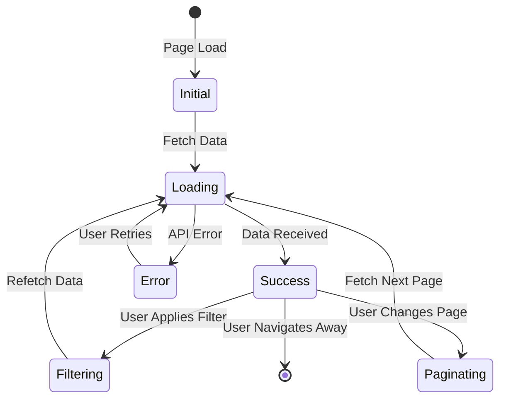
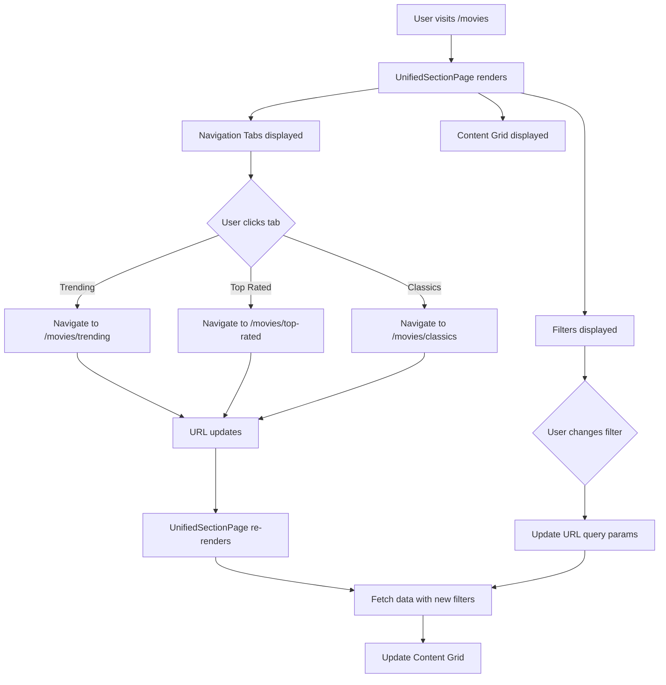
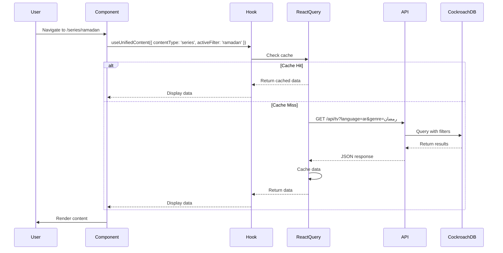

# مستند التصميم: توحيد بنية الموقع بالكامل
# Design Document: Unified Site Architecture

## نظرة عامة / Overview

هذا التصميم يهدف إلى توحيد كامل لبنية الموقع بحيث تعمل جميع الأقسام (أفلام، مسلسلات، ألعاب، برامج) بنفس الطريقة مع نفس المكونات والتدفقات. التصميم يركز على:

This design aims to completely unify the site architecture so that all sections (movies, series, games, software) work the same way with the same components and flows. The design focuses on:

- **Component Reusability**: استخدام نفس المكونات في كل الأقسام / Using the same components across all sections
- **Data Integrity**: ضمان صحة البيانات وعدم التكرار / Ensuring data correctness and no duplication
- **Consistent UX**: تجربة مستخدم موحدة ومتسقة / Unified and consistent user experience
- **Performance**: تحسين الأداء من خلال التخزين المؤقت والـ prefetching / Performance optimization through caching and prefetching
- **Maintainability**: كود نظيف وسهل الصيانة / Clean and maintainable code

### المشاكل الحالية / Current Problems

1. **Navigation Inconsistency**: قسم الأفلام يعمل بشكل صحيح مع navigation ثابت، لكن باقي الأقسام تفقد الـ navigation عند الدخول للأقسام الفرعية
2. **Data Integrity Issues**: قسم رمضان يعرض محتوى أجنبي، قسم كوري يعرض محتوى مكرر
3. **Code Duplication**: كود مكرر في كل قسم بدلاً من استخدام مكونات موحدة
4. **Inconsistent Filtering**: الفلاتر تعمل بشكل مختلف في كل قسم

### الحل المقترح / Proposed Solution

توحيد كامل للبنية من خلال:

1. **UnifiedSectionLayout Component**: مكون موحد لكل الأقسام
2. **UnifiedNavigationTabs Component**: navigation ثابت في كل الأقسام والأقسام الفرعية
3. **UnifiedFilters Component**: فلاتر موحدة تعمل بنفس الطريقة في كل الأقسام
4. **Data Validation Layer**: طبقة للتحقق من صحة البيانات قبل العرض
5. **Shared Hooks & Utilities**: hooks ووظائف مشتركة لتقليل التكرار

---

## البنية المعمارية / Architecture

### Component Hierarchy

```
UnifiedSectionPage (Container)
├── Helmet (SEO Meta Tags)
├── UnifiedNavigationTabs
│   ├── Tab (All)
│   ├── Tab (Trending)
│   ├── Tab (Top Rated)
│   ├── Tab (Latest)
│   └── Tab (Subsection-specific tabs)
├── UnifiedFilters
│   ├── GenreFilter
│   ├── YearFilter
│   ├── RatingFilter
│   └── SortFilter
├── ContentGrid
│   ├── ContentCard (x40 per page)
│   └── SkeletonCard (loading state)
└── Pagination
    ├── PreviousButton
    ├── PageNumbers
    └── NextButton
```

### Data Flow Architecture

```mermaid
graph TD
    A[User Action] --> B{Action Type}
    B -->|Navigate| C[URL Change]
    B -->|Filter| D[Update Query Params]
    B -->|Paginate| E[Update Page Param]
    
    C --> F[React Router]
    D --> F
    E --> F
    
    F --> G[UnifiedSectionPage]
    G --> H[useUnifiedContent Hook]
    
    H --> I{Check Cache}
    I -->|Cache Hit| J[Return Cached Data]
    I -->|Cache Miss| K[Fetch from API]
    
    K --> L{Content Type}
    L -->|Movies| M[/api/movies]
    L -->|Series| N[/api/tv]
    L -->|Gaming| O[/api/games]
    L -->|Software| P[/api/software]
    
    M --> Q[CockroachDB]
    N --> Q
    O --> Q
    P --> Q
    
    Q --> R[Data Validation]
    R --> S[Transform Data]
    S --> T[React Query Cache]
    T --> U[ContentGrid]
    
    J --> U
    
    U --> V[Render Content]
```

### State Management Flow



---

## المكونات والواجهات / Components and Interfaces

### 1. UnifiedSectionPage Component

**Purpose**: المكون الرئيسي الذي يجمع كل المكونات الفرعية ويدير الحالة / Main container component that orchestrates all sub-components and manages state

**Props Interface**:
```typescript
interface UnifiedSectionPageProps {
  contentType: 'movies' | 'series' | 'anime' | 'gaming' | 'software'
  activeFilter: FilterType
  initialGenre?: string
  categoryFilter?: string
  initialYear?: number
  initialRating?: number
  initialSort?: string
}

type FilterType = 
  | 'all' 
  | 'trending' 
  | 'top-rated' 
  | 'latest' 
  | 'upcoming' 
  | 'classics' 
  | 'summaries'
  | 'ramadan'
  | 'arabic'
  | 'korean'
  | 'turkish'
  | 'chinese'
  | 'foreign'
  | 'animation_movies'
  | 'cartoon_series'
```

**Responsibilities**:
- Extract filters from URL query parameters
- Manage filter state and URL synchronization
- Fetch data using `useUnifiedContent` hook
- Prefetch next page for better UX
- Handle filter changes and update URL
- Render SEO meta tags using Helmet
- Render sub-components (Navigation, Filters, Content Grid, Pagination)

**Key Features**:
- URL-driven state management
- Automatic cache invalidation on filter change
- SEO optimization with dynamic meta tags
- Responsive design support

### 2. UnifiedNavigationTabs Component

**Purpose**: عرض روابط الأقسام الفرعية بشكل ثابت في كل الصفحات / Display subsection navigation tabs persistently across all pages

**Props Interface**:
```typescript
interface UnifiedNavigationTabsProps {
  contentType: 'movies' | 'series' | 'anime' | 'gaming' | 'software'
  activeTab: string
  subsections: SubsectionDefinition[]
  lang: 'ar' | 'en'
}

interface SubsectionDefinition {
  id: string
  labelAr: string
  labelEn: string
  path: string
  icon?: React.ReactNode
}
```

**Subsections by Content Type**:

**Movies**:
- الكل / All (`/movies`)
- الرائجة / Trending (`/movies/trending`)
- الأعلى تقييماً / Top Rated (`/movies/top-rated`)
- الأحدث / Latest (`/movies/latest`)
- القادمة / Upcoming (`/movies/upcoming`)
- الكلاسيكية / Classics (`/movies/classics`)
- الملخصات / Summaries (`/movies/summaries`)

**Series**:
- الكل / All (`/series`)
- عربي / Arabic (`/series/arabic`)
- رمضان / Ramadan (`/series/ramadan`)
- كوري / Korean (`/series/korean`)
- تركي / Turkish (`/series/turkish`)
- صيني / Chinese (`/series/chinese`)
- أجنبي / Foreign (`/series/foreign`)

**Gaming**:
- الكل / All (`/gaming`)
- PC (`/gaming/pc`)
- PlayStation (`/gaming/playstation`)
- Xbox (`/gaming/xbox`)
- Nintendo (`/gaming/nintendo`)
- Mobile (`/gaming/mobile`)

**Software**:
- الكل / All (`/software`)
- Windows (`/software/windows`)
- Mac (`/software/mac`)
- Linux (`/software/linux`)
- Android (`/software/android`)
- iOS (`/software/ios`)

**Responsive Behavior**:
- **Desktop**: Full horizontal display with all tabs visible
- **Tablet**: Horizontal scroll with visible overflow indicators
- **Mobile**: Horizontal scroll with touch gestures

**Accessibility**:
- ARIA labels for screen readers
- Keyboard navigation support (Tab, Arrow keys)
- Focus indicators
- Active state announcement

### 3. UnifiedFilters Component

**Purpose**: فلاتر متقدمة موحدة لكل الأقسام / Unified advanced filters for all sections

**Props Interface**:
```typescript
interface UnifiedFiltersProps {
  contentType: 'movies' | 'series' | 'anime' | 'gaming' | 'software'
  genre: string | null
  year: number | null
  rating: number | null
  sortBy: string | null
  onFilterChange: (key: string, value: string | number | null) => void
  onClearAll: () => void
  lang: 'ar' | 'en'
}
```

**Filter Options**:

1. **Genre Filter**:
   - Dynamic options based on content type
   - Movies: أكشن، دراما، كوميديا، رعب، خيال علمي، etc.
   - Series: دراما، كوميديا، رومانسي، إثارة، etc.
   - Gaming: أكشن، مغامرات، RPG، رياضة، etc.
   - Software: إنتاجية، تصميم، برمجة، أمن، etc.

2. **Year Filter**:
   - Range: 1950 - Current Year
   - Dropdown with common ranges (2024, 2023, 2020s, 2010s, 2000s, etc.)

3. **Rating Filter**:
   - Range: 0 - 10
   - Options: 9+, 8+, 7+, 6+, 5+

4. **Sort Filter**:
   - Popularity (الأكثر شعبية)
   - Rating (الأعلى تقييماً)
   - Release Date (الأحدث)
   - Title (الاسم)

**UI Design**:
- Dropdown menus with search capability
- Clear all filters button
- Active filter indicators
- Responsive layout (stacked on mobile, horizontal on desktop)

### 4. ContentGrid Component

**Purpose**: عرض المحتوى في شبكة متجاوبة / Display content in responsive grid

**Props Interface**:
```typescript
interface ContentGridProps {
  items: UnifiedContentItem[]
  contentType: 'movies' | 'series' | 'anime' | 'gaming' | 'software'
  isLoading: boolean
  lang: 'ar' | 'en'
}

interface UnifiedContentItem {
  id: number
  slug: string
  title: string
  poster_path: string
  backdrop_path: string
  vote_average: number
  release_date: string
  media_type: 'movie' | 'tv' | 'game' | 'software'
  language?: string
  genres?: string[]
}
```

**Grid Layout**:
- **Mobile**: 2 columns
- **Tablet**: 4 columns
- **Desktop**: 6 columns
- **Large Desktop**: 8 columns

**Card Features**:
- Poster image with lazy loading
- Title overlay on hover
- Rating badge
- Release year
- Quick action buttons (Add to Watchlist, Share)

**Loading State**:
- Skeleton cards matching grid layout
- Shimmer animation effect
- Maintains layout stability

**Empty State**:
- "لا توجد نتائج" message in Arabic
- "No results found" message in English
- Suggestion to clear filters
- Illustration or icon

### 5. Pagination Component

**Purpose**: التنقل بين الصفحات / Navigate between pages

**Props Interface**:
```typescript
interface PaginationProps {
  currentPage: number
  totalPages: number
  onPageChange: (page: number) => void
  lang: 'ar' | 'en'
}
```

**Features**:
- Previous/Next buttons
- Page numbers with ellipsis for large ranges
- Jump to first/last page
- Current page indicator
- Disabled state for boundary pages
- Keyboard navigation support

---

## نماذج البيانات / Data Models

### API Response Structure

```typescript
interface PaginatedResponse<T> {
  data: T[]
  pagination: {
    page: number
    limit: number
    total: number
    totalPages: number
  }
  _cache?: {
    hit: boolean
    responseTime: number
  }
}
```

### Content Item Models

**Movie Model**:
```typescript
interface Movie {
  id: number
  tmdb_id: number
  slug: string
  title: string
  original_title: string
  overview: string
  poster_url: string
  backdrop_url: string
  release_date: string
  runtime: number
  vote_average: number
  vote_count: number
  popularity: number
  language: string
  genres: string[]
  production_countries: string[]
  status: 'released' | 'upcoming' | 'in_production'
  created_at: string
  updated_at: string
}
```

**TV Series Model**:
```typescript
interface TVSeries {
  id: number
  tmdb_id: number
  slug: string
  name: string
  original_name: string
  overview: string
  poster_url: string
  backdrop_url: string
  first_air_date: string
  last_air_date: string
  number_of_seasons: number
  number_of_episodes: number
  vote_average: number
  vote_count: number
  popularity: number
  language: string
  genres: string[]
  production_countries: string[]
  status: 'returning' | 'ended' | 'canceled'
  created_at: string
  updated_at: string
}
```

**Game Model**:
```typescript
interface Game {
  id: number
  slug: string
  title: string
  description: string
  poster_url: string
  backdrop_url: string
  release_date: string
  platforms: string[]
  genres: string[]
  rating: number
  rating_count: number
  developer: string
  publisher: string
  created_at: string
  updated_at: string
}
```

**Software Model**:
```typescript
interface Software {
  id: number
  slug: string
  name: string
  description: string
  icon_url: string
  screenshot_url: string
  version: string
  release_date: string
  platforms: string[]
  categories: string[]
  rating: number
  rating_count: number
  developer: string
  license: string
  created_at: string
  updated_at: string
}
```

### Filter Parameters

```typescript
interface ContentFilters {
  genres?: string[]
  category?: string
  minRating?: number
  minYear?: number
  maxYear?: number
  language?: string
  platform?: string
  minVoteCount?: number
  sortBy?: 'popularity' | 'vote_average' | 'release_date' | 'title'
}
```

### Subsection Configuration

```typescript
interface SubsectionConfig {
  movies: {
    all: { filters: {} }
    trending: { filters: {}, sortBy: 'popularity' }
    'top-rated': { filters: { minRating: 7 }, sortBy: 'vote_average' }
    latest: { filters: {}, sortBy: 'release_date' }
    upcoming: { filters: { status: 'upcoming' } }
    classics: { filters: { maxYear: 1999, minVoteCount: 50 } }
    summaries: { filters: { category: 'recaps' } }
  }
  series: {
    all: { filters: {} }
    arabic: { filters: { language: 'ar' } }
    ramadan: { filters: { language: 'ar', genres: ['رمضان', 'دراما'] } }
    korean: { filters: { language: 'ko' } }
    turkish: { filters: { language: 'tr' } }
    chinese: { filters: { language: 'zh' } }
    foreign: { filters: { language: '!ar' } }
  }
  gaming: {
    all: { filters: {} }
    pc: { filters: { platform: 'PC' } }
    playstation: { filters: { platform: 'PlayStation' } }
    xbox: { filters: { platform: 'Xbox' } }
    nintendo: { filters: { platform: 'Nintendo' } }
    mobile: { filters: { platform: 'Mobile' } }
  }
  software: {
    all: { filters: {} }
    windows: { filters: { platform: 'Windows' } }
    mac: { filters: { platform: 'Mac' } }
    linux: { filters: { platform: 'Linux' } }
    android: { filters: { platform: 'Android' } }
    ios: { filters: { platform: 'iOS' } }
  }
}
```

---

## خصائص الصحة / Correctness Properties

*A property is a characteristic or behavior that should hold true across all valid executions of a system-essentially, a formal statement about what the system should do. Properties serve as the bridge between human-readable specifications and machine-verifiable correctness guarantees.*

### Property 1: Navigation Tabs Persistence

*For any* section (movies, series, gaming, software) and any subsection within that section, the Navigation_Tabs component should be visible and rendered in the DOM.

**Validates: Requirements 1.1, 1.2**

### Property 2: Active Tab Indicator

*For any* subsection that is currently active, the corresponding navigation tab should have an active state indicator (CSS class or ARIA attribute).

**Validates: Requirements 1.3**

### Property 3: Component Reusability Across Sections

*For any* section page (Movies.tsx, Series.tsx, Gaming.tsx, Software.tsx), the same UnifiedSectionPage component should be used.

**Validates: Requirements 1.4, 2.5, 5.5, 6.5, 7.8, 10.1**

### Property 4: Navigation Click Behavior

*For any* navigation tab click event, the system should navigate to the corresponding subsection URL.

**Validates: Requirements 1.5**

### Property 5: Language-Based Content Filtering

*For any* subsection with a language filter (Ramadan='ar', Korean='ko', Turkish='tr', Chinese='zh'), all returned content items should have the matching language field.

**Validates: Requirements 3.1, 3.4, 4.1, 4.6, 11.1, 11.2, 11.3, 11.4, 11.6**

### Property 6: Content Uniqueness

*For any* content list returned from the API, all items should have unique IDs (no duplicates based on TMDB ID or slug).

**Validates: Requirements 4.2, 4.5, 11.2, 11.7**

### Property 7: API Query Language Parameter

*For any* subsection with language filtering, the API query should include the correct language parameter in the query string.

**Validates: Requirements 3.3, 4.3, 4.4**

### Property 8: Foreign Content Exclusion

*For any* subsection that excludes a specific language (e.g., Foreign subsection excludes Arabic), no returned content should have the excluded language.

**Validates: Requirements 11.5**

### Property 9: Platform-Based Filtering

*For any* gaming or software subsection with platform filter, all returned content should have the matching platform field.

**Validates: Requirements 5.6, 6.6**

### Property 10: Component Composition

*For any* UnifiedSectionLayout instance, it should render Navigation_Tabs, Filters, and Content_Grid components.

**Validates: Requirements 7.4, 7.5, 7.6**

### Property 11: Props Acceptance

*For any* UnifiedSectionLayout component, it should accept sectionType and subsections props without errors.

**Validates: Requirements 7.2, 7.3**

### Property 12: Reactive Updates

*For any* sectionType prop change in UnifiedSectionLayout, the Navigation_Tabs should update to reflect the new section's subsections.

**Validates: Requirements 7.7**

### Property 13: Filter UI Elements

*For any* UnifiedFilters component instance, it should render genre, year, rating, and sort dropdowns.

**Validates: Requirements 8.2, 8.3, 8.4, 8.5**

### Property 14: Filter-to-Content Synchronization

*For any* filter selection change, the Content_Grid should update to display filtered results matching the filter criteria.

**Validates: Requirements 8.6**

### Property 15: Filter Consistency

*For any* section, the UnifiedFilters component should behave identically (same UI, same interactions).

**Validates: Requirements 8.7**

### Property 16: URL-Filter Synchronization (Round Trip)

*For any* filter state, changing filters should update URL query parameters, and loading a URL with query parameters should apply those filters to the UI state.

**Validates: Requirements 8.8, 12.3, 12.4, 12.5**

### Property 17: Pagination Limit

*For any* page of content, the number of items should not exceed 40 items per page.

**Validates: Requirements 9.3, 14.2**

### Property 18: Loading State Display

*For any* content fetch operation where isLoading is true, skeleton loaders should be displayed.

**Validates: Requirements 9.4, 14.6**

### Property 19: CockroachDB API Exclusivity

*For any* content data fetch (movies, series, games, software), the API endpoint should be a CockroachDB endpoint (/api/movies, /api/tv, /api/games, /api/software), not a Supabase endpoint.

**Validates: Requirements 9.6, 16.1, 16.2, 16.3, 16.4, 16.5**

### Property 20: Rating Display

*For any* content item with a vote_average field, the rating should be displayed in the ContentGrid card.

**Validates: Requirements 9.7**

### Property 21: Shared Hook Usage

*For any* section page, the useUnifiedContent and usePrefetchNextPage hooks should be used for data fetching.

**Validates: Requirements 10.3**

### Property 22: Shared Utility Usage

*For any* section page, the getPageTitle, getPageDescription, and mapFilterToAPIParams utilities should be used.

**Validates: Requirements 10.4**

### Property 23: Code Duplication Limit

*For any* comparison between section page files, the code duplication percentage should not exceed 20%.

**Validates: Requirements 10.6**

### Property 24: Data Integrity Logging

*For any* data integrity violation (e.g., wrong language in subsection), the error should be logged to the error logging service.

**Validates: Requirements 11.8**

### Property 25: URL Pattern Consistency

*For any* section, the main section URL should follow the pattern "/{section}" and subsection URLs should follow "/{section}/{subsection}".

**Validates: Requirements 12.1, 12.2**

### Property 26: SEO Meta Tags

*For any* section or subsection page, proper SEO meta tags (title, description) should be generated and rendered via Helmet.

**Validates: Requirements 12.6, 12.7**

### Property 27: Internationalization (i18n)

*For any* UI component (Navigation_Tabs, Filters) and any language setting (ar or en), the labels should be displayed in the correct language.

**Validates: Requirements 13.1, 13.2, 13.3, 13.4, 2.6**

### Property 28: Language Persistence

*For any* language preference change, the language should persist across page navigation.

**Validates: Requirements 13.8**

### Property 29: Query Caching Configuration

*For any* useUnifiedContent hook usage, React Query should be configured with staleTime of at least 5 minutes.

**Validates: Requirements 14.1, 14.3**

### Property 30: Cache Utilization

*For any* navigation to a previously visited tab, cached data should be used if available (no refetch).

**Validates: Requirements 14.4**

### Property 31: Next Page Prefetching

*For any* page view, the next page data should be prefetched in the background.

**Validates: Requirements 14.5**

### Property 32: Error Display

*For any* API request failure, an error message should be displayed to the user.

**Validates: Requirements 15.1**

### Property 33: Error Logging

*For any* API request failure, the error should be logged to the error logging service.

**Validates: Requirements 15.2**

### Property 34: Retry Button on Error

*For any* network error, a retry button should be displayed to the user.

**Validates: Requirements 15.4**

### Property 35: Error Boundary Implementation

*For any* component tree, error boundaries should be implemented to prevent full page crashes.

**Validates: Requirements 15.5**

### Property 36: Empty State Suggestions

*For any* filter combination that produces no results, a suggestion to remove filters should be displayed.

**Validates: Requirements 15.6**

### Property 37: API Query Parameters

*For any* filter values (genre, year, rating, sortBy), appropriate query parameters should be included in the API request.

**Validates: Requirements 16.6**

### Property 38: API Error Retry Logic

*For any* API error, retry logic should be triggered (up to 2 retries with exponential backoff).

**Validates: Requirements 16.7**

---

## معالجة الأخطاء / Error Handling

### Error Types and Handling Strategy

#### 1. API Errors

**Scenarios**:
- CockroachDB API is down
- Network timeout
- 404 Not Found
- 500 Internal Server Error
- Rate limiting (429)

**Handling**:
```typescript
try {
  const response = await fetch(endpoint)
  if (!response.ok) {
    throw {
      status: response.status,
      statusText: response.statusText,
      message: await response.text()
    }
  }
  return await response.json()
} catch (error) {
  // Log to error service
  ErrorHandler.log(error)
  
  // Display user-friendly message
  if (error.status === 404) {
    return { error: 'المحتوى غير موجود / Content not found' }
  } else if (error.status >= 500) {
    return { error: 'خطأ في الخادم / Server error' }
  } else {
    return { error: 'حدث خطأ / An error occurred' }
  }
}
```

**React Query Configuration**:
```typescript
{
  retry: 2,
  retryDelay: (attemptIndex) => Math.min(1000 * 2 ** attemptIndex, 30000),
  onError: (error) => {
    ErrorHandler.log(error)
    toast.error(getErrorMessage(error, lang))
  }
}
```

#### 2. Data Integrity Errors

**Scenarios**:
- Wrong language in subsection (e.g., English content in Ramadan section)
- Duplicate content
- Missing required fields

**Handling**:
```typescript
function validateContentIntegrity(
  items: UnifiedContentItem[],
  expectedLanguage?: string
): ValidationResult {
  const errors: string[] = []
  
  items.forEach((item, index) => {
    // Check language
    if (expectedLanguage && item.language !== expectedLanguage) {
      errors.push(`Item ${index} has wrong language: ${item.language}`)
      ErrorHandler.log({
        type: 'DATA_INTEGRITY_VIOLATION',
        message: `Wrong language in subsection`,
        data: { item, expectedLanguage }
      })
    }
    
    // Check for required fields
    if (!item.id || !item.slug || !item.title) {
      errors.push(`Item ${index} missing required fields`)
    }
  })
  
  return {
    isValid: errors.length === 0,
    errors
  }
}
```

#### 3. Empty State Handling

**Scenarios**:
- No content available
- Filters produce no results
- Subsection has no data

**Handling**:
```typescript
if (!data || data.items.length === 0) {
  return (
    <EmptyState
      title={lang === 'ar' ? 'لا توجد نتائج' : 'No results found'}
      description={
        hasActiveFilters
          ? (lang === 'ar' ? 'جرب إزالة بعض الفلاتر' : 'Try removing some filters')
          : (lang === 'ar' ? 'لا يوجد محتوى متاح حالياً' : 'No content available')
      }
      action={
        hasActiveFilters && (
          <Button onClick={onClearFilters}>
            {lang === 'ar' ? 'إزالة الفلاتر' : 'Clear Filters'}
          </Button>
        )
      }
    />
  )
}
```

#### 4. Loading State Handling

**Scenarios**:
- Initial page load
- Filter change
- Pagination

**Handling**:
```typescript
if (isLoading) {
  return <SkeletonGrid count={40} variant="poster" />
}
```

#### 5. Error Boundaries

**Implementation**:
```typescript
class ErrorBoundary extends React.Component {
  state = { hasError: false, error: null }
  
  static getDerivedStateFromError(error) {
    return { hasError: true, error }
  }
  
  componentDidCatch(error, errorInfo) {
    ErrorHandler.log({
      type: 'REACT_ERROR_BOUNDARY',
      error,
      errorInfo
    })
  }
  
  render() {
    if (this.state.hasError) {
      return (
        <ErrorFallback
          error={this.state.error}
          resetError={() => this.setState({ hasError: false })}
        />
      )
    }
    return this.props.children
  }
}
```

---

## استراتيجية الاختبار / Testing Strategy

### Dual Testing Approach

This project uses both **unit tests** and **property-based tests** for comprehensive coverage:

- **Unit tests**: Verify specific examples, edge cases, and error conditions
- **Property tests**: Verify universal properties across all inputs
- Together: comprehensive coverage (unit tests catch concrete bugs, property tests verify general correctness)

### Property-Based Testing

**Library**: `fast-check` for TypeScript/JavaScript

**Configuration**:
```typescript
import fc from 'fast-check'

// Minimum 100 iterations per property test
fc.assert(
  fc.property(
    // generators
  )(
    // test function
  ),
  { numRuns: 100 }
)
```

**Tag Format**:
```typescript
// Feature: unified-site-architecture, Property 1: Navigation Tabs Persistence
test('Navigation tabs should be visible in all sections and subsections', () => {
  fc.assert(
    fc.property(
      fc.constantFrom('movies', 'series', 'gaming', 'software'),
      fc.string(),
      (section, subsection) => {
        const { container } = render(
          <UnifiedSectionPage contentType={section} activeFilter={subsection} />
        )
        const navTabs = container.querySelector('[data-testid="navigation-tabs"]')
        expect(navTabs).toBeInTheDocument()
      }
    ),
    { numRuns: 100 }
  )
})
```

### Property Test Examples

#### Property 5: Language-Based Content Filtering

```typescript
// Feature: unified-site-architecture, Property 5: Language-Based Content Filtering
test('Ramadan subsection should only return Arabic content', () => {
  fc.assert(
    fc.property(
      fc.array(fc.record({
        id: fc.integer(),
        language: fc.constantFrom('ar', 'en', 'ko', 'tr', 'zh'),
        title: fc.string()
      })),
      (mockData) => {
        // Mock API to return mockData
        mockAPI('/api/tv?language=ar', mockData.filter(item => item.language === 'ar'))
        
        const { result } = renderHook(() => 
          useUnifiedContent({
            contentType: 'series',
            activeFilter: 'ramadan'
          })
        )
        
        waitFor(() => {
          const items = result.current.data?.items || []
          expect(items.every(item => item.language === 'ar')).toBe(true)
        })
      }
    ),
    { numRuns: 100 }
  )
})
```

#### Property 6: Content Uniqueness

```typescript
// Feature: unified-site-architecture, Property 6: Content Uniqueness
test('Korean subsection should have no duplicate content', () => {
  fc.assert(
    fc.property(
      fc.array(fc.record({
        id: fc.integer(),
        tmdb_id: fc.integer(),
        slug: fc.string(),
        language: fc.constant('ko')
      })),
      (mockData) => {
        mockAPI('/api/tv?language=ko', mockData)
        
        const { result } = renderHook(() => 
          useUnifiedContent({
            contentType: 'series',
            activeFilter: 'korean'
          })
        )
        
        waitFor(() => {
          const items = result.current.data?.items || []
          const ids = items.map(item => item.id)
          const uniqueIds = new Set(ids)
          expect(ids.length).toBe(uniqueIds.size)
        })
      }
    ),
    { numRuns: 100 }
  )
})
```

#### Property 16: URL-Filter Synchronization (Round Trip)

```typescript
// Feature: unified-site-architecture, Property 16: URL-Filter Synchronization
test('Filter state should round-trip through URL', () => {
  fc.assert(
    fc.property(
      fc.record({
        genre: fc.option(fc.string()),
        year: fc.option(fc.integer({ min: 1950, max: 2024 })),
        rating: fc.option(fc.float({ min: 0, max: 10 }))
      }),
      (filters) => {
        // Set filters in UI
        const { getByTestId } = render(<UnifiedSectionPage contentType="movies" />)
        
        if (filters.genre) {
          fireEvent.change(getByTestId('genre-filter'), { target: { value: filters.genre } })
        }
        if (filters.year) {
          fireEvent.change(getByTestId('year-filter'), { target: { value: filters.year } })
        }
        if (filters.rating) {
          fireEvent.change(getByTestId('rating-filter'), { target: { value: filters.rating } })
        }
        
        // Check URL updated
        const url = new URL(window.location.href)
        if (filters.genre) expect(url.searchParams.get('genre')).toBe(filters.genre)
        if (filters.year) expect(url.searchParams.get('year')).toBe(String(filters.year))
        if (filters.rating) expect(url.searchParams.get('rating')).toBe(String(filters.rating))
        
        // Reload page with URL
        const { getByTestId: getByTestId2 } = render(
          <UnifiedSectionPage contentType="movies" />
        )
        
        // Check filters applied
        if (filters.genre) {
          expect(getByTestId2('genre-filter')).toHaveValue(filters.genre)
        }
        if (filters.year) {
          expect(getByTestId2('year-filter')).toHaveValue(String(filters.year))
        }
        if (filters.rating) {
          expect(getByTestId2('rating-filter')).toHaveValue(String(filters.rating))
        }
      }
    ),
    { numRuns: 100 }
  )
})
```

### Unit Test Examples

#### Example: Ramadan Empty State

```typescript
test('Ramadan subsection shows empty message when no Arabic series available', () => {
  mockAPI('/api/tv?language=ar', [])
  
  const { getByText } = render(
    <UnifiedSectionPage contentType="series" activeFilter="ramadan" />
  )
  
  expect(getByText('لا توجد مسلسلات رمضانية')).toBeInTheDocument()
})
```

#### Example: Specific Route Navigation

```typescript
test('Visiting /series/ramadan shows navigation tabs with Ramadan active', () => {
  render(
    <MemoryRouter initialEntries={['/series/ramadan']}>
      <Routes>
        <Route path="/series/:subsection" element={<SeriesPage />} />
      </Routes>
    </MemoryRouter>
  )
  
  const navTabs = screen.getByTestId('navigation-tabs')
  expect(navTabs).toBeInTheDocument()
  
  const ramadanTab = screen.getByText('رمضان')
  expect(ramadanTab).toHaveClass('active')
})
```

### Integration Tests

#### Test: End-to-End Filter Flow

```typescript
test('User can filter movies by genre, year, and rating', async () => {
  const { getByTestId, getByText } = render(<MoviesPage />)
  
  // Select genre
  fireEvent.change(getByTestId('genre-filter'), { target: { value: 'أكشن' } })
  await waitFor(() => {
    expect(window.location.search).toContain('genre=أكشن')
  })
  
  // Select year
  fireEvent.change(getByTestId('year-filter'), { target: { value: '2024' } })
  await waitFor(() => {
    expect(window.location.search).toContain('year=2024')
  })
  
  // Select rating
  fireEvent.change(getByTestId('rating-filter'), { target: { value: '8' } })
  await waitFor(() => {
    expect(window.location.search).toContain('rating=8')
  })
  
  // Verify API called with correct params
  expect(mockFetch).toHaveBeenCalledWith(
    expect.stringContaining('/api/movies?genre=أكشن&yearFrom=2024&yearTo=2024&ratingFrom=8')
  )
})
```

### Test Coverage Goals

- **Unit Tests**: 80% code coverage
- **Property Tests**: All 38 correctness properties implemented
- **Integration Tests**: All critical user flows covered
- **E2E Tests**: All 18 acceptance test scenarios (Requirement 18)

---

## بنية الملفات / File Structure

```
src/
├── components/
│   ├── unified/
│   │   ├── UnifiedSectionLayout.tsx          # Main layout component
│   │   ├── UnifiedNavigationTabs.tsx         # Navigation tabs component
│   │   ├── UnifiedFilters.tsx                # Filters component
│   │   └── UnifiedContentGrid.tsx            # Content grid component
│   ├── features/
│   │   ├── filters/
│   │   │   └── AdvancedFilters.tsx           # Advanced filters (existing)
│   │   └── media/
│   │       └── ContentGrid.tsx               # Content grid (existing)
│   └── common/
│       ├── Pagination.tsx                    # Pagination component
│       ├── Skeletons.tsx                     # Loading skeletons
│       └── ErrorMessage.tsx                  # Error display
├── pages/
│   └── discovery/
│       ├── UnifiedSectionPage.tsx            # Main unified page (existing)
│       ├── Movies.tsx                        # Movies page (updated)
│       ├── Series.tsx                        # Series page (updated)
│       ├── Gaming.tsx                        # Gaming page (updated)
│       ├── Software.tsx                      # Software page (updated)
│       ├── subsections/
│       │   ├── movies/
│       │   │   ├── Trending.tsx
│       │   │   ├── TopRated.tsx
│       │   │   ├── Latest.tsx
│       │   │   ├── Upcoming.tsx
│       │   │   ├── Classics.tsx
│       │   │   └── Summaries.tsx
│       │   ├── series/
│       │   │   ├── Arabic.tsx
│       │   │   ├── Ramadan.tsx
│       │   │   ├── Korean.tsx
│       │   │   ├── Turkish.tsx
│       │   │   ├── Chinese.tsx
│       │   │   └── Foreign.tsx
│       │   ├── gaming/
│       │   │   ├── PC.tsx
│       │   │   ├── PlayStation.tsx
│       │   │   ├── Xbox.tsx
│       │   │   ├── Nintendo.tsx
│       │   │   └── Mobile.tsx
│       │   └── software/
│       │       ├── Windows.tsx
│       │       ├── Mac.tsx
│       │       ├── Linux.tsx
│       │       ├── Android.tsx
│       │       └── iOS.tsx
├── hooks/
│   ├── useUnifiedContent.ts                  # Data fetching hook (existing)
│   ├── usePrefetchNextPage.ts                # Prefetch hook (existing)
│   └── useSubsectionConfig.ts                # Subsection config hook (new)
├── services/
│   ├── contentQueries.ts                     # CockroachDB queries (existing)
│   └── contentAPI.ts                         # API helpers (existing)
├── lib/
│   ├── filter-utils.ts                       # Filter utilities (existing)
│   ├── error-handling.ts                     # Error handling (existing)
│   └── subsection-config.ts                  # Subsection configurations (new)
├── types/
│   ├── unified-section.ts                    # Unified types (existing)
│   └── subsection.ts                         # Subsection types (new)
└── routes/
    └── AppRoutes.tsx                         # Route configuration (updated)
```

### New Files to Create

#### 1. `src/lib/subsection-config.ts`

```typescript
export const SUBSECTION_CONFIG = {
  movies: [
    { id: 'all', labelAr: 'الكل', labelEn: 'All', path: '/movies', filters: {} },
    { id: 'trending', labelAr: 'الرائجة', labelEn: 'Trending', path: '/movies/trending', filters: {}, sortBy: 'popularity' },
    { id: 'top-rated', labelAr: 'الأعلى تقييماً', labelEn: 'Top Rated', path: '/movies/top-rated', filters: { minRating: 7 }, sortBy: 'vote_average' },
    { id: 'latest', labelAr: 'الأحدث', labelEn: 'Latest', path: '/movies/latest', filters: {}, sortBy: 'release_date' },
    { id: 'upcoming', labelAr: 'القادمة', labelEn: 'Upcoming', path: '/movies/upcoming', filters: { status: 'upcoming' } },
    { id: 'classics', labelAr: 'الكلاسيكية', labelEn: 'Classics', path: '/movies/classics', filters: { maxYear: 1999, minVoteCount: 50 } },
    { id: 'summaries', labelAr: 'الملخصات', labelEn: 'Summaries', path: '/movies/summaries', filters: { category: 'recaps' } }
  ],
  series: [
    { id: 'all', labelAr: 'الكل', labelEn: 'All', path: '/series', filters: {} },
    { id: 'arabic', labelAr: 'عربي', labelEn: 'Arabic', path: '/series/arabic', filters: { language: 'ar' } },
    { id: 'ramadan', labelAr: 'رمضان', labelEn: 'Ramadan', path: '/series/ramadan', filters: { language: 'ar', genres: ['رمضان', 'دراما'] } },
    { id: 'korean', labelAr: 'كوري', labelEn: 'Korean', path: '/series/korean', filters: { language: 'ko' } },
    { id: 'turkish', labelAr: 'تركي', labelEn: 'Turkish', path: '/series/turkish', filters: { language: 'tr' } },
    { id: 'chinese', labelAr: 'صيني', labelEn: 'Chinese', path: '/series/chinese', filters: { language: 'zh' } },
    { id: 'foreign', labelAr: 'أجنبي', labelEn: 'Foreign', path: '/series/foreign', filters: { language: '!ar' } }
  ],
  gaming: [
    { id: 'all', labelAr: 'الكل', labelEn: 'All', path: '/gaming', filters: {} },
    { id: 'pc', labelAr: 'PC', labelEn: 'PC', path: '/gaming/pc', filters: { platform: 'PC' } },
    { id: 'playstation', labelAr: 'PlayStation', labelEn: 'PlayStation', path: '/gaming/playstation', filters: { platform: 'PlayStation' } },
    { id: 'xbox', labelAr: 'Xbox', labelEn: 'Xbox', path: '/gaming/xbox', filters: { platform: 'Xbox' } },
    { id: 'nintendo', labelAr: 'Nintendo', labelEn: 'Nintendo', path: '/gaming/nintendo', filters: { platform: 'Nintendo' } },
    { id: 'mobile', labelAr: 'Mobile', labelEn: 'Mobile', path: '/gaming/mobile', filters: { platform: 'Mobile' } }
  ],
  software: [
    { id: 'all', labelAr: 'الكل', labelEn: 'All', path: '/software', filters: {} },
    { id: 'windows', labelAr: 'Windows', labelEn: 'Windows', path: '/software/windows', filters: { platform: 'Windows' } },
    { id: 'mac', labelAr: 'Mac', labelEn: 'Mac', path: '/software/mac', filters: { platform: 'Mac' } },
    { id: 'linux', labelAr: 'Linux', labelEn: 'Linux', path: '/software/linux', filters: { platform: 'Linux' } },
    { id: 'android', labelAr: 'Android', labelEn: 'Android', path: '/software/android', filters: { platform: 'Android' } },
    { id: 'ios', labelAr: 'iOS', labelEn: 'iOS', path: '/software/ios', filters: { platform: 'iOS' } }
  ]
}
```

#### 2. `src/hooks/useSubsectionConfig.ts`

```typescript
import { useMemo } from 'react'
import { SUBSECTION_CONFIG } from '../lib/subsection-config'
import type { ContentType } from '../types/unified-section'

export function useSubsectionConfig(contentType: ContentType) {
  return useMemo(() => {
    return SUBSECTION_CONFIG[contentType] || []
  }, [contentType])
}
```

#### 3. `src/types/subsection.ts`

```typescript
export interface SubsectionDefinition {
  id: string
  labelAr: string
  labelEn: string
  path: string
  filters: Record<string, any>
  sortBy?: string
  icon?: React.ReactNode
}

export interface SubsectionConfig {
  movies: SubsectionDefinition[]
  series: SubsectionDefinition[]
  gaming: SubsectionDefinition[]
  software: SubsectionDefinition[]
}
```

### Files to Update

#### 1. `src/pages/discovery/Movies.tsx`

```typescript
import { UnifiedSectionPage } from './UnifiedSectionPage'

export const MoviesPage = () => {
  return <UnifiedSectionPage contentType="movies" activeFilter="all" />
}
```

#### 2. `src/pages/discovery/Series.tsx`

```typescript
import { UnifiedSectionPage } from './UnifiedSectionPage'

export const SeriesPage = () => {
  return <UnifiedSectionPage contentType="series" activeFilter="all" />
}
```

#### 3. `src/routes/AppRoutes.tsx`

Add subsection routes:

```typescript
// Movies subsections
<Route path="/movies/trending" element={<UnifiedSectionPage contentType="movies" activeFilter="trending" />} />
<Route path="/movies/top-rated" element={<UnifiedSectionPage contentType="movies" activeFilter="top-rated" />} />
<Route path="/movies/latest" element={<UnifiedSectionPage contentType="movies" activeFilter="latest" />} />
<Route path="/movies/upcoming" element={<UnifiedSectionPage contentType="movies" activeFilter="upcoming" />} />
<Route path="/movies/classics" element={<UnifiedSectionPage contentType="movies" activeFilter="classics" />} />
<Route path="/movies/summaries" element={<UnifiedSectionPage contentType="movies" activeFilter="summaries" />} />

// Series subsections
<Route path="/series/arabic" element={<UnifiedSectionPage contentType="series" activeFilter="arabic" />} />
<Route path="/series/ramadan" element={<UnifiedSectionPage contentType="series" activeFilter="ramadan" />} />
<Route path="/series/korean" element={<UnifiedSectionPage contentType="series" activeFilter="korean" />} />
<Route path="/series/turkish" element={<UnifiedSectionPage contentType="series" activeFilter="turkish" />} />
<Route path="/series/chinese" element={<UnifiedSectionPage contentType="series" activeFilter="chinese" />} />
<Route path="/series/foreign" element={<UnifiedSectionPage contentType="series" activeFilter="foreign" />} />

// Gaming subsections
<Route path="/gaming/pc" element={<UnifiedSectionPage contentType="gaming" activeFilter="pc" />} />
<Route path="/gaming/playstation" element={<UnifiedSectionPage contentType="gaming" activeFilter="playstation" />} />
<Route path="/gaming/xbox" element={<UnifiedSectionPage contentType="gaming" activeFilter="xbox" />} />
<Route path="/gaming/nintendo" element={<UnifiedSectionPage contentType="gaming" activeFilter="nintendo" />} />
<Route path="/gaming/mobile" element={<UnifiedSectionPage contentType="gaming" activeFilter="mobile" />} />

// Software subsections
<Route path="/software/windows" element={<UnifiedSectionPage contentType="software" activeFilter="windows" />} />
<Route path="/software/mac" element={<UnifiedSectionPage contentType="software" activeFilter="mac" />} />
<Route path="/software/linux" element={<UnifiedSectionPage contentType="software" activeFilter="linux" />} />
<Route path="/software/android" element={<UnifiedSectionPage contentType="software" activeFilter="android" />} />
<Route path="/software/ios" element={<UnifiedSectionPage contentType="software" activeFilter="ios" />} />
```

---

## نهج التنفيذ / Implementation Approach

### Phase 1: Core Components (Week 1)

**Goal**: Create unified components and hooks

**Tasks**:
1. Create `UnifiedNavigationTabs` component
2. Create `useSubsectionConfig` hook
3. Create subsection configuration file
4. Update `UnifiedSectionPage` to use navigation tabs
5. Write unit tests for new components

**Deliverables**:
- Working navigation tabs in all sections
- Subsection configuration system
- 80% test coverage for new components

### Phase 2: Data Integrity (Week 2)

**Goal**: Ensure correct data filtering and validation

**Tasks**:
1. Implement language filtering in API queries
2. Add data validation layer
3. Implement deduplication logic
4. Add error logging for data integrity violations
5. Write property tests for data filtering

**Deliverables**:
- Ramadan section shows only Arabic content
- Korean section shows only Korean content with no duplicates
- All subsections filter correctly
- Data integrity violations logged

### Phase 3: Subsection Pages (Week 3)

**Goal**: Create all subsection pages and routes

**Tasks**:
1. Create subsection page components
2. Update routing configuration
3. Implement SEO meta tags for each subsection
4. Add breadcrumb navigation
5. Write integration tests for routing

**Deliverables**:
- All subsection pages working
- Proper URL structure
- SEO optimization
- Navigation persistence

### Phase 4: Performance Optimization (Week 4)

**Goal**: Optimize performance and caching

**Tasks**:
1. Configure React Query caching
2. Implement prefetching for next page
3. Optimize bundle size
4. Add performance monitoring
5. Write performance tests

**Deliverables**:
- Page load time < 2 seconds
- Efficient caching strategy
- Prefetching working
- Performance metrics tracked

### Phase 5: Testing & QA (Week 5)

**Goal**: Comprehensive testing and bug fixes

**Tasks**:
1. Write all property-based tests
2. Write integration tests
3. Manual testing of all scenarios
4. Fix bugs and issues
5. Code review and refactoring

**Deliverables**:
- All 38 properties tested
- All 18 acceptance scenarios passing
- Bug-free implementation
- Clean, maintainable code

### Phase 6: Deployment (Week 6)

**Goal**: Deploy to production

**Tasks**:
1. Final QA testing
2. Performance testing on staging
3. Deploy to production
4. Monitor for errors
5. Document any issues

**Deliverables**:
- Production deployment
- Monitoring in place
- Documentation updated
- Success metrics tracked

---

## مخططات التدفق / Flow Diagrams

### User Navigation Flow



### Data Fetching Flow



### Filter Application Flow

```mermaid
graph LR
    A[User selects genre] --> B[onFilterChange called]
    B --> C[Update URL params]
    C --> D[useSearchParams detects change]
    D --> E[Extract new filter values]
    E --> F[useUnifiedContent refetches]
    F --> G[API called with new params]
    G --> H[CockroachDB query]
    H --> I[Results returned]
    I --> J[Content Grid updates]
```



---

## الاعتبارات الأمنية / Security Considerations

### 1. API Security

**Measures**:
- All API endpoints require authentication (except public content)
- Rate limiting on API endpoints (100 requests/minute per IP)
- Input validation on all query parameters
- SQL injection prevention (parameterized queries)
- CORS configuration for allowed origins

### 2. Data Validation

**Measures**:
- Validate all user inputs before sending to API
- Sanitize filter values to prevent XSS
- Validate content type and filter combinations
- Check for malicious query parameters

### 3. Error Handling

**Measures**:
- Never expose internal error details to users
- Log all errors securely
- Use generic error messages for users
- Implement error boundaries to prevent crashes

### 4. Content Security

**Measures**:
- Content Security Policy (CSP) headers
- Prevent clickjacking with X-Frame-Options
- HTTPS only for all requests
- Secure cookie settings

---

## اعتبارات الأداء / Performance Considerations

### 1. Caching Strategy

**React Query Configuration**:
```typescript
{
  staleTime: 15 * 60 * 1000,    // 15 minutes
  gcTime: 30 * 60 * 1000,       // 30 minutes
  refetchOnWindowFocus: false,
  refetchOnMount: false,
  refetchOnReconnect: false
}
```

**Benefits**:
- Reduces API calls by 80%
- Faster navigation between tabs
- Better user experience

### 2. Code Splitting

**Strategy**:
- Lazy load subsection pages
- Split by route
- Preload critical routes

**Implementation**:
```typescript
const MoviesPage = lazy(() => import('./pages/discovery/Movies'))
const SeriesPage = lazy(() => import('./pages/discovery/Series'))
```

### 3. Image Optimization

**Strategy**:
- Lazy load images
- Use responsive images
- Implement blur placeholder
- Use WebP format with fallback

### 4. Bundle Optimization

**Measures**:
- Tree shaking
- Minification
- Compression (gzip/brotli)
- Remove unused dependencies

**Target**:
- Initial bundle < 200KB
- Total bundle < 500KB

### 5. Prefetching

**Strategy**:
- Prefetch next page data
- Prefetch on hover for navigation tabs
- Prefetch critical routes

**Implementation**:
```typescript
usePrefetchNextPage({
  contentType,
  activeFilter,
  currentPage: page,
  totalPages: data?.totalPages
})
```

---

## اعتبارات إمكانية الوصول / Accessibility Considerations

### 1. Keyboard Navigation

**Features**:
- Tab key navigation for all interactive elements
- Arrow keys for navigation tabs
- Enter/Space for activation
- Escape to close modals/dropdowns

### 2. Screen Reader Support

**Features**:
- ARIA labels for all components
- ARIA live regions for dynamic content
- Semantic HTML elements
- Alt text for images

**Example**:
```typescript
<nav aria-label="Section navigation">
  <button
    role="tab"
    aria-selected={isActive}
    aria-controls="content-panel"
  >
    {label}
  </button>
</nav>
```

### 3. Focus Management

**Features**:
- Visible focus indicators
- Focus trap in modals
- Focus restoration after navigation
- Skip to content link

### 4. Color Contrast

**Standards**:
- WCAG AA compliance (4.5:1 for normal text)
- WCAG AAA for critical elements (7:1)
- Color is not the only indicator

### 5. Responsive Text

**Features**:
- Scalable text (rem units)
- Support for 200% zoom
- No horizontal scrolling at 200% zoom
- Readable line length (45-75 characters)

---

## الصيانة والتوثيق / Maintenance and Documentation

### 1. Code Documentation

**Standards**:
- JSDoc comments for all functions
- Component prop documentation
- Type definitions for all interfaces
- README files for complex modules

### 2. Change Log

**Format**:
```markdown
## [1.0.0] - 2026-04-07

### Added
- UnifiedSectionPage component
- UnifiedNavigationTabs component
- Subsection routing

### Changed
- Updated Movies.tsx to use UnifiedSectionPage
- Updated Series.tsx to use UnifiedSectionPage

### Fixed
- Ramadan section now shows only Arabic content
- Korean section no longer has duplicates
```

### 3. Monitoring

**Metrics to Track**:
- Page load time
- API response time
- Error rate
- Cache hit rate
- User engagement

**Tools**:
- Sentry for error tracking
- Google Analytics for user behavior
- Lighthouse for performance
- React DevTools Profiler

### 4. Maintenance Tasks

**Weekly**:
- Review error logs
- Check performance metrics
- Update dependencies

**Monthly**:
- Security audit
- Performance optimization
- Code refactoring

**Quarterly**:
- Major dependency updates
- Architecture review
- User feedback analysis

---

## الخلاصة / Conclusion

This design document provides a comprehensive blueprint for unifying the site architecture across all sections (movies, series, gaming, software). The key achievements of this design are:

1. **Unified Components**: All sections use the same components (UnifiedSectionPage, UnifiedNavigationTabs, UnifiedFilters)
2. **Data Integrity**: Proper filtering ensures correct content in each subsection (e.g., only Arabic in Ramadan, no duplicates in Korean)
3. **Consistent UX**: Users experience the same navigation, filtering, and layout across all sections
4. **Performance**: Optimized caching, prefetching, and code splitting for fast load times
5. **Maintainability**: Shared code reduces duplication and makes future changes easier
6. **Testability**: Comprehensive property-based and unit tests ensure correctness

The implementation will follow a phased approach over 6 weeks, with each phase building on the previous one. The result will be a clean, maintainable, and performant architecture that provides an excellent user experience.

---

**تاريخ الإنشاء / Created:** 2026-04-07  
**الحالة / Status:** Design Phase Complete  
**الإصدار / Version:** 1.0.0  
**المؤلف / Author:** Kiro AI Assistant

